# 官方视频

[视频教程 - 服务中心 (bn100.com)](https://community.bn100.com/video)

# 快速入门

## 01、快速入门

### [Workfine简介](https://community.bn100.com/video)

Workfine是一个可以自由搭建企业业务的开发平台，你可以通过Workfine搭建人事管理、销售管理、采购管理、财务管理、生产管理、项目管理等企业应用软件，也可以用它设计请假审批、报销审批、工单审批等流程审批，还可以用它设计驾驶舱、数据大屏、导航等可视化应用，而这一切无需代码。

开始使用之前，我们先来介绍一些核心功能，业务系统、审批流程、数据可视化，结合这些功能，我们可以实现很多种业务场景，业务系统将企业的每一项业务进行数字化管理，从而建立企业内部的标准化管理流程，我们通过在一个类Excel的设计器上建立表单、确定流转、建立约束等操作，一步一步搭建出一个业务系统，最后将不同的人给予不同的权限，这样一个业务系统就能够完美的应用。

企业中很多业务需要多位负责人审批完成后才能够通过，我们需要将表单和工作流进行结合，因此除了设计表单外，还需要设计流程，然后将工作流程与表单结合，设置好每个节点的责任人、可操作字段、流转方式等，就可以发起流程了。

接下来我们介绍决策，决策是一个可视化工具，通过系统的数据都可以建立起可视化统计和分析，可视化建立的过程非常简单，给你一个画布，自己添加资源来确定整个可视化的结构样式，然后在资源中添加想要的可视化元素，就能够立马实现想要的可视化效果，我们可以通过决策管理建立可视化分析、数据大屏、驾驶舱或者导航图等，帮助你洞察变化，辅助决策。

除了业务系统、审批流程、数据视化以外，Workfine还有数据集成、批量导入、预警、提醒等更多功能等待你去探索。  
Workfine，您身边的数字化管理专家。

### [软件的下载与安装](https://community.bn100.com/video)

大家好，欢迎来到Workfine课堂，这节课我们来学习软件的下载与安装。

知识点1，软件的下载，首先我们打开浏览器，输入Workfine官方的网址，[www.bn100.com](www.bn100.com)，在官网的上方点击下载，在下载页面当中我们可以看到Workfine有三个不同的版本，分别适用于不同的系统，后期大家可以根据自己的需求选择相应的版本进行下载，这里呢，我来下载Windows版本，鼠标放在免费试用上，右击，将链接另存为，这里我把软件保存到桌面上，这里需要提醒大家一下，Workfine软件只适用于Windows64位操作系统，回到桌面之后，我们可以看到一个Workfine的安装包，这个就是我们刚刚下载的文件。

当我们的软件下载完成之后，我们来看知识点2，软件的安装，这里呢，需要提醒大家一下，如果我们的电脑安装了杀毒软件，那我们在安装软件之前一定要提前退出杀毒软件，这里呢，我已经提前退出了杀毒软件，回到桌面之后在Workfine安装文件上双击，许可协议当中选择，我同意此协议，下一步，下一步，下一步，安装，安装完成之后关闭说明文件，这时我们会发现桌面上新增了两个图标，一个红色的为Workfine设计器，一个蓝色的为Workfine应用端。

当我们的软件安装成功之后，我们来看知识点3，就是测试一下我们的软件是否真的安装成功，回到桌面双击Workfine设计器，在登陆页面使用Workfine默认的账户进行登录，用户名为admin，密码为空，点击登录，登录成功之后回到桌面上，双击Workfine应用端，在登录页面使用Workfine默认的账户来进行登录，用户名为admin，密码为空，当我们的应用端和设计器均可以正常登录的时候，就说明了我们的软件安装成功了。

这节课呢，主要讲解了软件的下载与安装，课程就到这里，谢谢观看。

### [第一个B/S应用](https://community.bn100.com/video)

大家好，欢迎使用Workfine数字化管理平台，它能快速完成企业数字化建设的要求，这里我们用十分钟的时间给大家快速实现一个供应商管理系统的搭建。

那在做系统之前，我们先来了解一下实际场景，我们做线下供应商管理时，经常会出现数据分散、信息混乱等问题，但是，如果通过系统管理，就能形成有序且规范的档案库，这样更便于进行统一的管理、维护、查询及统计工作。

那下面我们就来确定我们的开发目标，我们需要在供应商管理系统中实现三个功能模块，一是供应商信息，包括供应商信息的添加、修改与删除，二是供应商查询，能根据要求快速筛选出符合条件的供应商信息，三是供应商分析，能实时展示供应商统计分析的结果。目标明确后，下面我们就来演示如何快速的实现系统搭建。

在桌面上双击Workfine设计器，在登录界面中使用系统默认的账户用户名admin，密码为空,登录系统，登录成功后进入模板设计界面，添加模板分组→供应商管理，在分组中添加模板，模板的名称为供应商信息，这个表是用户用来填写供应商信息的表，所以模板类型为填写，设置完成后，点击新建，模板建立完成后，可在这里设计模板的样式，这里是类Excel设计器，可以像在Excel中一样来设计表单的样式，因为操作比较简单，这里就省去了制作的过程，当表单的样式设计完成后，选中需要填写信息的单元格，右击→定义主表项，去除主表项名称中的特殊符号，让命名更加规范，保存，然后选中需要填写多条数据的单元格，右击→定义扩展项，去除扩展项名称中的特殊符号，检查扩展项的数据类型，将质量修改为文本常规，设置完成后保存，这样我们的模板就制作完成了，保存模板。  
前往应用端测试，使用系统默认的账户，用户名admin，密码为空，登录应用端，在供应商管理中找到供应商信息，点击新增，我们就可以在这里填写供应商的信息，在填写信息时，我们会发现一个个手动录入比较麻烦，如果在填写信息时，这里的编号能按照要求自动生成，这里的供应商类型能在下拉中选择相应的值，这里的日期能在日期选择器中选择日期，就会让我们填写数据的工作更加规范，更加高效，那下面我们来看如何给模板添加数据规范。  
回到Workfine设计器，选中供应商编号字段，在右侧的数据规范中点击编辑，打开数据规范窗口，在自动编号类目中点击新增，编号的名称为供应商编码，编号前缀为供应商的拼音首字母，流水位数为4位，设置完成后，点击新建，绑定数据规范，然后将绑定字段切换到供应商类型，在萨拉内目中点击新增，输入下拉的名称→供应商类型，修改节点的名称为，优选供应商，然后点击加号，将供应商的类型依次添加进去，添加完成后，点击新建，绑定供应商类型，然后将绑定字段切换到成立日期，在日期类目中找到年月日格式，直接绑定，把数据规范添加完成后，关闭数据规范窗口，保存模板，在应用端刷新，找到模板之后，再次点击新增，这时我们会发现供应商编号已经按照设置的标准自动生成了，不需要我们再手动录入，供应商类型可以在下拉中选择相应的类型，单击日期可以在日期选择器中选择相应的日期，当其他信息都填写完整后，点击保存，这就是信息的添加功能，同样的方法，再次点击新增，可以多添加几条供应商的数据。  
关闭窗口，在模板的名称上单击，在历史记录界面中就能看到刚才添加的多条记录，在每条记录的右侧都有查看、编辑和删除按钮，点击查看可以查看供应商的信息，也可以点击编辑按钮修改供应商的信息，修改完成后保存即可，最后，不需要的供应商也可以通过删除按钮来删除，到这里，我们就完成了系统的第一个功能，供应商信息，包括信息的添加、修改与删除。

下面我们来看如何实现第二个模块，查询功能，回到Workfine设计器，在模板设计界面中新增分组供应商查询，在分组中新增模板，称为供应商查询表，这个模板只用于查询信息，所以模板类型选择报表，点击新建，然后在这里设计好查询模板的样式，选中供应商类型的单元格，右击→定义主表项，保存，然后选中供应商类型的单元格，在右侧的数据规范中点击编辑，在下拉中绑定供应商类型，因为查询的结果可能会有多条信息，所以这里选择多行单元格之后右击→定义扩展项，将序号的数据类型修改为数值中的整数，设置完成后，点击保存。  
当模板定义完成后，我们来实现查询表的功能，单击表间公式，在取数公式中添加取数公式，公式的名称为供应商信息查询，数据来源为供应商管理中的供应商信息主表，筛选条件，供应商信息主表中的供应商类型等于本表中的供应商类型，取值字段→填充数据到供应商查询表_扩展表，然后将供应商信息表中的字段对应填充到扩展表，最后在公式执行中，将公式的执行时机勾选为手动执行，设置完成后，点击新建，关闭表间公式窗口，保存模板，前往应用端测试，在供应商查询中找到供应商查询表，选中需要查询的供应商类型后，点击上方的查询按钮，就能查出符合条件的供应商信息，这里我们只设置了一个查询条件，其实在实际应用中，我们可以设置多个查询条件，然后根据不同的条件进行查询，这就是系统的查询功能，能够根据要求快速筛选出符合条件的供应商信息。

下面我们来看最后一个统计分析的功能，也就是决策分析，回到Workfine设计器，进入决策分析界面，新增分组→供应商分析，在分组中新增决策→供应商数据分析，保存在刚才所建立的分组中，点击新建→添加资源框，在图表上单击点击新增，选择右侧的柱形图，然后在基本属性中修改图表的名称，供应商数量，在数据属性中设置图表的数据源，添加数据源为供应商管理中的供应商信息主表，在填充方式中，选择柱形分类填充供应商的类型，然后选择柱形的数据填充供应商的名称，然后点击右侧的编辑按钮，给供应商的名称进行计数（12:20），设置完成后保存，保存，点击图表的边框，将图表放大，并移动到合适的位置，然后将鼠标点在资源框以外的地方，在右侧的模板中心，选择合适的配色，开启自动刷新，设置查看权限，添加系统管理员，也就是说，给系统管理员添加决策的查看权限，这里不要忘记勾选首页显示，设置完成后，点击保存，保存决策，前往应用端刷新，在这里，我们就能看到刚才所做的决策，这里是实时展示数据的分析结果，当我们的供应商数量发生变化时，这里的数据也会跟着发生变化，比如，我们在供应商信息中找到一个合格供应商进行删除，再次回到决策界面，就能看到合格供应商的数量已经从刚才的3个变成了2个，那到这里，我们一个简单的业务系统就完成了。

大家会发现，我们用Workfine软件，在不敲代码的情况下，轻轻松松就能实现一个简单的应用程序开发，非常简单快捷，这是我们快速搭建的一个简单案例，Workfine还有更多更好的实用功能，能满足更加复杂的数字化建设要求，欢迎大家来体验Workfine数字化建设的乐趣，这节课就讲解到这里，谢谢大家的观看。

## 02、控制台应用

### [1、控制台介绍](https://community.bn100.com/video)

大家好，欢迎来到Workfine数字化课堂，这节课我们来学习控制台，本节课知识点，一、控制台的作用，二、如何进入控制台，三、认识控制台的操作界面。

首先，在Workfine中，控制台的作用是管理系统账套，例如账套的添加与删除、账套运行状态的维护以及账套的备份与还原。

了解了控制台的功能后，我们来看如何进入控制台，在登录控制台时，有一个知识点需要特别注意，就是我们只能在服务器上登录控制台，如果是云服务器，从外网是无法登录的，在服务器上登录控制台有两种方法，一是通过网址（http://localhost:5000/admin/index.html）直接登录，二是在设计器的登录界面中点击控制台进行登录，不管哪种方法，进入登录界面后都可以使用系统默认的账户进行登录，下面我们来看如何通过设计器的登录界面进入控制台，在桌面上双击Workfine设计器，在登录界面中点击控制台，输入系统默认的账户用户名admin，密码admin，输入验证码，点击登录，不修改密码，直接登录。

登录成功后，我们来认识一下控制台的操作界面，上方这里是服务器的信息区域，包括work fine授权要用到的ID号都会显示在这里，如果这里的信息显示为空白，那我们需要给电脑安装一个插件（.net 4.5），下面这里是账套的信息区域，系统中所有的账套都会显示在这里，在运行状态上单击就能切换账套的运行状态，这里需要注意的是，只有运行中的账套才能在设计器中正常登录，如果哪个账号忘记了登录密码，我们还可以在账套上右击，重置系统账户后，就能使用系统默认的admin账户登录，当然，不需要的账号可以在这里删除，也可以在这里点击新增账号来添加新的账号，右侧这里是账套的备份与还原，这就是控制台的整个操作界面。

这节课我们主要讲解了控制台的作用，如何登录控制台以及控制台的操作界面，控制台的操作界面虽然看上去非常简单，但是在实际应用中，比如在新增账套的时候，备份还原帐套的时候，都会有很多细节点需要注意，不然容易出错，后面我们会有两个针对性的案例来演示账套的基本操作，这节课就讲解到这里，谢谢大家的观看。

### [2、LocalDB账套的建立](https://community.bn100.com/video)

大家好，欢迎来到Workfine数字化课堂，这节课我们来学习本地数据库帐套的基本操作，包括账套的添加与删除，账套运行状态的维护以及账套的备份与还原。

在动手操作前，我们先来看注意事项，首先，在新建账套时，这里的账套名称可以用中文，但是数据库路径中是不允许出现中文的，数据库路径可以根据需求自己指定目录，也可以使用Workfine系统默认的数据库路径，其次，在备份账套时，一定要先填写备份路径、间隔时间，保留备份保存参数，之后再去手动备份，这里需要注意的是，只有运行中的账套才能正常备份，暂停的账套不能备份，最后，在还原账套时特别需要注意，备份的数据只能还原到原账套，也就是说，A账套的备份只能还原到A账套，不能还原到其他账套。

​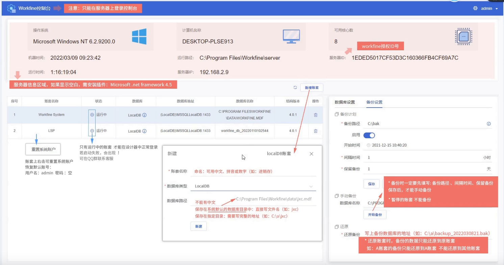​

了解了这些注意事项后，下面我们来看具体的操作，在控制台中点击新增账套，输入账套的名称→进销存，选择数据库类型为本地数据库（LocalDB），数据库路径，我们写上账套名称的拼音首字母，这里表示我们使用的是Workfine系统默认的数据库目录，设置完成后点击新建，这样我们就创建了一个新的账号，选中新的帐号，点击刷新，上套才能处于正常的运行状态，需要注意的是，只有运行中的帐套才能在设计器中正常登录，比如这时，我们在设计器中只能选择运行中的账套进行登录，右侧这里是账套的备份与还原，在操作时，首先要选中需要备份的账套，在备份设置中，先填写备份的路径、间隔时间、保留备份的天数，设置完成后，点击保存，然后再开始手动备份，备份成功后，在备份文件目录中就能看到这个就是刚刚备份的文件，最下面是账套的还原，如果我们想把账套还原到之前的某个状态，那我们可以将之前备份好的文件及路径填写到这里，比如现在我们想把这个账套还原到刚刚备份的状态，找到备份路径，复制之后，粘贴，然后选择备份文件，将路径及文件名填写正确后，点击还原，还原成功后，就能在设计器中看到帐套还原的效果，这就是本地账套的新增备份与还原，至于账套如何重置系统账户，如何切换账套的运行状态，以及如何删除多余的账套，这些操作都比较简单，这里就不再演示了，希望课后大家可以多去尝试操作。

这节课我们主要讲解了本地账套的基本操作以及操作时的注意事项，希望通过这节课的学习，大家之后都能熟练的操作本地账套，这节课就讲解到这里，谢谢大家的观看。

### [3、SQLsever账套的建立](https://ke.qq.com/webcourse/index.html?r=1679836647125#cid=5958219&term_id=106180765&taid=13995215364483659)

大家好，欢迎来到Workfine数字化课堂，这节课我们来学习SQL Server账套的基本操作，包括账套的添加与删除、账套运行状态的维护以及账套的备份与还原，其中这两块的内容我们就不用讲了，因为它跟本地帐套的操作方法是一样的，所以这节课我们只需要讲解如何新增SQ server账套。

下面我们来看具体的操作，登录控制台，点击新增账套，输入账号的名称→采购系统，选择数据库类型，SQL Server，输入连接地址→127.0.0.1，认证方式，推荐使用账号密码验证，输入数据库的sa账号密码，当数据库测试连接成功后，点击新建数据库，这里需要注意的是，尽量做到一个账套对应一个数据库文件，输入数据库的名称→采购系统，点击确认，设置完成后，点击新建，选中新增的账套，点击刷新，刷新后，当帐套的状态处于运行中时，说明这个帐套可以正常使用。

这节课我们主要讲解了如何新增SQL Server账套，整个过程非常简单，希望通过这节课的学习，大家能够做到举一反三，以后就算遇到其他类型的数据库，也要能正确的添加账套，这节课就讲解到这里，谢谢大家的观看。

# 模板设计

## 01、新建模板

### [1、新建模板 ](https://community.bn100.com/video)

大家好，欢迎来到Workfine数字化课堂，这节课我们来学习新建模板，知识点一、创建模板分组，二、创建模板，三、制作模板的样式，其中，创建模板分组和创建模板的过程类似电脑上建立文件夹和文件的过程，在企业管理中，我们需要对不同的业务进行归类，比如在库存管理模块下建立采购入库模板，那我们需要先建立模板分组，再建立模板，这样就便于我们对不同的业务进行归类和分辨，当模板创建完成后，我们还需要制作模板的样式，模板的样式不仅要求信息完整、美观，还要求有合理的结构和布局。

下面我们来看具体的操作，在桌面上双击Workfine设计器，在登录界面使用系统默认的账户登录，用户名admin，密码为空，点击登录，进入模板设计界面，鼠标放在加号上，点击新增分组，输入模板分组的名称→库存管理，鼠标放在模板分组名称的右侧，在出现的选项中点击新增模板，输入模板的名称→采购入库，模板类型设计方式保持默认，点击新建，这样我们就创建了一个模板，左侧这里是模板的名称，目前是保存在库存管理这个模板的分组当中，右侧是模板的编辑窗口，这里有行有列，有单元格，上方还有设置样式的功能选项，在这里不管是操作界面还是功能选项，与我们平时所使用的Excel软件基本一致，在这里，我们可以像在Excel中一样去设计模板的样式。

当然，在日常工作中，我们经常会遇到一种情况，就是我们已经有了Excel中做好的模板，那这个时候我们就不需要在Workfine中重新去设计模板，我们可以直接将Excel文件导入到Workfine中进行使用，下面我们来看一下如何导入，在桌面上有一个采购入库单，双击打开后，可以看到，在Excel中已经设计好了这个模板的样式，关闭文件，回到Workfine设计器，点击打开按钮，选择桌面上的采购入库单，取消网格线，点击保存，当我们保存模板之后，右上角会出现模板文件的大小，如果我们导入的文件比较大，可以选择表区域后，鼠标放在右上角，点击收缩文件大小，对导入的文件进行收缩，收缩完成后，鼠标点在表区域之外的任意单元格上，再次点击保存，这样我们就制作了一个模板，这里需要提醒大家的是，课程中用到的素材可以点击视频旁边的课程资料自行下载使用，当模板制作完成后，我们来预览模板，鼠标放在右上角，点击前往Workfine应用端，在应用端使用系统默认的账号登录，用户名admin，密码为空，点击登录，找到模板分组找到模板之后点击新增，就能看到我们刚才设计的模板。

通过刚才的操作演示，我们发现Workfine采用的是类Excel设计方式，突破了传统的Excel服务器技术瓶颈，提升了用户的操作体验，其中所见即所得的模板设计界面，可以让我们的工作更加高效，更加自如，能最大限度的提高我们的工作效率。

这节课我们主要讲解了如何创建模板分组，如何创建模板以及如何制作模板的样式，最后，细心的朋友可能会发现，刚才建立的模板在应用端浏览时不能进行数据填写，这是因为模板还没有完成定义，在Workfine中，只有定义好的模板才能实现填写功能，下一节课我们会给大家介绍如何定义模板，这节课就讲解到这里，谢谢大家的观看。

### [2、定义数据项](https://community.bn100.com/video)

大家好，欢迎来到Workfine数字化课堂，这节课我们来学习定义数据项，为什么要定义数据项呢，通过上节课的学习，我们会发现没有定义数据项的模板在应用端没有办法填写数据，想要实现模板的填写功能，就要定义数据项。

在定义数据项之前，我们先简单的了解一下数据项的概念，在Workfine中，主表项，备用主表，扩展项、备用扩展表，那什么是主表呢，主表是一次只能填写一条记录的表，它的特点是没有扩展功能，扩展表是一次能够填写多条记录的表，它的特点是可以向下或向右进行单方向的扩展。

了解了主表项和扩展项的概念后，我们来看具体的操作，回到Workfine设计器，打开上节课制作好的模板，采购入库，按住CTRL键，选中需要定义主表项的单元格，右击→定义主表项，主表项的名称中不允许出现特殊符号，单击名称旁边的去除特殊字符，可以一次性去除所有主表项名称中的特殊符号，让命名更加规范，这里是数据类型，正常情况下，Workfine会自动识别数据类型，这里我们保持默认，保存。

下面我们来定义扩展项，按住左键选中多行之后右击→定义扩展项，点击去除特殊符号，去除所有扩展项名称中的特殊字符，数据类型，序号选择数值中的整数样式，入库数量，选择数值中的整数样式，计量单位选择文本类型中的常规，其他保持默认，点击保存，当主表项和扩展项定义完成后，保存模板，前往应用端刷新测试，这时我们就会发现可以对模板进行填写数据。

这里我们录入了一个单号为2021001的采购入库信息，上方是主表项，一次只能填写一条信息，下面是扩展项，一次可以填写多条记录，当扩展信息比较多的时候，我们可以通过鼠标右击添加行，这样就可以继续向下填写信息，当信息填写完成后，点击保存。

这节课我们主要讲解了定义数据项，想要实现模板的填写功能，就必须要定义数据项，由于主表和扩展表的基本属性不同，所以在定义的时候要分开定义，最后，细心的朋友可能会发现，我们在填写信息的时候不填，或填写重复的单号都能保存成功，在历史记录界面可以看到有的单号为空，有的单号是重复的值，那在录入信息时如何实现字段的唯一性，以及必填属性条件格式等等，这些我们会在后面的视频中讲解，这节课就讲解到这里，谢谢大家的观看。

### [3、模板分组的基本操作](https://community.bn100.com/video)

在业务系统中，想要把模板按其作用放在对应的模板分组中，就必须要先熟练掌握模板分组的基本操作，包括如何创建模板分组，以及模板分组的移动、修改与删除。

下面我们来看具体的操作，回到Workfine设计器，进入模板设计界面，鼠标放在加号上，点击新增分组，输入模板分组的名称、基础信息，同样的方法可以创建其他分组，当分组创建完成后，可在分组中建立相应的模板文件，当业务划分的更详细时，我们还可以给模板分组建立子分组，鼠标放在分组名称的右侧，在出现的选项中点击新增分组，输入分组的名称，就可以给模板分组建立子分组。

创建好的分组可以通过鼠标拖拽的方法改变位置，除了可以上下移动改变顺序外，还可以进行层级移动，需要注意的是，在移动分组时，组内的内容会跟着分组一起移动，不需要的分组也可以删除，鼠标放在分组名称的右侧，在出现的选项中点击删除分组，当组内有内容的时候，我们需要先删除组内的内容，然后再删除分组，否则会出错。

模板分组的操作非常简单，后期大家可以根据业务需求，把模板合理的放在不同的分组当中，以便系统后期的维护和管理，

### [4、主表项的操作](https://community.bn100.com/video)

在修改主表项之前，我们先来认识一下主表项的组成部分，在Workfine中，主表项是由名称和区域组合而成，所以在移动的时候，我们应该将主表项的名称和区域作为一个组合来移动，其次，当主表项发生变化时，比如区域合并或取消合并的单元格，我们应该及时修改主表项的所在区域，最后，不需要的主表项可以删除。

下面我们来看具体的操作，回到Workfine设计器，打开之前制作好的模板，在移动主表项时，应该将名称和区域作为一个组合一起选中，在移动时不要利用鼠标右键去操作，这样会报错，我们要利用快捷键来操作，CTRL+X剪切，在需要的地方，CTRL+V粘贴，粘贴后，这个主表上的数据区域就是F27到G27，在修改主表项时，如果这里的单元格取消合并，那这个主表项的所在区域就不再是F27到G27了，应该是F27，所以这个时候我们应该去数据管理器，在主表中找到附件，将所在区域修改为F27到F27，如果主表项的名称发生了变化，我们也可以在这里直接修改，这里就不再修改了，保存。

最后，不需要的主表项可以删除，最简单的方法就是在行号上删除行，在删除行的同时，可以直接删除主表项，主表项的操作方法非常简单，希望在后期的操作中大家都能正确的修改主表项。

### [5、扩展项的操作](https://community.bn100.com/video)

在修改扩展项之前，我们先来认识一下扩展项，扩展项也是由名称和区域组合而成，所有的扩展向区域加在一起，就是整个扩展表的数据区域。我们在修改扩展项时，要保证整个扩展表的数据区域是连续的，中间不能断开，否则会出错。

下面我们来看具体的操作，如果我们想把这两个扩展项互换位置，那正确的方法应该是将扩展项的名称和区域一起选中后，利用快捷键来移动，需要注意的是，修改完成后，要保证扩展表的数据区域是连续的，中间不能断开，如果在这里插入一个空列，那整个扩展表的数据区域就不是连续的了，中间出现了断开的情况，那扩展表就会出错，所以我们在操作的时候，一定要保证整个扩展表的数据区域是连续的，中间不能断开，不需要的扩展项，可以在删除列的同时删除扩展下，删除后一定要保证扩展表的数据区域是连续的。

最后，我们来给这个扩展表添加一个明细号，如果将明细号放在与扩展表不相邻的地方，那我们在定义扩展项时，Workfine会自动切换到新建扩展表，就是将明细号放在一个新的扩展表中，如果想让明细号放在原扩展表中，那我们需要将明细号放在与原扩展表相邻的地方，然后在定义扩展项时，Workfine会自动选定为追加，就是将明细号追加到原扩展表中，保存后设置一下格式，这样我们就追加了一个扩展项，扩展项的操作方法非常简单，希望通过这节课的学习，大家都能正确的去修改扩展项。

### [6、定义交叉表](https://community.bn100.com/video)

交叉表主要应用于查询表，它可对数据进行二维的展示，如图所示，交叉表是由左侧标题、上方标题和交叉区域三部分组成，交叉表也属于扩展表，它的特点是可以同时向下或向右进行扩展。

​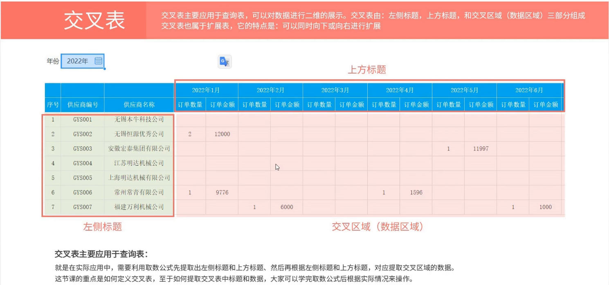​

那下面我们就来看如何在Workfine中定义交叉表，回到Workfine设计器的模板设计界面中，新增模板，模板的名称为交叉表，所属分组选择→查询管理，因为交叉表主要应用于查询表，所以模板类型选择→报表，设置完成后点击新建，在模板中输入了文字并设置相应的格式后，我们来定义交叉表，定义交叉表要从交叉区域开始选，向下扩展至少选两行，向右扩展至少选两列，那就是这个区域，选中这个区域后右击→定义扩展项，这里是交叉表的名称，这里是扩展方向，我们将向下修改为二维，在二维设置中，可以设置上方的标题数量和左侧的标题数量，根据这里的需求，我们将上方的标题设置为两个，左侧的标题设置为三个，设置完成后，点击确认。

下面我们来修改标题的名称，上方标题一的名称为月份，数据类型选择日期中的年月，上方标题二为订单金额，数据类型为带小数的数值，左侧的标题一为序号，数据类型为整数，左侧的标题二为供应商编号，数据类型为文本常规，左侧的标题三是供应商名称，数据类型保持默认，最后是数据区域，根据需求这里选择小数，设置完成后，点击保存，保存模板。

前往应用端测试，在查询管理分组中找到交叉表后单击，就能看到刚才定义的交叉表，我们在左侧标题上右击可以添加行，在上方标题上右击，可以根据需求添加列，这就是交叉表，可以同时向下或向右进行扩展，我们刚才讲过，在Workfine中交叉表主要应用于查询表，因为这里我们没有查询任何的数据，所以交叉表中的数据为空。那在实际应用中，我们需要利用取出公式，先提取出左侧标题和上方标题，然后再根据左侧标题和上方标题对应提取交叉区域的数据。

那这节课的重点是教大家如何定义交叉表，至于如何提取交叉表中的标题和数据，大家可以学完取数公式后，根据实际情况来操作。

## 02、数据管理器

### [1、唯一](https://community.bn100.com/video)

大家好，欢迎来到Workfine数字化课堂，这节课我们来学习数据管理器中的唯一，通过上节课的学习，我们发现在应用端录入数据时，同一条入库信息可以录入多次，在现实工作中，想要避免录入重复的信息，就需要对数据项设置唯一的属性，所以在Workfine中设置唯一的目的就是为了用户在填报数据时避免相应的内容出现重复。

在设置唯一之前，我们先来简单的了解一下唯一的类型，唯一分为，数据表唯一和本表唯一，各字又分为，单列唯一和组合唯一。下面我们通过一张图来区分一下唯一的类型，当我们在应用端单击模板名称后，右侧出现了是这个模板的所有填写记录，其中每一条历史记录都对应一个填写表单，数据表唯一，它指的是在这个模板的所有历史记录中不允许出现重复值，而本表唯一主要应用在扩展表中，是要求在当前这个填写表单上不允许出现重复值，其中单列唯一指勾选了这一列不能有重复的值，而组合唯一可以勾选多个列，它是将勾选的多个列视为一个组合，这个组合不能有重复的值。

​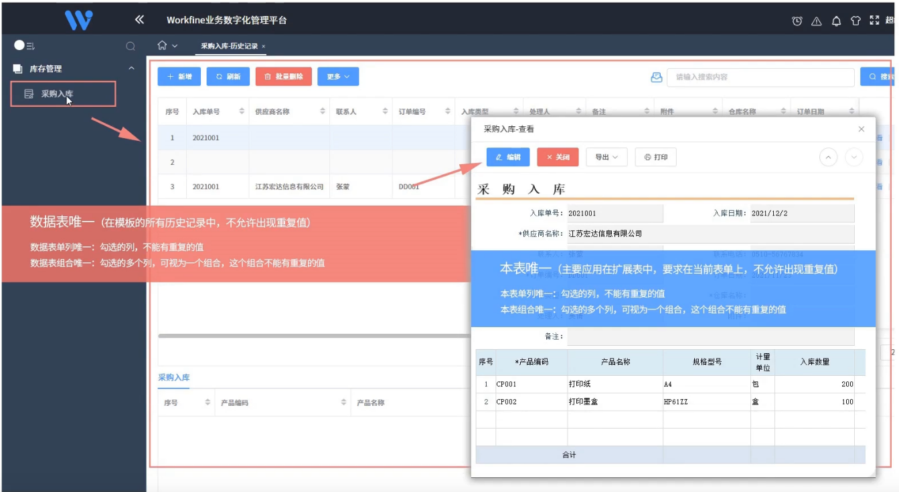​

那我们来思考一下，用户在录入采购入库信息时，想要实现一个入库单号，只能录一次，那我们可以将入库单号设置为数据表唯一中的单列唯一，如果把扩展表中的产品名称、规格、型号都设置为本表组合为一，那用户每次填写信息时，这两个的组合值是不允许出现重复的。

下面我们来看具体的操作，在设置唯一之前，先前往应用端检查之前录入的测试数据，删掉违反唯一性的测试数据，以防与后面设置的唯一相冲突，回到设计器，鼠标右击→打开数据项管理，在主表中找到入库单号，在唯一设置中单击设置，勾选数据表单列为一，这时我们会发现地铁下默认被勾选，就是说，我们在应用端填写数据时，入库单号为必填项，不填则无法保存，点击扩展表，找到产品名称和规格型号，在唯一设置中勾选本表组合唯一，设置完成后，单击保存，鼠标点在表区域之外的任意单元格上保存模板。

前往应用端刷新测试，点击新增后，再次录入一条采购入库信息，在填写信息时需要注意，入库单号为数据表单列唯一且为必填项，不填或填写重复的单号都将保存失败，其次，在扩展表中，产品名称和规格型号为本表组合为一，就是说，在当前这个填写表单上，产品名称和规格型号的组合值不允许出现重复，否则在保存时也会出现出错提示，其实当这个组合值出现重复的时候，就可以判定为同一个产品，我们可以对入库数量整合后，删除多余的信息，这样就可以保存成功。

这节课我们主要讲解了唯一设置，唯一的目的就是为了避免用户录入重复的数据，希望通过这节课的学习，大家可以根据不同的业务需求设置不同类型的唯一，这节课就讲解到这里，谢谢大家的观看。

### [2、条件格式](https://community.bn100.com/video)

大家好，欢迎来到Workfine数字化课堂，这节课我们来学习数据管理器中的条件格式。

什么是条件格式呢，说白了，就是对符合条件的内容设置指定的格式。那这个格式都可以设置哪些呢，首先是字形上的格式设置，字形上的格式设置非常简单，就是我们平常所使用的字体加粗、倾斜、下划线，字体颜色，单元格底色；其次呢，是动作上的格式设置，就是要不要显示提示性文字，是否拒绝录入的操作。

了解了条件格式的基本知识后，我们来假设一个条件，在录入数据时，一旦出现入库数量大于1000的情况，表单会出现警告文字，入库数量较大，请核实后录入，并且让数据行在字形上凸显出来。

下面我们来看具体的操作，回到Workfine设计器，打开之前制作的采购入库模板，鼠标右击，打开数据项管理，在扩展表中找到入库数量，在条件格式列中点击设置，点击加号新增条件格式，输入条件格式的名称，入库数量较大，请核实后录入，触发条件，单击右下角的编辑按钮来书写公式，为了让书写公式更加准确、方便，Workfine提供了常用的英文字符，我们可以单击上方的符号来代替手动录入，在左侧扩展表中找到入库数量，单击大于号，输入1000，保存。动作设置→当入库数量大于1000时，显示警告文字，并且提示内容为“入库数量较大，请核实后录入”，字形设置，我们让符合条件的文字加粗倾斜单元格底色设置为浅粉色，字体设置为红色，并且针对整行进行变化，设置完成后点击右下角的验证，验证成功后，单击保存，关闭，保存数据管理器。

保存模板后，前往应用端刷新测试，在填写信息时，一旦入库数量大于1000整行数据就会使用刚才设置的字形格式，并且上方还有警告性文字，入库数量较大，请核实后录入，核实数据之后点击保存。

这节课我们主要讲解了条件格式，什么是条件格式，就是对数据表中的内容进行指定条件的判断，并返回预先指定的格式，希望通过这节课的学习，大家以后能够根据实际的业务需求，灵活的使用条件格式，最后给大家留一个思考，如果将刚才的假设条件更改为，当入库数量大于1000时，表单拒绝录入数据，并且出现警告文字，入库数量较大，无法录入，那应该如何设置条件格式呢，希望大家课后去尝试操作，这节课就讲解到这里，谢谢大家的观看。

### [3、数据类型](https://community.bn100.com/video)

大家好，欢迎来到Workfine数字化课堂，这节课我们来学习数据类型。

在Workfine中，数据类型总共有五种，分别是文本型、数值型、日期型、图片型和附件型。

首先来看文本型，当我们把数据类型设置为文本型后，在应用端输入的内容都将作为文本，也就是字符串进行处理，需要注意的是，文本不能进行算术运算，在Workfine中，文本型数据有七种样式，不同的样式对数据的录入有不同的要求，其中文本在录入的数据无要求无限制，身份证要求录入的数据必须是15或18位数字，邮箱要求录入的数据为正确的邮箱地址，手机号码要求录入的数据为11位数字，电话号码，要求录入的是区号加固定电话号码，其中区号必须是零开头的三或四位数，固定号码要求为七或八位数，序号于固定号码中间，可以用短信连接，也可不用短信连接，超链接要求录入的信息为网址，在实际应用中，想保证录入数据的准确性，就需要在定义数据项时，给每个数据项设置正确的数据类型及样式。

​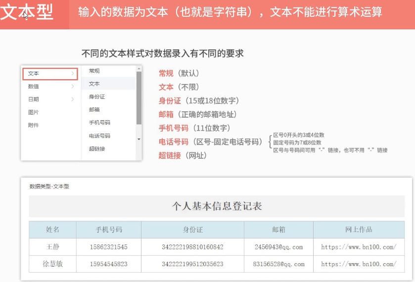​

下面我们来看具体的操作，回到Workfine设计器，在个人基本信息登记表中选中单元格右击→定义扩展项，姓名选择文本类型中的文本，手机号码选择文本中的手机号码，身份证选择文本中的身份证，邮箱选择文本型中的邮箱，网上作品选择文本中的超链接，设置完成之后保存，保存模板前往应用端测试，在填写信息时，如果内容不符合要求，只有保存时才有出错提示，只有录入正确格式的数据才能保存成功。

了解了文本型后，我们来看数值型，当我们把数据类型设置为数值型后，输入的数据为数值数量，是可以进行算术运算的，在Workfine中，数值的显示样式有多种，可以显示为整数、小数、百分比，千分隔位样式以及带货币符号的样式，其中，小数还可以在数据管理器中设置，保存小数位数以及展示小数位数，在实际应用中，我们可以根据需求给数值设置不同的显示样式。  
下面我们来看具体的操作，在提成表中选中单元格之后右击→定义扩展项，销售数量选择数值中的整数，单价选择数值中带小数的样式，个人业绩选择数值中千位分隔样式，提成选择数值中带货币符号的样式，设置完成后，点击保存，保存模板，前往应用端测试，在应用端填写信息时，Fine会自动把数值转换成之前设置好的数值样式。

​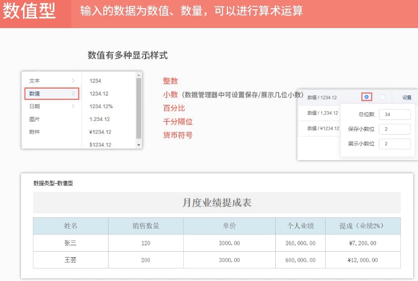​

了解完数值型后，我们来看日期型、图片型和附件型，因为这三个数据类型比较简单，所以放在一起讲。当数据类型为日期型时，表示输入的数据为日期，日期的显示样式非常多，各种年月日时间的格式都有，大家可以根据需求选择合适的时间样式；当数据类型为图片型和附件型时，在应用端有上传图片和上传附件的功能，这里需要注意的是，不管是图片还是附件都不要太大。

下面我们来看具体的操作，在申请表中选中单元格后，右击→定义主表项，入职时间选择日期型，显示样式为年月日，个人简历选择数据类型附件，转正申请书选择附件，保存后，选中证件照的单元格，右击→定义主表项，将名称改为证件照，数据类型设置为图片，保存，保存模板之后前往应用端测试，在填写信息时，日期会自动转化为之前设置好的日期样式，单击上传附件，上传图片，选择对应的内容，上传之后保存。

这节课我们主要讲解了数据类型，希望通过这节课的学习，大家在之后定义数据项时，能给每一个数据项都设置正确的数据类型及样式，这节课就讲解到这里，谢谢大家的观看，

### [4、相同值合并](https://community.bn100.com/video)

相同值合并就是当内容相同时，单元格会自动合并，在Workfine中，相同值合并主要应用于查询表，它能让查询的数据显示的更加直观明了，需要注意的是，当多个字段都要做相同值合并时，合并的优先级为降序，就是数值越小，合并的级别就越高。

下面我们来看具体的操作，回到Workfine设计器，在查询模板中打开数据管理器，在扩展表中设置相同值，合并，默认都为零，我们可以输入整数，因为优先级为降序，所以这里先对产品类别合并，然后再对产品名称进行合并，设置完成后保存数据管理器，保存模板，前往应用端刷新测试，在应用端找到查询模板，输入要查询的入库单号，点击查询按钮，可以看到，相同值合并可以让查询的数据显示的更加清晰明了，

### [5、间隔色](https://community.bn100.com/video)

间隔色其实就是隔行换色的效果，在Workfine中，间隔色只能在扩展表中设置，它能让表单的样式更加饱满美观。

下面我们来看具体的操作，回到Workfine设计器的模板编辑窗口，打开数据项管理，在扩展表中点击设置按钮，开启间隔色，设置间隔色的颜色，间隔色一般以淡色系为主，这里选择淡灰色，设置完成后，保存数据管理器，保存模板，前往应用端刷新测试，扩展表中添加间隔色，可以让表单的样式更加饱满美观。

### [6、复制新增](https://community.bn100.com/video)

复制新增，在应用端填写信息时，给需要重复填写的内容设置复制新增属性，可以让数据的录入更加快捷方便，想要实现这个功能，我们还需要提前把复制新增的按钮调出来。

下面我们来看具体的操作，回到Workfine设计器，在采购入库模板中，我们先调出复制新增的按钮，点击上方的属性，在模板属性窗口中找到按钮设置，找到复制新增按钮，勾选显示，保存模板属性，这样我们就调出了复制新增的按钮。

下面我们来给数据项添加复制新增的属性，打开数据管理器，在主表中找到处理人，勾选复制新增属性，保存数据管理器，保存模板，前往应用端刷新测试，在应用端填写信息后，点击上方的复制新增按钮，在保存信息并新增的同时，处理人中的数据被复制过来，这样可以让用户在填写信息时更加方便快捷。

### [7、用户签名](https://community.bn100.com/video)

在Workfine中，签名有手动签名和默认签名两种方式，不管用户使用哪种签名方式，最终签名呢，都是以图片的形式保存在Workfine中，所以这就决定了存放签名的字段，它的数据类型一定是图片型，当数据类型为图片型后，想要实现这种签名的样式，我们还需要在数据管理器中开启手动签名的功能。

了解了签名的基本知识后，下面我们来看如何给这个案例中的系统管理员签字添加签名效果，回到Workfine设计器，在评分表模板中选中系统管理员签字的单元格，右击→定义主表项，首先去除名称中的特殊符号，其次将签名的数据类型改为图片型，设置完成后保存。然后打开数据管理器，找到系统管理员签字，在字段类型属性中勾选手动签名功能，设置完成后，保存数据管理器，保存模板。

前往应用端查看，在填写信息时，鼠标放在这里，在出现的编辑按钮上单击，就可以在这里手动签名，保存后，在历史记录界面中就可以看到签名是以图片的形式保存在Workfine中。

再次点击新增，在签名窗口中，如果用户觉得每次都要手动签名比较麻烦，那我们有一个更加快速的方法，就是先在这里签名，然后将签名截图保存到桌面上，然后关闭手写签名窗口，将鼠标放在界面的右上角账户信息上，在出现的编辑选项中点击设置，在个人设置中头像的右侧点击修改签名，上传刚才的签名图片，保存。

这时回到填写信息窗口，点击签名，在右下角点击默认签名，就可以将刚才的签名截图直接存放在这个单元格中，这样就不用每次手签这么麻烦，非常的方便，希望通过这节课的学习，大家之后在工作中能够灵活的设置签名，

### [8、历史数据](https://community.bn100.com/video)

在数据管理器中，历史数据有三个选项，分别是参与搜索、隐藏、字段排序，下面我们来看一下这三个选项与历史记录界面之间的关系通。

​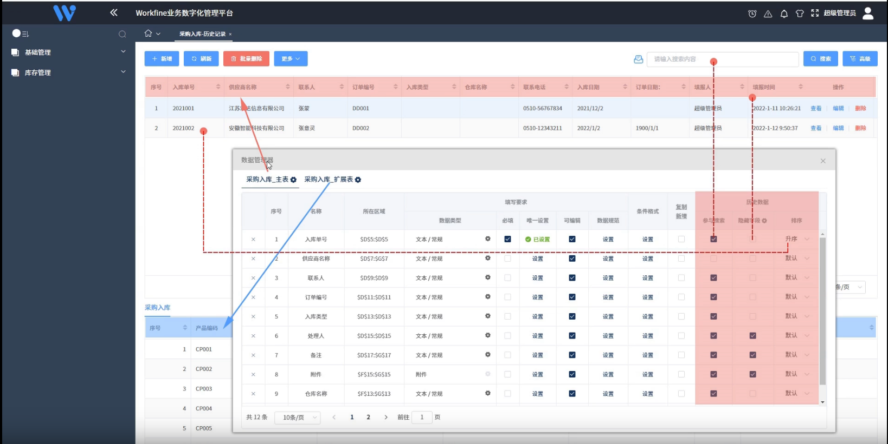​

过这张图我们可以看到，在数据管理器中，主表中的字段会按照序号从左到右显示在历史记录界面的上方，扩展表中的字段会按照序号从左到右显示在历史记录界面的下方，不管是主表还是扩展表中的字段，都可以利用鼠标拖动的方法重新排序，让重要的字段在数据管理器中靠前显示，在历史记录界面中靠左显示。

下面我们以主表为例来看一下隐藏字段，当某个字段勾选了隐藏字段后，那这个字段就不会在这里显示出来，所以通过设置隐藏字段，可以将一些不必要的信息隐藏起来，让历史记录界面看上去更加简洁明了，字段的下方是填写记录，默认情况下，这些填写记录是按照添加时间降序排列，就是最新添加的信息会显示在上方，其实我们也可以让他们按照某个字段的内容来排序，比如这里呢，我们可以让他以入库单号的升序标准来重新排序。

最后，当填写记录比较多的时候，我们可以通过右上角的普通搜索或者是高级搜索来查找需要的数据，如果某个字段取消了参与搜索的选项，那不管是在普通搜索还是在高级搜索中都无法搜索到该字段的相关内容，其实这里的历史数据指的就是历史记录界面的展示形式。

下面我们来看具体的操作，回到Workfine设计器，在采购入库模板中打开数据管理器，在主表中利用鼠标拖动的方法让重要的字段靠前显示，不必要的字段，勾选隐藏字段，让历史记录界面看上去更加简洁明了，最后，我们让填写的数据以入库单号升序的标准来重新排序，保存数据管理器，保存模板，前往应用端刷新测试。

课后，大家可以根据业务需求打造更合适的个性化的历史记录展示界面。

## 03、数据规范

### [1、自动编号](https://community.bn100.com/video)

大家好，欢迎来到Workfine数字化课堂，这节课我们来学习数据规范中的自动编号，自动编号能帮助表单自动生成唯一的编码，在添加自动编号之前，我们先来看自动编号的组成部分，在Workfine中，自动编号由前缀、日期部分和流水位数三部分自由组合而成，其中日期部分为编号的周期，当一个周期结束之后，会从新的周期开始重新编号。

​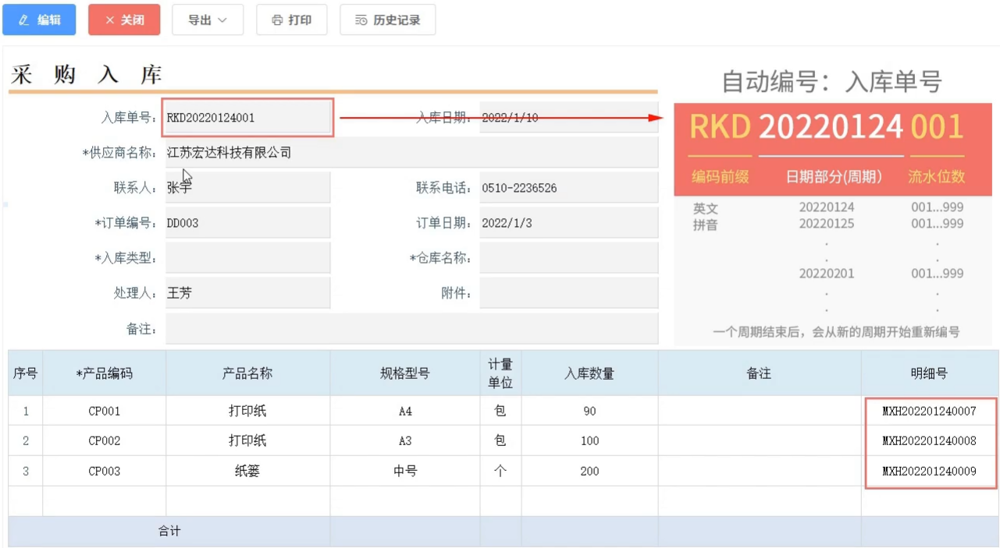​

下面我们结合实际的案例来详细的了解自动编号，在这个案例当中，入库单号绑定了自动编号，我们来分析一下这个自动编号的组成部分，这里是编号的前缀，前缀一般使用英文或拼音，这里采用的是编号名称的拼音首字母，这里是编号的日期部分，因为每天都有很多入库单要填写，所以根据实际需求，这里选择年月日格式为编号的周期，这里是流水位数三位，就是从001到999，这里需要注意的是，日期部分为编号的周期，当一个周期结束后，会从新的周期开始重新编号，最后，还有一个知识点需要注意，模板中如果有主表和扩展表，那主表建立单据编号的同时，扩展表也需要建立单据明细号，所以这里还需要给扩展表添加一个自动编号。

下面我们来看具体的操作，回到Workfine设计器，在采购入库模板中点击数据规范，在左侧单击自动编号，在自动编号类目中点击新增，在新增窗口输入编号的名称→入库单编号，编号的前缀使用拼音首字母，入库单日期部分选择年月日，流水位数为三位，点击新建。当入库单编号创建完成后，再次点击新增，输入编号的名称→明细号，编号的前缀使用编号名称的拼音首字母，日期部分选择年月日，流水位数为四。

设置完成后，点击新建，当两个自动编号都创建完成后，我们来绑定字段，在上方选择主表中的入库单号，绑定入库单编号，然后选择扩展表中的明细号，绑定明细号，关闭数据规范窗口，选择入库单号，取消字段的可编辑状态，选择明细号取消字段的可编辑状态，保存模板，前往应用端刷新测试，在新增信息时入库单号，会按照刚才设置的标准自动生成编号，扩展表中的明细号只有在填写信息并且保存之后，才会生成编号。

这节课我们主要讲解了自动编号，自动编号的作用就是帮助表单自动生成唯一的编码，唯一编码的使用在整个业务系统中是至关重要的，请大家在搭建系统的时候一定不要怕麻烦，每个模板都应该建立对应的自动编号字段，这节课就讲解到这里，谢谢大家的观看。

#### [小知识：自动编号-废号重用](https://community.bn100.com/video)

当模板中的字段绑定了自动编号后，在应用端填写信息时，如果有单据的信息填错了，那在删除填写记录时记录中的编号也会被删除，这些被删掉的编号就是废号。如何重新使用这些废号，就涉及到了废号的重用规则。

在Worfine中废号的重用规则有三种，分别是废号重用关闭，完整重用和顺序重用。

​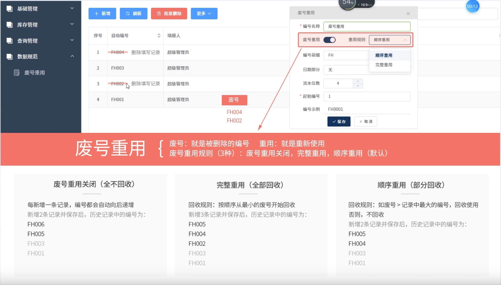​

首先来看废号重用关闭，就是对所有的废号全都不回收，每新增一条记录编号都会自动向后递增，也就是说，在这个规则下，我们点击新增下一  
出现了编号，将会是FH005，再次点击新增出现了编号将会是FH006。

完整重用，就是将所有的废号全部回收，重新使用。回收的规则是按顺序从最小的废号开始回收。所以在这个规则下，我们点击新增，下一个出现的编号将会是回收的废号FH002。再次点击新增，出现的编号是回收的废号FH004。当废号回收完毕后，点击新增，编号会自动向后递增。  

顺序重用，也是系统默认的重用规则，是对废号进行部分回收。回收的规则是，如果废号大于历史记录中最大的编号就回收使用，否则不回收。在这个规则下，我们记录中目前最大的编号是003，所以废号中的004是可以回收使用的，002不回收，所以点击新增下一个出现的编号将会是回收的FH004，再次点击新增编号会自动向后递增。

废号重用的规则非常简单，希望通过这节课的学习，大家在之后添加自动编号时能根据实际的业务需求选择最合适的重用规则。

### [2、下拉](https://community.bn100.com/video)

大家好，欢迎来到Workfine数字化课堂，这节课，我们来学习数据规范中的下拉，在Workfine中，下拉分为两种，一种是固定值下拉，一种是数据源下拉。下面我们通过实际的案例来详细的了解，固定值下拉和数据源下拉的区别。

​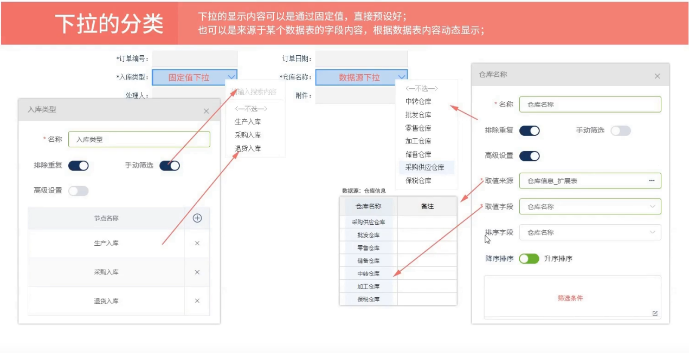​

我们先来看左边的固定值下拉，固定值下拉是指在建立下拉时，直接将下拉的内容在节点上设置好，这种下拉的好处是建立方法简单，维护也方便，如果后期要修改下拉的内容，那我们只需要在设计器中找到这个下拉，然后修改这里的节点即可，当下拉内容比较多的时候，我们还可以开启手动筛选功能，这样在应用端浏览时，下拉的上方会出现搜索功能，可以帮助我们搜索到想要的内容。

右边这里是数据源下拉，数据源下拉是指下拉的值来源于某个数据表的字段内容，如图所示，仓库名称中下拉的值来源于这张表中的这个字段内容，当然，我们还可以在这里设置筛选条件，对这里的数据进行筛选，将筛选后的内容作为下拉的值显示在这里，如果后期要修改下拉的内容，我们只需要找到这张表，来修改这里的字段内容就可以了，因为下拉的值会随着数据表内容的变化而变化。

了解了固定值下拉和数据源下拉的区别后，我们来看具体的操作，回到Workfine设计器，打开采购入库模板，打开数据规范，在左侧点击下拉，切换到下拉内目中，点击新增，我们先来做固定值下拉，输入固定值下拉的名称→入库类型，点击编辑节点的名称，输入下拉的内容→采购入库，点击加号，添加节点的名称→生产入库，再次点击加号，输入节点的名称→退货入库，当下拉内容，设置完成后点击新建，这样我们就创建了一个固定值下拉。

下面我们来做数据源下拉，需要注意的是，做数据源下拉要先有数据源，数据源我已经提前做好了，给大家看一下，在应用端基础管理模块中有仓库信息模板，点击查看，可以看到里面也填写了相应的数据，有了数据源，我们就可以制作数据源下拉，点击新增按钮，输入下拉的名称→仓库名称，开启高级设置，取值来源，单击后，在基础管理模块中选择仓库信息模板扩展表，取值字段为仓库名称，排序字段→仓库名称，根据需求选择排序规格，这里可以设置筛选条件，感兴趣的朋友课后可以尝试对数据进行筛选，这里我们就不做过多的讲解，因为下拉的内容比较多，所以我们开启手动筛选功能，点击新建。

当下拉创建完成后，我们来绑定下拉，在上方切换到主表中的入库类型，绑定入库类型，然后切换到仓库名称，绑定仓库名称，在绑定时，我们还可以设置绑定条件，鼠标放在这个按钮上，点击绑定设置，默认是单选，我们也可以开启多选功能，这样在应用端就可以对下拉的内容实行多选，关闭数据规范窗口，选择入库类型，取消字段的可编辑状态，选择仓库名称，取消字段的编辑状态，保存模板后，前往应用端刷新测试。

在新增信息时，这里是固定值下拉，这里是数据源下拉，因为数据源下拉开启了手动搜索功能，所以在这里可以对下拉的内容进行搜索，在绑定的时候，数据源下拉还设置了多选功能，所以在这里除了单选之外，我们还可以选择多个内容。

这节课我们主要讲解了下拉，下拉的内容可以是通过固定值直接设置好，也可以是来源于某个数据表中的字段内容，不同类型的下拉，后期修改的方法也会不同，希望通过这节课的学习，大家能够熟练掌握下拉的操作，这节课就讲解到这里，谢谢大家的观看。

### [3、列表](https://community.bn100.com/video)

大家好，欢迎来到Workfine数字化课堂，这节课我们来学习数据规范中的列表，本节课知识点，一、什么是列表，二、如何创建列表，三、如何绑定列表。

首先我们来认识一下什么是列表以及列表与下拉的区别，这里是我们上节课制作的下拉，细心的朋友肯定已经发现，下拉的值只能填充到这一项，而在这里（供应商名称）单击选择相应内容后，我们会发现，它除了填充这一项之外，它还能填充与这个字段相关的其他字段内容（联系人、联系电话等），在Workfine中，这种表现形式就是列表。认识了列表之后，我们来看如何创建列表，在Workfine中创建列表，分为三步，一、选择数据源→二、设置筛选条件→三、设置填充方式。

​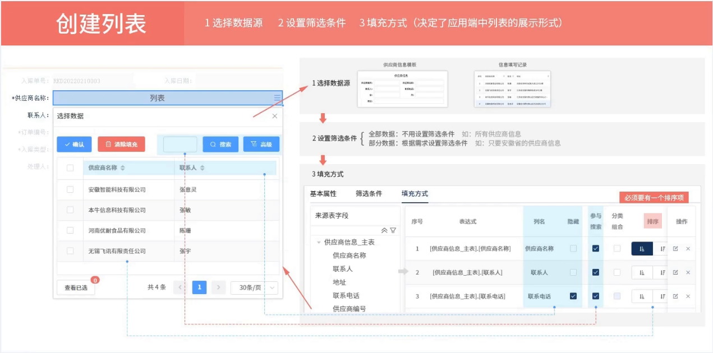​

下面我们结合实际的案例来详细的了解创建列表的思路，左边这里是供应商列表，在创建列表时，首先要明确的是列表中显示的这些数据来自哪里，这也是创建列表的第一步，选择数据源，这里的显示数据来源于供应商信息模板中的填写数据，当数据源确定之后，我们来看第二步，根据需求设置筛选条件，如果我们需要的是所有的供应商信息，那就不用设置筛选条件，如果我们需要的是供应商信息模板中部分数据，那就要根据实际情况设置筛选条件，最后是设置填充方式，填充方式中的选项决定了列表在应用端的展示形式，我们来看填充方式中的部分选项，左侧这里是数据源中所有的字段，我们可以通过单击将需要的字段添加到右边的列表中，这里的列名会按照从上到下的顺序，从左到右展示在列表的界面中，当然，不重要的列名可以勾选隐藏，这样列名就不会显示在这里，可以让列表的界面更加简洁明了，这里的排序指的是列表中的数据以什么样的标准来排列，需要注意的是，在创建列表时必须要有一个排序项，否则创建列表会出错。

理清了创建列表的思路后，我们来看具体的操作，回到Workfine设计器，在采购入库模板中点击数据规范，切换到列表类目中，点击新增，在基本属性中输入列表的名称→供应商列表，下面我们开始创建列表的第一步，选择数据源，在基础管理模块中选择供应商信息模板中的主表，第二步，设置筛选条件，因为这里我们需要的是数据源中所有的供应商信息，所以不需要设置筛选条件，第三步是设置填充方式，我们可以通过单击将需要的信息填充到右边的列表中，不重要的列名可以勾选隐藏，让列表的展示界面更加简洁明了，最后需要注意的是，列表必须要有一个排序项，否则会出错，这里我们让列表中所有的信息以供应商名称升序的标准来排列，设置完成后，点击新建，这样我们就创建了一个列表，切换到主表中供应商名称字段，绑定，供应商列表，在绑定界面中，左边是我们刚才创建的列表中所有的字段，右边是本表字段，也就是采购入库当中所有的字段，在这里，我们只需要将列表中的字段对应填充到本表字段即可，设置完成后，点击确定，关闭数据规范窗口，保存模板后前往应用端刷新测试。在应用端填写数据时，点开列表后，可以看到，列表中的数据是按照供应商名称升序排列，联系电话被隐藏，在列表中看不到，但是值还是可以正常传递的。

这节课我们主要讲解了列表，它不仅能填充绑定字段的值，还能填充相关的其他字段值，列表在业务系统中应用非常广泛，希望课后大家能够多加练习，课程最后给大家留一个思考，这里的订单编号也能做成列表的形式，希望大家课后能独立完成，这节课就讲解到这里，谢谢大家的观看，

### [4、分类组合](https://community.bn100.com/video)

在Workfine中，分类组合就是在列表的左侧添加这样的分类数，可以让用户在列表中按照类别快速找到所需要的内容，当多个字段都勾选了分类组合时，哪个字段在上方，哪个字段的优先级就越高，当然，我们可以利用鼠标拖动的方法来改变字段上下的位置，从而决定分类组合的优先级。

下面我们来看具体的操作，回到Workfine设计器，在采购入库模板中打开数据规范，在列表中找到供应商列表，下面我们来给这个列表添加分类组合，鼠标放在右侧的设置按钮上，点击修改，在填充方式界面，将左侧数据源中的省市字段添加到列表中，然后勾选分类组合，鼠标放在序号上，可以将省移动到市的上方，也就是说先按省进行分组，然后再按市来分组，设置完成后，点击保存，关闭数据规范窗口保存模板，前往应用端刷新测试，在填写信息时，如果供应商列表中的信息比较多，我们可以通过左侧的分类组合来快速筛选信息，这样可以更快速的找到所需要的内容，让填写数据的工作更加快捷，更加方便。

### [5、助记码](https://community.bn100.com/video)

在Workfine中，助记码是文本内容的拼音首字母，当列表中信息比较多的时候，通过设置助记码，能让用户在使用列表时更方便的搜索到所需要的内容。

​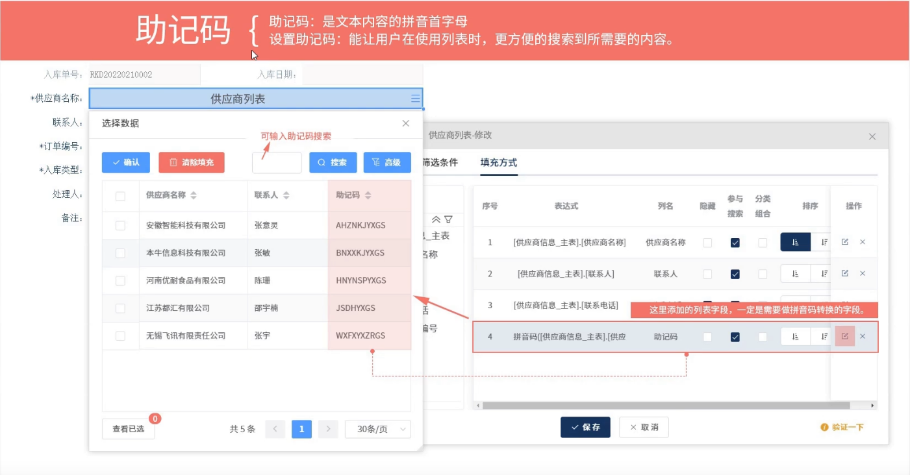​

下面我们来看具体的操作，回到Workfine设计器，在采购入库模板中打开数据规范，找到之前的供应商列表，我们来给这个列表添加助记码，鼠标放在设置上，点击修改，在填充方式界面，将左侧数据源中的供应商名称再次添加到右边的列表，这里需要注意的是，添加的字段一定是要做拼音码转换的字段，修改列名为助记码，然后在操作列上点击编辑按钮，进入表达式的编辑界面，删掉原来的内容，在函数中找到字符串函数→拼音码，选中小括号中的内容，将它替换为供应商名称，设置完成后，保存，保存列表，关闭数据规范，保存模板后前往应用端测试，在应用端填写信息时，点击供应商列表，这里就是助记码，是供应商名称的拼音首字母，当我们在搜索框中输入供应商名称中的部分拼音首字母时，点击搜索，就会搜索到对应的供应商信息，所以当列表中的信息比较多的时候，通过助记码能方便我们快速搜索到所需要的内容，

### [6、系统变量](https://community.bn100.com/video)

系统变量就是Workfine系统中的信息，用户可以通过绑定系统变量来自动获取相应的信息，系统变量比较多，我们先来大致的了解一下，最上面这里的日期和时间为当前使用电脑的日期和时间，中间这里用户姓名和账户名称为当前登录账户的信息，我们一直在用系统默认的账户admin登录，这个账户的登陆名称admin、用户姓名超级管理员与这里是一一对应的，下面这一块是当前账号所在的部门信息，包括部门的名称、全称、部门的ID号以及用户的角色和签名等，这些系统变量的使用方法非常简单，只需要在字段上直接绑定即可。

​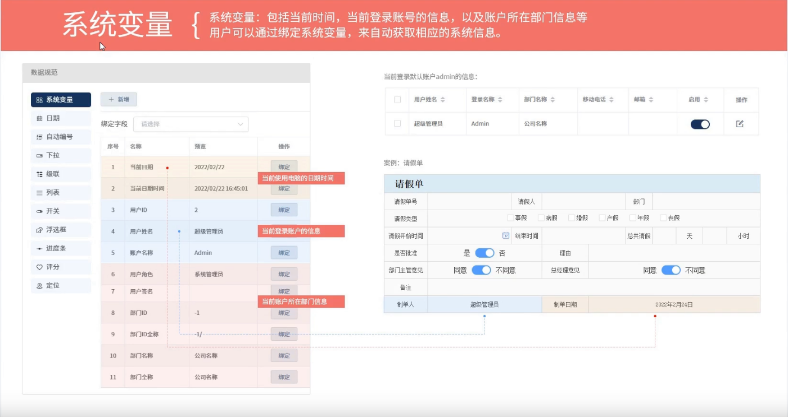​

下面我们来看如何给请假单中的制单人和制单日期绑定系统变量，回到Workfine设计器，打开请假单模板，选择制单人，在右侧点击绑定数据规范，在系统变量类目中找到用户姓名，点击绑定，然后切换到制单日期，在当前日期上点击绑定，绑定完成后，关闭数据规范窗口，保存模板后，前往应用端查看，当我们在请假单模板上点击新增时，制单人和制单日期会自动获取到系统中的信息，制单人为当前登录账号的用户姓名，制单日期与电脑右下角的日期是一致的，所以当模板中的字段绑定了系统变量时，能让填写数据的工作更加快捷方便。

最后，Workfine中的系统变量比较多，大家课后一定要花点时间将这些系统变量都熟悉一下，这里呢，我们就不再一一演示了，希望在之后的系统开发工作中，大家都能灵活的使用系统变量。

### [7、日期](https://community.bn100.com/video)

日期，Work fine提供了不同形式的日期规范，像年、月、日、时间等形式，用户可以根据需求选择需要的形式绑定即可，就比如在请假单中这个制单时间，它的字段类型是日期中的年月日格式，所以这个字段应该绑定日期规范中的年月日形式，再比如请假开始时间，它的字段类型是日期中的年月日时间格式，所以这个字段应该绑定日期规范中的年月日时间形式，如果遇到区间日期，就是这种请假时间从这里开始到这里结束的，那在绑定日期规范时，还可以在绑定设置中开启区间选择，然后在这里确定开始时间和结束时间的字段即可。

​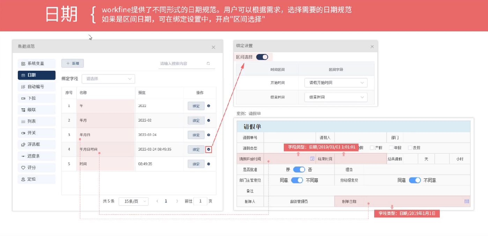​

了解了日期规范后，下面我们来看具体的操作，回到Workfine设计器，打开请假单模板，选中制单日期，在右侧点击绑定数据规范，在日期类目中选择年月日形式，点击绑定，然后切换到请假开始时间字段，在年月日时间上点击绑定，因为是区间日期，可以在这里点击绑定设置，开启区间，选择开始时间，绑定到请假开始时间，结束时间绑定到结束时间字段，设置完成后，确定关闭数据规范窗口，保存模板后前往应用端查看，在填写信息时，可以在日期选择器上单击选择时间，在选择区间日期时，第一次单击是选择开始日期，第二次单击是选择结束日期，点击选择时间可以设置开始时间和结束时间，设置完成后，点击确认即可，当字段绑定了日期规范后，用户在录入数据时就不用再手动填写时间了，非常的方便。

### [8、开关](https://community.bn100.com/video)

在Workfine中，开关是一种数据规范，它的原理非常简单，就是开和关分别对应不同的字段内容，其实开关就是二选一，他约束了用户只能选择开值或者关值。

下面我们来看具体的操作，回到Workfine设计器，在请假单模板中点击数据规范，在开关类目中点击新增，输入开关的名称，左值为同意，右值为不同意，默认选中右值→不同意，在主题中选择一个配色方案，设置完成后，点击新建，当开关制作完成后，我们来绑定开关，找到主表中的部门主管意见，绑定同一开关，然后切换到总经理意见，绑定同一开关，绑定完成后关闭数据规范，保存模板，前往应用端查看，这里就是刚刚添加的两个开关，只要通过鼠标的单击就可以选择相应的内容，非常方便，同时，开关的使用还能让表单的界面更加丰富美观。

### 9、级联

#### [级联基础概念](https://community.bn100.com/video)

级联首先我们来看一下什么是级联，比如用户在产品类别中单击时，可以根据需求按照类别一级一级向下选的就是级联，所以在Workfine中，级联就是指下拉中的内容能根据数据间的层次关系进行分级展示，同时级联还能关联填充其他字段。

​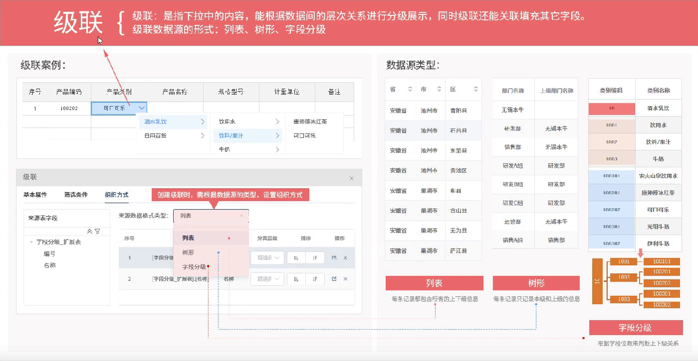​

认识了级联后，我们来看级联数据源的形式，在Workfine中，级联的数据源有三种形式，分别是列表、树形和字段分级，下面我们来看如何区分数据源的类型。

列表数据源，它的特点是每条记录都有完整的上下级关系，就像这个表中的数据一样，每条记录都有完整的省市区信息。  
树形数据源，它的特点是每条记录只记录本级和上级的信息，像这个表中的数据一样，每条信息只记录了本级和上级部门的名称，如果想要找到销售a组所有的上级，那我们需要不断的遍历，先找到销售a组的上级销售部，然后再找到销售部的上级无锡本牛，然后再找无锡本牛的上级，这里上级为空，说明它是根极，所以树形数据源是每条记录只记录本级和上级的信息，如果想知道所有的上级，我们需要不断的去遍历。  
字段分级它的特点是根据字段的位数来判断上下级关系，比如在这张表中，编码为两位数的时候表示一级目录，编码为四位数的时候，表示二级目录，编码为六位数时，表示的是三级目录。

这三种数据源都具有非常明显的特点，非常容易区分，这是一个非常重要的知识点，也只有掌握这个知识点，我们才能在创建级联时正确的设置组织方式，这节课我们主要介绍了级联以及级联的数据源，后面我们会有三个案例来分别演示这三种数据源级联的创建方法。

#### [级联—列表型数据源](https://community.bn100.com/video)

在Workfine设计器中打开员工档案模板，我们给这里的省市区添加级联规范，在创建级联前，我们先来做数据源，在基础管理模块中，有一个省市区的模板，打开后，选中单元格，右击→定义主表项，保存。

保存模板后，前往应用端添加省市区的数据，在填写信息时，我们会发现一个问题，就是全国省市县数据太多，我们不可能一条一条的复制粘贴过来，所以这时我们来看如何批量导入这些数据。

导入数据的第一步，在模板的历史记录界面中点击更多→下载模板。  
第二步，填写模板中的数据，这个模板中只有省市区信息，打开已经准备好的省市区素材文件，我们不要序号，只要省市区信息从第一条选到最后一条，复制，然后回到模板中，粘贴，保存。  
当模板填写完毕后，回到应用端，来看第三步，在更多上点击导入数据，因为我们的模板是主表，所以导入类型选择主表，导入方式按整体导入选择，文件选择刚才填写的模板文件，开始导入，导入成功后关闭导入数据窗口。

在历史记录界面中，我们来判断一下这里的数据源是哪种类型，这里的每一条数据都有完整的上下级信息，所以它属于列表型数据源。

下面回到Workfine设计器，在员工档案模板中选择省，然后点击数据规范，在级联类目中，点击新增，输入级联的名称，选择数据源，在基础管理模块中选择省市区模板→主表，在组织方式中，来源数据格式选择列表，然后将左侧数据源中的字段添加到级联上，省是一级，市为二级，区为三级，设置完成后，点击新建。

当级联创建完成后，我们来绑定级联，在省的字段上，绑定省市区规范，在绑定时，我们找到省市区对应的去填充字段即可，关闭数据规范窗口保存模板，前往应用端查看，用户在填写信息时可以在省上单击，去选择相应的信息即可完成填写。

#### [级联—树形数据源](https://community.bn100.com/video)

在Workfine设计器中打开员工档案模板，我们来给所在部门添加级联规范。

在创建级联前，我们先来做数据源，点击上方的组织用户，在左侧，大家可以根据需求提前设置好公司的部门信息，当部门信息设置完成后，我们点击上方的数据集成，在常规视图中找到系统部门，然后点击这里的数据预览，就可以看到刚才在组织用户中设置的各部门的信息，这里的数据有一个特点，就是每条信息中只记录了本级和上级部门的信息，所以这个数据应该是属于树形数据源。

关闭数据预览窗口，回到模板设计界面，选中所在部门，打开数据规范，在级联中点击新增，输入级联的名称→部门，添加数据源，在数据视图中找到视图系统部门，勾选系统部门，在组织方式中，将来源数据格式类型选择为树形，将左侧数据源中的字段部门名称、上级部门名称添加到右边的集联中，部门名称为本级字段，上级部门名称为上级字段，在应用端我们显示本级部门名称，设置完成后保存。

当级联创建完成后，我们来给所在部门字段绑定部门级联，在绑定设置中找到所在部门和上级部门对应填充字段，设置完成后，保存关闭数据规范窗口保存模板，在应用端刷新，用户在填写信息时，只要在所在部门中选择相应的部门，即可完成上级部门的填写。

#### [级联—字段分级数据源](https://community.bn100.com/video)

在Workfine中打开产品信息表，下面我们来给这里的产品类别添加级联规范。

同样，在添加级联规范前，首先要做数据源，这里我已经做好了数据源，我们来看一下，在基础管理模块中，有一个产品类别，查看里面的填写数据，我们会发现这里的数据有一个特点，如果编码为两位，代表是一级目录，编码为四位数的时候，代表是二级目录，编码为六位的时候，表示是三级目录，很明显，这个数据属于字段分级数据源。

了解了数据源的形式后，回到Workfine设计器，选中产品类别，点击数据规范，在级联中点击新增，输入级联的名称（产品类别），添加数据来源→在基础管理模块中有产品类别，勾选产品类别扩展表，保存。在组织方式中，将来源数据格式选择为字段分级型，将左侧数据源中的字段添加到几点中，在编号中点击分级设置，我们点击加号来添加三个层级，层级一为两位数，层级二一共是四位数，去掉层级一中的两位，还剩两位，层级三一共有六位数，去掉层级一中的两位，层级二中的两位，那还剩下两位，而设置完成后，保存，显示字段为产品类别名称，设置完成后，点击新建。

当级联创建完成后，我们来给产品类别字段绑定级联规范，在绑定设置中找到产品编码和产品类别，完成相应的填充，设置完成后，关闭数据规范窗口，保存模板，前往应用端查看。在填写信息时，用户可以根据需求，按照类别一级一级向下选择需要的类目。

### [10、浮选框](https://community.bn100.com/video)

浮选框，首先我们来认识一下什么是浮选框，在请假类型中，所有的选项都显示在单元格中，单击后可以直观的看到已选和未选的内容，在Workfine中，这种表现形式就是浮选框。浮选框的创建方法与下拉规范的创建方法类似，在新增浮选框时，如果将浮选框中的内容都设置在节点上，那就是固定值浮选框，如果复选框中的内容来源于某个数据表中的字段内容，那就是数据源浮选框。

​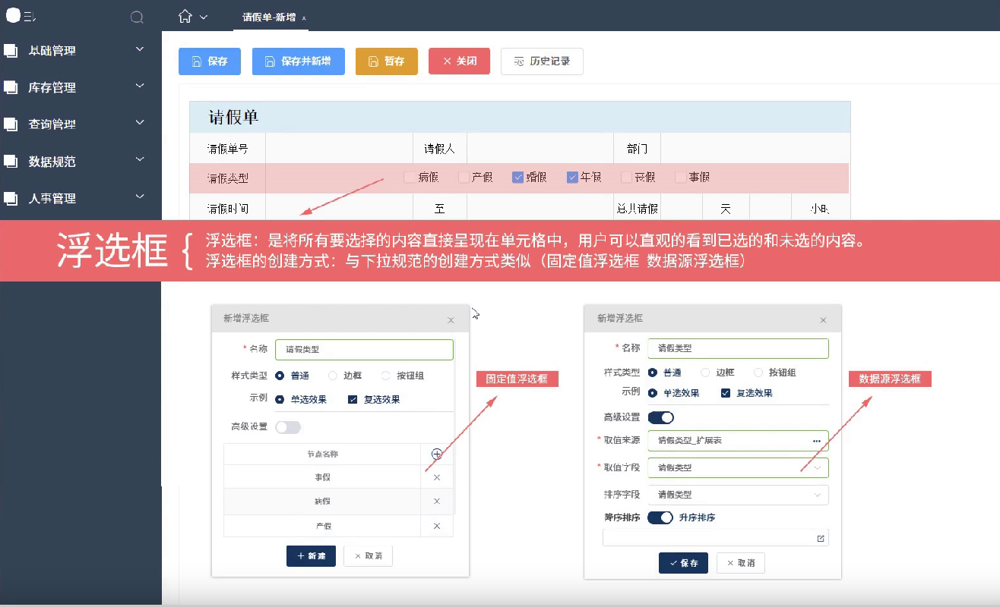​

下面我们来看如何新建固定值浮选框，回到Workfine设计器，在请假单模板中点击数据规范，在浮选框类目中点击新增，输入浮选框的名称→请假类型，在样式类型中给浮选框选择相应的样式，在节点中点击编辑节点名称→事假，点击新增，输入节点名称→病假，再次点击新增添加节点名称，同样的方法，将浮选框中的内容都添加到节点中，点击新建，当浮选框创建完成后，我们找到主表中的请假类型字段，绑定请假类型浮选框，我们还可以在绑定设置中，将默认的单选改成多选，当浮选框绑定完成后，关闭数据规范窗口，保存模板，前往应用端查看，在填写记录时，我们可以在浮选框上单击选择需要的内容。

这里我们演示了固定值复选框的创建方法，非常简单，至于如何制作数据源复选框，这里就不再演示了，希望课后大家去尝试操作，将请假类型制作成数据源浮选框。

### [11、进度条](https://community.bn100.com/video)

进度条，在Workfine中，进度条是0到1之间的小数，结合Excel公式就能展示某项业务的大致进度，进度条的类型有细线、实线和环形三种样式，它的使用方法非常简单，用户可根据需求在需要的样式上直接绑定即可，需要注意的是，在Workfine中，进度条默认是蓝色，如果想打造个性化的进度条，大家可以在绑定设置中对颜色和状态的变化进行设置。

​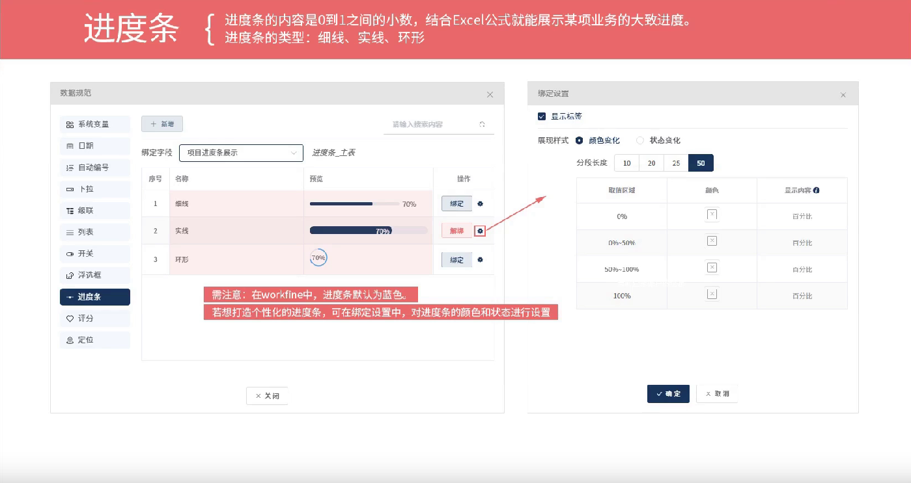​

了解了进度条的基本知识后，下面我们来看具体的操作，回到Workfine设计器，在进度条模板中选中项目进度单元格，可以看到里面的公式是已完成数量除目标数量，在绑定数据规范前，我们还需要注意一个知识点，就是进度条为0到1之间的小数，所以它的数据类型应该为数值型中的小数，选中单元格，在右侧点击绑定数据规范，在进度条类目中找到需要的样式，实现点击绑定，在绑定设置中可以修改颜色和状态的变化，操作方法都很简单，这里就不再演示了，我们保持默认，关闭数据规范窗口，保存模板后前往应用端查看，在填写信息时，我们会发现进度条会随着数据实时变化。这里进度条的样式为默认的蓝色，如果后期大家需要打造个性化的进度条，可以在绑定设置中对进度条的颜色和状态进行设置，因为操作比较简单，这里就不再演示了，希望课后大家多去尝试操作。进度条除了能直观的展示项目的进度外，还能让界面更加丰富美观。

### [12、评分](https://community.bn100.com/video)

在Workfine中，评分是零到五的整数，其中零分是最差，五分为最优，他有星星、笑脸、爱心等多种表现形式，评分的使用方法非常简单，用户可以根据需求在需要的样式上直接绑定即可。需要注意的是，在Workfine中，评分默认的颜色是橙色，并且不带数值显示，如果要修改颜色以及显示数值，我们可以在绑定设置中去设置。

​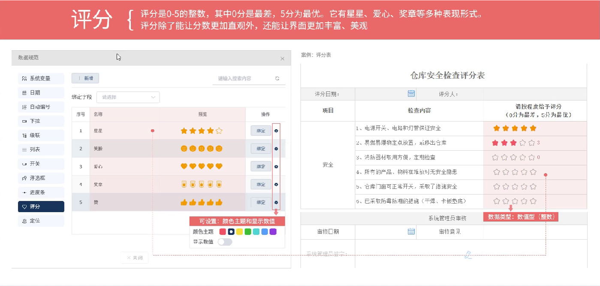​

了解了评分的基本知识后，下面我们来看如何给这个案例添加评分，回到Workfine设计器，在评分表模板中选中这里的单元格，右击→定义主表项，首先去除名称中的特殊符号，其次设置数据类型，因为评分是零到五的整数，所以这里我们统一将数据类型改成数值型中的整数样式，设置完成后保存，然后选中第一个评分项，在右侧点击绑定数据规范，在评分类目中找到新型样式，点击绑定，也可以在绑定设置中将默认的橙色改成红色，并且显示评分的数值，设置完成后，点击确认，关闭数据规范窗口。

保存模板后前往应用端查看，在填写信息时，评分不选的时候默认是零分，我们可以单击星星来评分，评分规范除了能让分数更加直观外，还能让表单的界面更加丰富美观，这里我们只给第一项添加了评分，后面这几项留给大家课后去练习。

### 13、定位

#### [定位—单点定位](https://community.bn100.com/video)

Workfine中的定位绑定的是百度地图，而百度地图呢，是利用经度和纬度组合成坐标系统来标示地球上的位置，这里有一个知识点需要大家注意，就是这里的经度和纬度的值都要求精确到小数点后六位。  
在Workfine中，定位有单点定位和两点测距，在绑定定位的时候，除了对应填充字段外，还有几个选项需要大家注意一下，首先，自动定位就是在应用端填写信息时，表单能自动获取到当前的位置，手动调整定位，就是可以手动调整这个定位点，手动调整地名就是可以手动修改这里自动生成的地名，定位范围就是可以设置离定位点多少米内为有效范围，比如公司设置考勤点时，可以设置在公司附近200米内都是有效范围。

​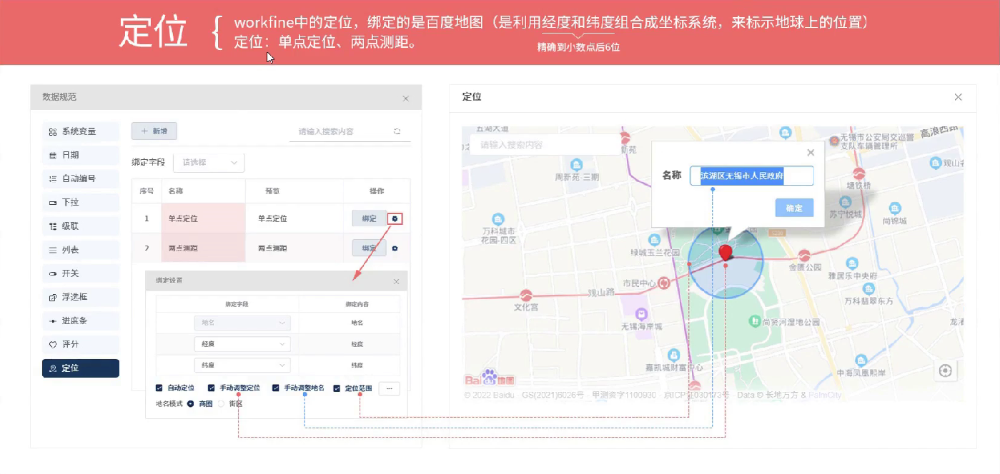​

了解了定位的基本知识后，下面我们来看具体的操作，回到Workfine设计器，在定位模板中，我们先来看单点定位，选中这里的单元格，右击→定义主表项，首先去除名称中的特殊符号，其次将经度纬度设置成数值且带小数位数，设置完成后，点击保存，在数据管理器中找到精度纬度，将数值的小数位数设置为六位，设置完成后，点击保存，选中地名，在右侧绑定数据规范，在定位类目中找到单点定位，点击绑定，在绑定设置中，我们将字段对应填充，精度填充到精度，纬度填充到纬度，勾选自动定位，手动调整定位，手动调整地名，也可以设置定位范围，这里呢，我就不设置了，设置完成后，点击确认，关闭数据规范窗口，保存模板。

前往应用端查看，在我们点击新增时，因为勾选了自动定位，所以这里每次新增信息时，表单都能自动获取到当前的位置，我们也可以在定位上单击，因为勾选了手动调整定位，所以这里我们可以按住左键拖动定位点，同时，我们还勾选了手动调整地名，所以这里我们可以修改地点名称，设置完成后确认，保存，这样就可以把这个位置的精度值和纬度值同时保存下来，这个就是单点定位。

#### [定位—两点测距](https://community.bn100.com/video)

两点测距，回到Workfine设计器，在定位模板中，选中单元格，右击→定义主表项，首先去除名称中的特殊符号，其次来设置数据类型，我们把所有的精度、纬度、公里和驾车耗时设置为数值中的小数样式，设置完成后保存。

打开数据管理器，将所有经度、纬度值的小数点位数都设置为六位，设置完成后，点击保存。  
选中路径名称，在右侧绑定数据规范，在定位类目中找到两点测距绑定，下面我们将字段对应填充，起始经度、起始纬度、起始名称、终点经度、终点纬度、终点名称、路径距离、路径用时，然后勾选手动调整地名，设置完成后，点击确认，关闭数据规范窗口，保存模板后前往应用端查看。

在填写信息时，我们可以在路径名称上点击定位，在百度地图中找到路程的起点，右击设为起点，在路程终点处，右击设为终点，设置完成后，我们根据需求选择驾车的路程和所需时间，保存，这样起点，终点的信息，以及起点到终点的公里数，驾车耗时时间都可以同时保存下来，当然，信息当中的路径名称和起点终点名称可以根据自己的需求去修改，这就是两点测距。

## 04、表间公式

### 1、取数公式

#### [取数公式](https://community.bn100.com/video)

大家好，欢迎来到Workfine数字化课堂，这节课我们来学习取数公式，取数公式是Workfine的核心功能点，它是将数据库中的数据提取到当前表，添加取数公式有四个步骤，虽然步骤有点多，但整个过程非常简单，不需要编写任何的代码，只需要通过鼠标的点击操作就能完成，下面我们结合实例来进一步了解取出公式的应用和添加流程。

上节课，我们给供应商和订单编号都添加了列表，细心的朋友肯定已经发现了，当我们在填写信息时，选择已有的订单编号后，还需要在扩展表中手动录入这个订单中的物品信息，这样的话，录入数据就比较麻烦，其实在实际应用中，我们可以利用取数公式，让扩展表自动填充所选订单中的物品信息，这样可以让数据录入的工作更加快捷方便。

​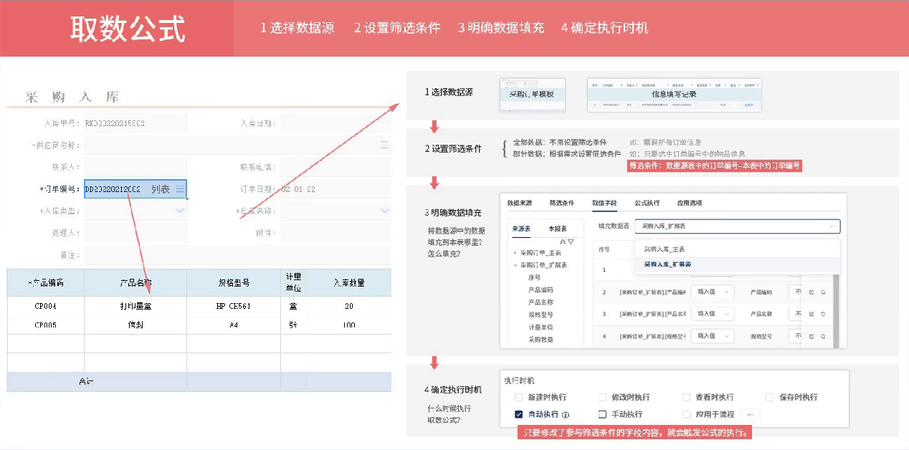​

下面我们来看添加取数公式的流程，添加取数公式的第一步，选择数据源，这个案例中，数据来源是采购订单模板中的填写信息；第二步是根据情况设置筛选条件，这里我们需要的是数据源中的部分数据，是哪一部分数据呢，是列表中选中这个订单编号中的物品信息，所以筛选条件是数据源中的订单编号，等于本表中的订单编号；第三步是明确数据填充，就是要理清楚数据源中的数据要填充到本表的哪里，怎么填充，这里应该明确的是，数据源中的字段应该填充到本表扩展表中的字段；第四步是确定公式的执行时机，模板已经添加了取数公式，那什么时候执行取数公式呢，执行时机有很多，在这里，我们根据需求选择自动执行，什么是自动执行呢，只要修改了参与筛选条件的字段内容，就会触发公式的执行，在这个案例当中，参与筛选条件的字段是订单编号，所以每当订单编号有变化时，就会自动执行取数公式。

了解了取数公式的添加流程后，我们来看具体的操作，回到Workfine设计器，点击上方的表间公式，在取数公式类目中点击新增输入取数公式的名称→提取物品信息，下面开始取数公式流程的第一步，选择数据源，在库存管理模块中选择采购订单，勾选主表和扩展表；第二步，设置筛选条件，鼠标点编辑窗口，点击数据源表中的订单编号，点击等号，然后点击本表中的订单编号；第三步是明确数据的填充，我们要将数据源中扩展表中的字段对应填充的本表扩展表中的字段，选中产品编码、单机产品编码、产品名称、规格、型号、计量单位以及数量；最后一步，确定公式的执行时机为自动执行，设置完成后，点击新建关闭表间公式窗口，保存模板后，前往应用端刷新测试，在填写信息时，因为取数公式的执行时机是自动执行，所以每当筛选条件也就是订单编号，发生变化时，都会自动执行取数公式。

这节课我们主要讲解了取数公式，取数公式虽然操作简单，但是在使用过程中要求设计者有较强的逻辑思维能力，还有，在添加取数公式时，中间的细节点特别多，希望课后大家能够根据实际情况多去尝试操作，这节课就讲解到这里，谢谢大家的观看。

#### [数据来源](https://community.bn100.com/video)

大家好，欢迎来到Workfine数字化课堂，上节课我们讲解了什么是取数公式以及添加取数公式的流程，那这节课我们来学习取数公式中的数据源。

在取数公式中数据源有三种形式，第一种是单表数据源，就是数据源只有一个主表或一个扩展表，这时的数据源比较简单，不需要做关联；第二种，当数据源是同一模板的主表加扩展表时，系统会自动将主表和扩展表关联起来，也不需要我们手动做关联；第三种，当数据源是不同模板的多个表时，就需要我们手动将数据表关联起来，在关联的过程中，我们要着重理解左关联、右关联和内联的意思，这些知识点呢，我们单独做了一个视频，放在数据集成中，视频的名称叫做数据表关联，课后大家一定要去看，这里就不再单独介绍了。

​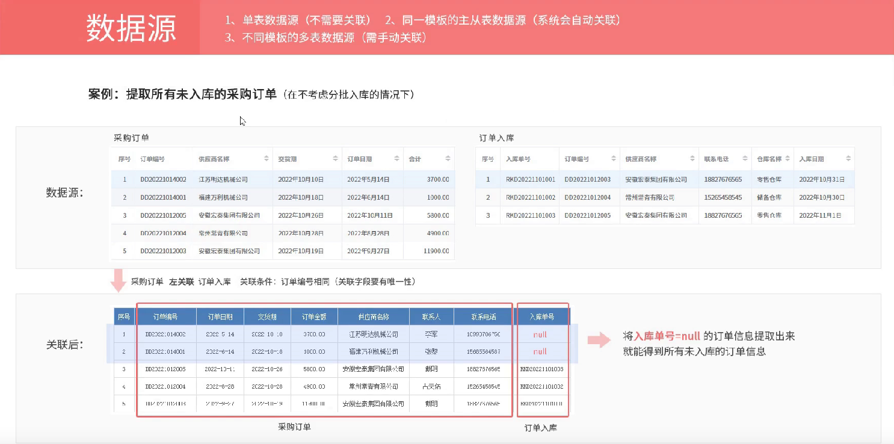​

了解了数据源的形式后，下面我们结合案例来重点讲一下当数据源是不同模板的多个表时，如何设置数据表的关联，我们的案例是在不考虑分批入库的情况下，统计出所有未入库的采购订单。

这时我们的数据源是采购订单和订单入库，是两个不同模板的表，所以呢，需要做数据表关联，我们用采购订单表左关联订单入库表，关联条件是订单编号相同，这里需要注意关联的字段要有唯一性，左关联就是先把左表中的数据拿过来，放在新的数据表中，也就是先把采购订单中的数据拿过来，放在新的数据表，然后根据关联条件，订单编号相同去匹配右表中的内容，匹配上时就把右表中的内容放在新的数据表中，匹配不上时为null值，那最终得到的关联结果就如图所示。然后，我们在关联结果中只需要将入库单号为null值的订单信息提取出来，就能得到所有未入库的采购订单。

了解了思路后，下面我们来看具体的操作，回到Workfine设计器，打开未入库订单统计表，在表间公式中找到取数公式，添加取数公式，方式的名称为未入库订单，添加数据源，在库存管理中，我们选择采购订单主表、采购入库主表，因为是两个不同模板的表，所以我们需要做数据表关联，我们用采购订单主表左关联采购入库表，单击设置，设置关联条件是采购订单中的订单编号等于入库单中的订单编号，筛选条件，这里呢，需要注意，我们是采购入库单中的入库单号等于null值，这里的null值是一个特殊的值，它既不是零值，也不是空值，在取值字段中，填出数据到扩展表，我们只需要将采购订单中的字段对应填充到扩展表即可，点击批量填充，检查一下填充的字段，然后选择订单金额单独填充采购订单中的合计，最后设置公示的执行时机为手动执行，点击新建，关闭表间公式窗口，保存模板后前往应用端测试。找到未入库订单表，点击新增，单击上方的查询按钮，就能查出所有未入库的订单信息。

这节课我们主要讲解了取数公式中的数据源，当数据源是单表数据源或同一模板的主从表数据源时，都不需要我们手动做关联，当数据源是不同模板的多个表时，情况比较特殊，也是最灵活的，需要我们手动设置关联，数据源很重要，希望课后大家可以根据自己的业务需求多加练习，这节课就讲解到这里，谢谢大家的观看。

#### [执行时机](https://community.bn100.com/video)

大家好，欢迎来到Workfine数字化课堂，这节课我们来学习取数公式中的执行时机。通过前面两节课的学习，我们知道取数公式就是将数据提取到当前表中来，但是并没有告诉我们什么时候提取，那这节课我们就来重点介绍取数公式的执行时机，包括新建时执行、手动执行、自动执行，查看、修改、保存时执行以及应用于流程（结合流程审批），那下面我们就结合时机的案例，带大家快速认识这些执行时机。

回到Workfine设计器，打开供应商信息统计表，我们来添加两个取数公式。第一个取数公式用来提取主表中的内容，包括制表人、所属部门和制表日期。第二个取数公式是根据供应商的类型提取扩展表中的信息。

在表间公式中找到取数公式，添加取数公式。第一个取数公式我们命名为提取主表字段内容，来源表为本表，在取值字段中，填充数据表为供应商信息统计表的主表，找到制表人，在右侧点击编辑，在系统变量中找到当前用户姓名；保存后选择所属部门，点击编辑按钮，在系统变量中找到当前用户所在部门；然后选择制表日期，点击编辑按钮，在系统变量中找到当前日期，保存；点击公式执行，将公式的执行时机设置为新建时执行。点击新建。

再次添加取数公式，公式的名称为提取扩展表信息，添加数据源，在基础管理中找到供应商信息表_主表，设置筛选条件，供应商信息表中的供应商类型等于本表中的供应商类型或者本表中的供应商类型等于空；设置完成后，点击取值字段，将数据填充到扩展表，然后将供应商信息表中的字段对应填充到扩展表，也可以在这里（填充数据右下角）点击自动填充；设置完成后，点击公式执行，这里的执行时机我们勾选手动执行和自动执行，设置完成后，点击新建。

在这两个取数公式中，我们用到了三个执行时机，新建时执行、手动执行以及自动执行。

保存模板后前往应用端测试，找到供应商信息统计，点击新增，这时我们就会发现，第一个取数公式中提取的制表人、所属部门以及制表日期已经有了相应的信息，这就是新建时执行，就是在点击新增时就会执行取收公式。

因为提取扩展表信息的执行时机为手动执行，所以我们需要点击上方的查询按钮才会触发公式的执行，当然，这个按钮是系统默认的查询按钮，我们也可以给取数公式绑定新的按钮，具体的方法可以参照按钮事件的视频教程，这里就不再演示了；第二个取数公式还有一个执行时机为自动执行，那什么是自动执行呢，自动执行是参与筛选条件的字段内容发生变化时才会触发公式的执行，那第二个取出公式的筛选条件是什么呢，是供应商类型字段，所以在更改供应商类型时，就能触发公式的执行，这就是自动执行。这里有一点需要强调，就是在自动执行时，如果是通过Excel公式导致筛选条件的字段值发生变化，则不会触发公式的执行。

认识了新建制执行、手动执行以及自动执行后，我们将供应商类型切换为优选供应商，然后将数据保存，在历史记录界面中，我们可以看到保存的记录。下面我们在供应商信息表中找到一个优选供应商，修改供应商的类型，比如合格供应商，那保存后这个供应商就不是优选供应商了。再次回到刚才的记录中，不管是点击查看还是点击修改，我们会发现这里的数据还是修改前的数据，那怎么在查看修改时提取到最新的数据呢，很简单，我们只需要将取数公式的执行时机都选上，查看时、修改时、保存时执行，保存模板后，前往应用端刷新测试，这样再次回到历史记录界面中，不管点击查看编辑还是保存，我们会发现刚才修改的那个供应商已经不在这里显示了，这样才能保证提取过来的数据是实时最新的数据。

最后一个执行时机是应用于流程，这个需要结合流程审批的知识点。那现在我们来假设一个业务需求，就是由系统管理员筛选出优选型供应商名单，提交给部门主管，然后由部门主管在名单中来确定合作的供应商。

那现在模板已经有了，我们怎么将取出公式的执行时机应用于流程呢，首先进入流程审批界面，添加流程，名称为供应商推荐名单，然后将起始任务、结束任务拖到画布当中，添加连接线，选中起始任务，绑定模板→选择刚才的供应商信息统计表，发起权限→添加系统管理员；然后选中结束任务，办理对象设置为指定角色，添加主管，设置完成后，保存流程。

当流程制作完成后，回到模板设计界面，在表间公式中找到刚才的取数公式，这里有两个取数公式，我们选中第二个取数公式，点击编辑，在公式执行中，我们将执行时机应用于流程，选中刚才添加的流程，选择起始任务，那在结束节点上就不会起作用，保存，同时勾选新建时执行和自动执行，设置完成后保存，保存模板。

前往应用端测试，使用系统管理员的账号登录，发起流程选择供应商推荐名单，这时我们会发现第二个取数公式可以正常执行，发起。退出账号，使用主管的账户登录，在流程管理界面中，找到刚才的流程，点击办理，这时我们会发现，在结束节点上修改供应商类型后，取数公式就不会再执行了，因为取数公式的执行时机绑定在了流程的起点，就只能在起点使用。

通过刚才的案例演示，我们主要讲解了取数公式的各种执行时机，希望通过这节课的学习，大家在以后的工作中能够根据实际的业务需求，给取数公式选择合适的执行时机。这节课就讲解到这里，谢谢大家的观看。

#### [执行条件](https://community.bn100.com/video)

大家好，欢迎来到Workfine数字化课堂，这节课我们来学习取数公式中的执行条件。当我们给取数公式设置了执行条件后，只有先满足执行条件，才能按筛选条件进行数据提取，如果执行条件不成立，那取数公式就不会执行。

下面我们来看具体的操作，回到Workfine设计器，打开供应商信息统计表，我们来添加一个取数公式，用来提取扩展表中的信息。根据表间公式，在取数公式中添加一个取数公式→提取扩展表信息；数据来源→在基础管理中选择供应商信息表主表；筛选条件→来源表中的供应商类型等于本表_主表中的供应商类型；在取值字段中，我们将数据填充到扩展表，自动填充，然后选中没有填充的字段，手动填充；最后我们来设置公式执行，我们将执行时机设置为手动执行，这里是执行条件，为了对比效果，我们先不设置执行条件，新建取数公式，关闭窗口，保存模板。

前往应用端测试，在应用端测试时，找到刚才的模板，点击新增，我们来测试一下效果，当供应商类型为空时，点击查询按钮，会查出供应商类型为空的所有供应商信息，当供应商类型不为空时，可以根据所选的供应商类型查询相应的供应商信息。

下面我们回到设计器，找到刚才的取数公式，点击编辑按钮，在公式执行中给取数公式添加一个执行条件→本表供应商类型字段不为空，设置完成后，点击保存关闭窗口保存模板，前往应用端测试。当供应商类型为空时，就不满足执行条件，取数公式就不会执行，所以这时点击查询按钮，会有提示→未取得任何数据；当供应商类型不为空时，满足了执行条件，取数公式才能正常执行，这就是取数公式的执行条件。

记住，只有先满足了执行条件，才能按筛选条件进行数据提取，如果执行条件不成立，那取数公式就不会执行，这节课就讲解到这里，谢谢大家的观看。

#### 筛选条件

##### [筛选条件：书写规范](https://community.bn100.com/video)

大家好，欢迎来到Workfine数字化课堂，这节课我们来学习筛选条件以及筛选条件的书写规范。筛选条件是为了在取数公式中对数据源进行筛选，从而得到更加精确的数据，所以筛选条件很重要，能帮助我们实现业务上的筛选。

在写筛选条件前，我们需要提前认识一下表间公式中的逻辑运算符。比如加减乘除，大于、大于等于、小于、小于等于、等于和不等于，这些都是我们小时候学过的，非常简单；这是单引号，如果遇到文本固定值，我们需要用单引号引起来；并且、或者，对于经常使用Excel的朋友应该非常熟悉，并且是要求左右两边的表达式必须同时成立，如果左右两个表达式中有任何一个不成立，那整个判定条件都不成立，或者是要求左右两边的表达式中至少有一个成立，如果左右两个表达式都不成立，那整个判定条件也不成立；最后是小括号，代表优先级，在写筛选条件时，需要优先判定的条件可以用小括号括起来。

认识了表间公式的逻辑运算符后，我们再来看筛选条件的书写规范，来源表字段等于本表字段，我们建议大家在写筛选条件时，左边放来源表字段，右边放本表字段，这样，当筛选条件比较多时，更能方便我们排查，找出错误点。

在写筛选条件时，还有一种情况需要我们特别注意，就是固定值条件的筛选，对于固定值的写法，Workfine有自己的要求，空值用单引号替代，固定文本、固定日期需要用单引号引起来，如果是数值可以直接写，不用加引号。

了解了这些基础的知识后，下面我们来看具体的案例，回到Workfine设计器，我们根据这里的要求来给模板添加取数公式。第一个要求是根据供应商名称字段提取对应的采购订单，单击表间公式，在取数公式中添加取数公式→提取采购订单信息；来源表选择库存管理中的采购订单_主表；在取值字段中，我们将采购订单中的字段对应填充到本表_扩展表，点击这里（填充数据右下角）的自动填充。然后选择订单金额→填充合计；点击公式执行，勾选执行时机为手动执行；最后我们来设置筛选条件，在筛选条件界面中，左边是来源表，右边是本表，这里是表间公式的运算符，在写筛选条件时，我们尽量养成一个良好的书写规范，就是左边放来源表字段，右边放本表字段，那这里的筛选条件就是来源表的供应商名称等于本表的供应商名称，在输入逻辑运算符时需要注意，如果是手动输入，一定要在英文的输入法下输入运算符，设置完成后，点击新建，保存模板，前往应用端测试。单击供应商名称，在下拉中选择相应的供应商，因为公式的执行时机是手动执行，所以需要单击查询按钮才能触发公示的执行，这样就可以根据供应商的名称来查询相关的采购订单。

第二个要求是利用固定值查找，查出订单金额大于3000的集中采购订单。找到刚才的取数公式，点击编辑按钮，我们来修改这里的筛选条件，这里有两个要求，第一个要求是订单中的金额大于3000，第二个要求是采购类型是集中采购，因为这两个条件必须同时满足，所以我们用并且来连接左右两个表达式，同时，这里用到了固定值查找数值可以直接写，但是文本必须要用单引号引起来，设置完成后，点击保存，保存模板，前往应用端测试。当我们点击查询按钮时，就可以看到这里的每一条信息都满足了两个条件，订单金额大于3000，并且都是集中采购。

第三个要求，查出订单金额大于3000的集中采购订单或所有的间接采购订单，那这里的筛选条件应该怎么写呢，我们给这个条件加一个小括号，或者，采购类型是间接采购，这里加了小括号，就改变了优先的顺序，括号内的逻辑会作为一个整体优先判断，然后再与括号外的条件做第二次判断，设置完成后，点击保存，保存模板，前往应用端测试。当我们点击查询按钮触发取数公式后，我们可以看到筛选出来的订单要么是订单金额大于3000的集中采订单，要么是间接采购订单。

这节课我们主要学习了筛选条件以及筛选条件的书写规范，希望课后大家多去思考，多去尝试操作，这节课就讲解到这里，谢谢大家的观看。

##### [筛选条件：精确查询条件](https://community.bn100.com/video)

大家好，欢迎来到Workfine数字化课堂，这节课我们来学习筛选条件中的精确查询，精确查询主要应用于业务表单的流转上。

|精确查询|正确写法|错误写法|
| ----------| ------------------------------------------------------------------------------------------------------------| -----------------------|
|单表字段|来源表.字段=本表.字段 并且 本表.字段 != ''|来源表.字段=本表.字段|
|多表字段|(来源表.字段A=本表.字段A 并且 本表.字段A != '') <br />并且 <br />(来源表.字段B=本表.字段B 并且 本表.字段B != '')<br />||

我们先来看在精确查询时，单表字段的书写范式，来源表.字段等于本表.字段 并且 本表.字段不为空，这里的并且是要求左右两边的表达式必须同时成立，如果左右两个表达式中有任何一个不成立，那整个判定条件都不成立。可能会有很多朋友疑惑，为什么不能直接写成来源表字段等于本表字段呢，那下面我们就结合实际的案例来看一下，比如，在采购订单统计模板中，我们想根据这里的主表字段来精确查找采购订单，单击表间公式，在取数公式中添加取数公式→精确查找；添加数据源，在库存管理中找到采购订单，勾选主表；在取值字段中，我们将采购订单中的字段对应填充到本表_扩展表；公式的执行时机勾选手动执行；最后我们来设置筛选条件，这是单表字段的精确查询，我们先将筛选条件设置为，来源表中的采购类型等于本表_主表中的采购类型，我们先来看为什么不能直接这样写，点击新建，关闭表间公式窗口，保存模板，前往应用端测试。当我们单击采购类型，在下拉中选择相应的类型后，点击上方的查询按钮，就可以查到相应的订单，但是当我们不选，也就是采购类型为空时，点击查询按钮，它会查出采购类型为空的记录，这时我们会发现，没有选择采购类型的订单都会被提取过来，这不是精确查找想要的结果。所以回到模板当中，找到刚才的取数公式，点击编辑，我们来修改这里的筛选条件，我们在采购类型后面添加，并且本表_主表中的采购类型字段不为空，就是本表的采购类型字段不能为空值，保存后，保存模板。在测试时需要注意，参与精确查询的字段是采购类型，所以当采购类型为空值时，点击查询按钮提示未取得任何数据，只有选择了相应的采购类型，点击查询按钮才能查出相应的订单，比如这里可以查出所有类型是集中采购的订单，也可以查出所有类型是分散采购的订单，这就是单个表字段的精确查询。

下面我们再来看多表字段的精确查询范式，当有多个表字段时，我们需要用小括号将单个表字段括起来，然后用并且进行连接，这样就能实现多表字段的精确查询。比如，在这个案例中，如果我们想按照主表中的采购类型、发票类型字段来精确查找采购订单，那该如何设置筛选条件呢，在表间公式中找到刚才的取数公式，点击编辑，我们来修改这里的筛选条件，这是两个表字段之间的精确查找，按照书写范式，我们先将第一个表字段用小括号括起来，然后书写第二个表字段，来源表中的发票类型等于本表主表中的发票类型并且本表主表中的发票类型不为空，最后将两个表字段用并且进行连接，设置完成后，点击保存，保存模板。在精确查询时需要注意，这里参与精确查询的字段是采购类型和发票类型，这两个当中只要有一个为空值，都无法查询到采购订单，只有选择了采购类型和发票类型后，点击查询按钮才能查出相应的订单信息，比如这里就可以查出采购类型是集中采购，并且发票类型是普通发票的采购订单，这是两个表字段之间的精确查询。

当然我们可以根据这个范式继续往上套，来实现三个表字段甚至更多个表字段之间的精确查找，这里呢，就不再演示了，留给课后大家去练习。

这节课我们主要讲解了精确查询，首先讲的是在精确查询时单表字段的书写范式，来源表.字段等于本表.字段并且本表.字段不为空，当有多个表字段时，我们需要用小括号将单个表字段括起来，然后用并且进行连接，就能实现多个表字段之间的精确查询。这节课就讲解到这里，谢谢大家的观看。

##### [筛选条件：模糊查询条件](https://community.bn100.com/video)

大家好，欢迎来到Workfine数字化课堂，这节课我们来学习筛选条件中的模糊查询。

|模糊查询|正确写法|错误写法|
| ----------| ------------------------------------------------------------------------------------------------------------| -----------------------|
|单表字段|来源表.字段=本表.字段 或者 本表.字段 != ''|来源表.字段=本表.字段|
|多表字段|(来源表.字段A=本表.字段A 或者 本表.字段A != '') <br />并且 <br />(来源表.字段B=本表.字段B 或者 本表.字段B != '')<br />||

我们先来看在模糊查询时，单表字段的书写范式，来源表.字段等于本表.字段 或者 本表.字段等于空，这里的或者是什么呢，是左右两边的表达式中，只要有一个表达式成立，那整个判定条件就成立。可能会有很多朋友疑惑，模糊查询，为什么不能直接写成来源表字段等于本表字段呢，因为在模糊查询时，如果输入了字段的内容，我们就按照字段的内容去查询，如果没有输入字段的内容，就会查出所有的记录，所以这里本表字段等于空值，就是对整个表字段的内容进行一个匹配，那下面我们就结合实际的案例来看一下。

在采购订单统计模板中，我们想根据这里的主表字段来模糊查找采购订单，点击表间公式，这是上节课的精确查找，我们将公式停用，然后新增取数公式，公式的名称为模糊查询；添加数据源，在库存管理中选择采购订单，勾选主表；在取值字段中，将来源表中的字段对应填充到本表_扩展表；公式执行勾选手动执行；最后我们来设置筛选条件，单表字段的书写范式是，来源表中的字段采购类型等于本表_主表中的采购类型 或者 本表_主表中的采购类型等于空，设置完成后，点击新建，保存模板，前往应用端测试。在测试时需要注意参与模糊查询的字段是采购类型，所以当采购类型为空值时，点击查询按钮可以查出所有的采购订单，当选择相应的采购类型后，比如集中采购，点击查询就可以查出所有集中采购的采购订单，这就是单表字段的模糊查询。

下面我们来看多表字段的模糊查询，在模糊查询时，如果有多个表字段，我们需要用小括号将单个表字段括起来，然后用并且进行连接，这样就能实现多个表字段之间的模糊查询。比如在这个案例中，如果我们想按主表中的采购类型和发票类型字段来模糊查找所有的采购订单，那该如何设置筛选条件呢，在表间公式中找到刚才的取数公式，点击编辑按钮，我们来修改这里的筛选条件，这是两个表字段之间的模糊查询，我们先将第一个表字段用小括号括起来，然后按照范式来书写第二个表字段，来源表中的发票类型等于本表_主表中的发票类型或者本表_主表中的发票类型等于空，两个表字段之间用并且进行连接，设置完成后点击保存，保存模板。在测试时需要注意，参与模糊查询的字段是采购类型和发票类型，当这两个字段都为空时，点击查询按钮会查出所有的采购订单，当输入任何一个查询字段内容都可以进行查询，比如采购类型为分散采购，点击查询按钮，就可以查出所有分散采购的采购订单，如果选择普通发票，点击查询按钮，就可以查出所有普通发票的采购订单，也可以同时输入采购类型和发票类型，点击查询按钮，这时就可以查出采购类型是分散采购，并且发票类型是普通发票的所有采购订单，这是两个表字段之间的模糊查询。

当然，我们根据这个范式往上套，就可以实现三个甚至更多个表字段之间的模糊查询，这里呢，就不再演示了，留给课后大家去练习。

这节课我们主要讲解了模糊查询，首先讲解的是在模糊查询时，单表字段的书写范式是来源表.字段等于本表.字段或者本表.字段等于空，这里的空值是对整个表字段的内容进行一个匹配，如果我们要对多个表字段进行模糊查询，那每个表字段都要用小括号括起来，然后用并且进行连接，就能实现多个表字段之间的模糊查询，这节课就讲解到这里，谢谢大家的观看。

##### [筛选条件：形如判断](https://community.bn100.com/video)

大家好，欢迎来到Workfine数字化课堂，这节课我们来学习筛选条件中的形如，也就是模糊匹配。

首先我们来认识一下形容的运算符（形如'%'++‘%’），在Workfine中，形容的运算符是以形如两个字开始，后面是单引号括起来的百分号，中间是两个加号，最后以单引号括起来的百分号结束，这就是形容的运算符，虽然看上去有点复杂，但是用起来还是比较简单的。我们来看一下形容的书写范式是 来源表.字段形如'%'+本表.字段+‘%’，这里有两点需要注意，第一点是本表.字段一定是放在形容运算符的两个加号中间，第二点一定是用来源表字段去形容本表字段，也就是用长字符串形容短字符串。

了解了形如的运算符和书写规范后，下面我们就结合实际的案例来看一下，在采购订单统计模板中，如果我们想在主表中的供应商名称字段中通过输入简短的名字来凝匹配相关的采购订单，那该如何设置筛选条件呢，单击表间公式，添加取数公式，公式的名称为形如；添加数据源，在库存管理中选择采购订单_主表；在取值字段中，我们将来源表中的字段对应填充到本表_扩展表；公式执行勾选手动执行；最后我们来设置筛选条件，根据形如的书写规范，我们要用来源表字段去形如本表字段，所以先找到来源表中的供应商名称字段，单击形如，本表字段要放在形容运算符的两个+号中间，设置完成后，点击新建，关闭表间公式窗口，保存模板，前往应用端测试。

在测试时需要注意参与模糊匹配的字段是供应商名称，所以当我们在这里输入供应商名称中的几个字时，比如明达，点击查询按钮，就能查出供应商名称中包含明达的所有订单信息；比如，输入安徽，点击查询，就可以查出供应商名称中包含安徽的所有采购订单。这就是形如，也是模糊匹配查询。

这节课我们主要讲解了形如，重点介绍了形如的书写规范，适用来源表字段形如本表字段，最后，还有一点需要注意，就是形如只能针对字符型，如果是数值型，就需要用单引号括起来转化成字符型，比如，我们要通过形如来查询身高是165的人员信息，那在写筛选条件时，这里的固定数值165就需要加上单引号，这个我们就不演示了，留给大家课后去练习。这节课就讲解到这里，谢谢大家的观看。

##### [筛选条件：日期间隔判断](https://community.bn100.com/video)

大家好，欢迎来到Workfine数字化课堂，这节课我们来学习筛选条件中的日期间隔判断。

在Workfine中，不管日期以什么样的格式显示，实际保存在系统中的时间都是年、月、日、时、分、秒，也正是因为系统中记录的时间都精确到了秒，所以在Workfine中用来源表的日期字段等于本表的日期字段作为日期相等的判断是错误的，哪怕是同一天，他也是不相等的。

所以这节课我们来讲一个高级函数，就是日期间隔函数，日期间隔(datepart,[开始日期],[结束日期])，这个函数中有三个参数，第一个参数是日期部分，第二个参数是开始日期，第三个参数是结束日期，这个函数的功能就是用这里的结束日期减去开始日期，然后根据日期部分，得出两个日期的间隔值，比如，当函数中的日期部分为yy时，是计算这两个日期间隔的年值，因为开始日期和结束日期都是2022年，所以这两个日期年的间隔为零，当函数中的日期部分为mm时，是计算这两个日期相差的值，这两个日期都是2022年的8月，所以这两个日期月的间隔为零，当函数中的日期部分为DD时，是计算这两个日期相差的天数，因为这两个日期都是2022年的8月1日，所以天的间隔为零，日期间隔函数在很多的业务场景中都能用到，比如日期间隔相等的判断和日期间隔范围的判断。

那下面我们就结合实际的案例来看一下，在采购订单统计模板中选中日期、开始日期、结束日期，右击→定义主表项，数据类型统一为日期年月日格式，保存后选中日期绑定数据规范，在日期类目中绑定年月日格式；然后选中开始日期，绑定年月日格式，在绑定设置中开启区间选择，开始时间选择开始日期，结束时间选择结束日期。

下面我们来实现日期间隔相等的判断，就是当我们在主表的日期字段中输入日期后，可以查询订单期是同一天的采购订单，单击表间公式，添加取数公式，公式的名称为日期间隔相等判断；添加数据源，在库存管理中选择采购订单_主表；在取值字段中将来源表字段填充到本表_扩展表；公式执行勾选手动执行，；最后我们来设置筛选条件，在做日期相等的判断时，不能直接用来源表的日期字段等于本表的日期字段，这是错误的写法，我们会查不到任何的数据，在函数中找到日期时间函数日期间隔，因为要判断同一天，所以日期部分我们修改为dd，然后用来源表的日期字段替换函数中的开始日期，用本表中的日期字段替换函数中的结束日期，当两个日期天的间隔为零时，就是同一天，设置完成后，点击新建，保存模板。在测试时，单击日期，选择一个日期之后点击查询，就能查出订单日期是这一天的采购订单，这就是日期相等的判断，当然，我们也可以根据需求来查询同一年、同一个月和同一个季度的采购订单，这个就留给大家课后去练习。

下面我们就来实现日期间隔范围的判断，就是当我们在主表的开始日期和结束日期两个字段中输入日期后，就可以查询订单日期是这个范围内的采购订单，也就是说来源表中的订单日期要大于等于这里的开始日期，并且小于等于这里的结束日期。理清了思路后，我们来添加取数公式，我们将刚才的取数公式复制一份，然后将取数公式停用，选中复制出来的公式之后，点击编辑修改，公式的名称修改为日期间隔范围判断；然后来修改这里的筛选条件，这里有两个判断条件，第一个判断条件是来源表中的订单日期要大于等于本表的开始日期，在这个日期间隔函数中，日期部分为dd，不用修改，我们将函数的结束日期修改为本表的开始日期，两个日期间隔的天数应该是小于等于零，然后将它复制一份，我们来写第二个筛选条件，就是来源表中的订单日期要大于等于本表的结束日期，我们将函数中的结束日期替换为本表的结束日期，两个日期相隔的天数应该是大于等于零，两个表达式中间用并且连接，设置完成后保存，保存模板。在测试时单击开始日期，选择开始和结束日期后，点击查询按钮，就能查出订单日期在这个日期范围内的采购订单，这就是日期间隔范围的判断。

这节课我们主要讲解了日期间隔判断，包括日期间隔相等的判断和日期间隔范围的判断，希望课后大家可以根据自己的业务需求多加练习，这节课就讲解到这里，谢谢大家的观看。

#### 填充

##### [填充：明细填充](https://community.bn100.com/video)

大家好，欢迎来到Workfine数字化课堂，这节课我们来学习取数公式中的数据填充。通过之前的学习，我们知道取数公式的目的是将数据提取到当前操作的表单上，并以合适的形式展示出来，那在填充时不仅能将数据按原有的形式显示，还能对数据做各种形式的转化后再填充。这节课我们重点来介绍明细填充，明细填充只需要将来源表中的字段按原有的形式对应填充到当前表的字段上即可，原理非常简单。

那下面我们来看具体的案例，在采购订单查询表中，我们想按主表中的供应商名称字段来模糊查询采购订单，并将订单信息按供应商中的订单金额降序排列在扩展表。那下面我们就来添加取数公式，单击表间公式，添加取数公式，名称为明细填充；选择数据源，在库存管理中选择采购订单_主表；筛选条件，根据模糊查询书写的范式，我们来设置筛选条件，来源表中的供应商名称字段等于本表_主表中的供应商名称字段 或者 本表_主表中的供应商名称字段等于空；公式执行勾选手动执行；最后我们来设置取值字段，在填充界面中，左边是来源表以及来源表中的字段，右边是本表以及本表中的字段，在这里，我们可以选择将数据填充到本表的主表还是填充到本表的扩展表，根据需求，这里选择扩展表，在填充时，我们可以点击这个按钮来自动填充，单击后Workfine会根据来源表和本表的字段名称进行自动填充，填充后，我们需要检查填充的结果是否正确，不需要的填充，可以单击这个按钮（最右侧的按钮）来清除填充，清除，对于填充错的字段以及没有填充的字段，我们可以选中字段后进行手动填充，选中金额，找到来源表中的合计字段，单击就可以填充。

在填充时需要注意，当我们把鼠标放在来源表的字段上时，可以看到这个字段的数据类型，所以大家要注意对应填充的两个字段，数据类型必须要统一，否则会出错。

当填充设置完成后，我们还可以根据需求给填充的数据进行排序，这里要求按供应商的订单金额降序排列，那我们先按照供应商的名称降序排列，然后再按照订单的金额降序排列，当有多个字段需要排序时，谁在上方谁的优先级就越高，所以我们将供应商名称字段移动到金额的上方，设置完成后，点击新建，保存模板，前往应用端测试。在测试时，因为是模糊查询，所以当供应商名称为空时，点击查询按钮可以查出所有的采购订单，那这时我们会发现采购订单中的数据就一一对应填充到了扩展表中，并且这些数据是先按供应商名称降序排列，然后再按订单金额降序排列，当我们选择供应商时，点击查询按钮，就能查出这个供应商所有的采购订单，这就是明细填充。

这节课我们主要讲解了数据填充中的明细填充，明细填充很简单，只需要将来源表中的字段按原有的形式对应填充到当前表的字段上即可。在明细填充时，有两点需要注意，第一点是对应填充的两个字段数据类型必须要统一，否则会出错，如果字段的数据类型不统一，大家可以在数据管理器中去修改；第二点是填充排序时，当有多个字段参与排序时，谁在上面谁的优先级就越高。这节课就讲解到这里，谢谢大家的观看。

##### [填充：聚合填充](https://community.bn100.com/video)

大家好，欢迎来到Workfine数字化课堂，上节课我们学习了明细填充，这节课我们来学习聚合填充。在Workfine的统计函数中，提供了合计、平均值、计数、排除重复的计数以及最大值、最小值等函数，我们只需要在填充时对相应的字段做合计处理，就能轻松实现数据各种维度的汇总，在业务系统中，我们经常需要对数据做各种维度的汇总。

那下面我们就结合实例来看一下，在采购订单查询表中，结合上节课的案例，当我们在提取采购订单时，还想对订单的金额进行汇总，对订单的数量进行计数，以及统计出订单中最大和最小的金额，那应该怎么操作呢。

单击表间公式，找到上节课的取数公式，复制公式，选中复制出来的取数公式，点击编辑，修改公式的名称为聚合填充；在取值字段中，我们将数据填充到当前表的主表，找到金额合计，点击编辑按钮，在函数中找到统计函数合计，将合计函数中的字段选中后替换成来源表中的合计字段，就是对订单金额做合计处理。

保存后找到订单数，点击编辑按钮，在统计函数中，找到计数，将函数中的字段选中，替换成来源表中的订单编号，就是对订单的编号做计数处理。

找到订单最大金额，点击编辑按钮，点击函数，在统计函数中找到对应的最大值，将函数中的字段名选中后，替换成来源表中的合计字段，就是统计出订单金额中的最大值。最小值这里呢，我就不做了，留给大家课后去练习，设置完成后，点击保存。

这时我们会发现这里有两个取数公式，第一个取数公式是将数据填充到扩展表，第二个取数公式是将数据填充到主表，当模板中有多个取数公式时，会按照执行时机从上到下执行，这两个取售公式的执行时机都是手动执行，所以在应用端点击查询按钮后，会依次执行这两个取数公式，保存模板，前往应用端测试，在测试时点击上方的查询按钮，就能看到第一个取数公式，将订单中的数据对应填充到了扩展表，第二个取数公式是将订单中的数据进行各种维度的汇总后填充到了主表，总金额，这就是聚合填充。

这节课我们主要讲解了数据填充中的聚合填充，非常简单，只需要在填充时对相应的字段做合计处理，就能轻松实现数据各种维度的汇总。这节课就讲解到这里，谢谢大家的观看。

##### [填充：条件填充](https://community.bn100.com/video)

大家好，欢迎来到Workfine数字化课堂，这节课我们来学习条件填充。

条件填充是指可以根据不同的条件填充不同的信息，这就涉及到了数据库中的case when用法，我们先来看一下case when语句，对于没有数据库基础的朋友，可以参照这个翻译，case就是我要开始写条件了，when就是如果，then就是显示，end表示设置完成。

```sql
case
when 库存数量<30 then '库存紧张'
when 库存数量>3000 then '库存溢出'
else '库存正常'
end
```

比如在这个案例中，整个的意思就是我要开始写条件了，如果库存数量小于30，就显示库存紧张；如果库存数量大于3000，就显示库存溢出；否则显示库存正常，设置完成。

```sql
计数(
case
when 性别='男' then 学院信息表.编号
end)
```

再比如，在这个案例中，我们先来看case的意思，我要开始写条件了，当性别等于男时，显示学员的编号，设置完成，外面有个计数函数，就是统计男同学的人数。这里需要注意的是，统计函数应该放在case when语句的外面，这个顺序不能错。

了解了case when语句后，下面我们来看具体的案例。在订单查询模板中，如果在提取采购订单的同时，需要给每个订单做一个入库情况的说明，已入库的订单备注已入库，未入库的订单备注未入库，那该如何实现呢。下面我们来看具体的操作，单击表间公式，将之前的取数公式停用，添加新的取数公式，名称为条件填充·入库说明；数据源在库存管理中选择采购订单_主表、采购入库_主表，这是两个不同模板的表，所以需要做数据表关联，我们用采购订单_主表左关联采购入库_主表，单击设置，添加关联条件，采购订单中的订单编号等于入库单中的订单编号；筛选条件，来源表中的供应商名称等于本表_主表中的供应商名称或者本表_主表中的供应商名称等于空；公式执行勾选手动执行；最后我们来设置取值字段，将数据填充到当前表的扩展表，手动填充扩展表中的字段，选中金额，选中采购订单中的合计，订单编号、供应商名称，订单日期，找到入库情况，点击编辑，有的订单已入库，有的订单未入库，我们要用语句来实现，当数据表关联结果中的入库单号等于null值，就显示订单未入库，否则显示订单已入库，最后设置完成，保存，点击验证，点击新建，关闭表间公式窗口，保存模板后前往应用端测试。在应用端测试时，点击上方的查询按钮，就能看到每一条采购订单的入库情况。

```sql
case
when [采购入库_主表].[入库单号]=null then '订单未入库'
else '订单已入库'
end
```

下面我们再来实现一个功能，就是针对提取出来的数据，我们在主表中分别统计出已入库和未入库的订单数量。在订单查询模板中单击表间公式，复制刚才的取数公式，点击编辑，公式的名称为条件填充订单统计；来源表就是当前表；筛选条件为空；执行时机勾选手动执行；最后我们来设置取值字段，将数据填充到当前表的主表中，找到已入库订单数量，点击编辑按钮，这里要统计扩展表中已入库订单的数量，在计数函数中添加case when语句，当本表_扩展表中的入库情况等于订单已入库，那就显示扩展表中的订单编号，最后设置完成。这里是先用case when找出已入库订单的订单编号，然后再对这些订单编号计数，这个顺序不能错，计数要放在case when的外面。

```sql
计数(
case when 本报表.[数据填充_扩展表].[入库情况]='订单已入库' then 本报表.[数据填充_扩展表].[订单编号]
end)
```

将它复制一份保存，找到未入库订单，点击编辑按钮，粘贴，将这里改成订单未入库，保存，保存取数公式，保存模板。

```sql
计数(
case when 本报表.[数据填充_扩展表].[入库情况]='订单未入库' then 本报表.[数据填充_扩展表].[订单编号]
end)
```

在测试时，点击上方的查询按钮，就可以看到第一个取数公式是将符合条件的订单提取到扩展表，然后第二个取数公式是将扩展表中的订单按照入库情况分别统计到主表中的已入库订单数量和未入库订单数量，这就是条件填充，根据不同的条件填充不同的信息。

这节课我们主要讲解了条件填充，用到了case when语句，通过不同的条件做出判断，从而满足填充实时的动态值。需要注意的是，如果要跟统计函数结合使用，统计函数一定要放在case when语句的外面，这节课就讲解到这里，谢谢大家的观看。

##### [填充：文本字段组合填充](https://community.bn100.com/video)

大家好，欢迎来到Workfine数字化课堂，这节课我们来学习数据填充中的文本字段组合填充。

首先来看一下组合规范，文本字段与文本字段之间直接用+号连接，固定值内容需要用单引号引起来，日期型字段需要用日期转字符函数转化成文本字段，数值型字段要用数值转字符函数转换成文本字段，最终我们得到的表达式就是：文本字段+'文本固定值'+日期转字符(日期字段)+数字转字符(数值字段)，~~文本字段直接用+号连接，固定值内容需要用单引号引起来，日期型字段和数值型字段需要用类型转换函数转换成文本字段~~。

那这里提到的类型转换函数是什么呢，类型转换函数是指当来源字段与被填充字段两个字段类型不一致时，需要将来源字段做一定的转换，使其以合适的形式和相同的类型填充到当前表的字段中。当然，Workfine也提供了相关的类型转换函数，像数值转字符函数、日期转字符函数以及字符转日期型函数等等，这些函数的用法都非常简单。

了解了这些基础知识后，下面我们来看具体的案例，打开之前的订单查询模板，如果我们在提取采购订单时，给每条数据都添加一个备注，记录形式是订单编号、订单金额、订单日期，这里需要注意的是，这里的备注是文本型字段，现在需要填充过来的有固定值文本，有文本型字段、数值型字段、日期型字段中的内容，那该如何设置这里的填充呢。

下面我们就来看具体的操作，单击表间公式，将之前的取数公式停用，然后新增取数公式→文本字段组合填充；添加数据源，在库存管理中找到采购订单_主表；筛选条件→来源表中的供应商名称等于本表_主表中的供应商名称 或者 本表_主表中的供应商名称等于空；公式执行勾选手动执行；最后我们来设置取值字段，将数据填充到当前表格扩展表，手动填充相应的字段，然后找到备注，点击编辑，  
​`'订单编号：'+[采购订单_主表].[订单编号]+'，订单金额：'+数值转字符([采购订单_主表].[合计] AS VARCHAR)+'订单日期：'+日期转字符(VARCHAR,[采购订单_主表].[订单日期],101)`​  
这里是文本字段的组合填充，在写的时候需要注意固定值文本需要用单引号引起来，然后用+号连接文本型字段，后面再用+号连接固定值文本，嗯，然后用加号，数值型字段要用数值转字符型函数转换成文本字段，选中函数中的数值字段，替换成来源表中的合计字段，然后再用加号连接固定值文本，订单日期，后面用加号连接日期日期型字段，要用日期转字符函数将日期型字段转换成字符型，选中函数中的日期字段，替换成来源表中的订单日期，这里是日期显示的格式，在Workfine中，日期的显示格式非常多，我们可以在这张图中参考一下日期的格式，找到对应的ID号，比如我想要这种日期格式，它对应的ID号是101，那我们就将函数中的格式改成101，设置完成后，点击保存，点击验证，保存后关闭窗口，保存模板，前往应用端测试。在测试时，当我们在上方的查询按钮上单击后，就能看到在每条数据的右边备注中都记录了订单编号、订单金额和订单日期，这就是文本字段的组合填充。

|Style ID|Style格式|
| -----------| --------------------------------------|
|100或者0|mon dd yyyy hh:miAM(或者 PM)|
|101|mm/dd/yy|
|102|yy.mm.dd|
|103|dd/mm/yy|
|104|dd.mm.yy|
|105|dd-mm-yy|
|106|dd mon yy|
|107|Mon dd, yy|
|108|hh:mm:ss|
|109或者9|mon dd yyyy  hh:mi:ss:mmmAM(或者 PM)|
|110|mm-dd-yy|
|111|yy/mm/dd|
|112|yymmdd|
|113或者13|dd mon yyyy  hh:mm:ss:mmm(24h)|
|114|hh:mi:ss:mmm(24h)|
|120或者20|yyyy-mm-dd  hh:mi:ss(24h)|
|121或者21|yyyy-mm-dd  hh:mi:ss.mmm(24h)|
|126|yyyy-mm-ddThh:mm:ss.mmm(没有空格)|
|130|dd mon yyyy  hh:mi:ss:mmmAM|
|131|dd/mm/yy  hh:mi:ss:mmmAM|

这节课我们主要讲解了文本字段的组合填充，在填充时一定要注意文本字段可以直接用加号连接，固定值内容需要用单引号引起来，数值型和日期型字段需要用类型转换函数转化成文本字段，这节课就讲解到这里，谢谢大家的观看。

##### [填充：日期时间函数](https://community.bn100.com/video)

大家好，欢迎来到Workfine数字化课堂，这节课我们来学习日期时间函数。

通过前面的课程学习，我们知道在使用日期字段填充时，可以对日期进行转化后再填充，当然在Workfine中也提供了很多简单实用的日期时间函数，比如这里有提取日期的年份值、月份值、日期值以及季度值等等，这几个函数是将日期转换成数值型；年月日和年月这两个函数是将日期转换成文本型；这几个月初、月末、季初、季末函数转换之后还是日期型。在使用这些函数时，一定要注意转换后的字段类型，因为在填充时要与被填充的字段类型保持一致。那对于转换后是什么字段类型，我们不用死记硬背，在使用函数时，Workfine会有相关的提示。

了解了这些基础的知识后，下面我们来看具体的操作，在订单查询模板中，我们要实现什么功能呢，就是在提取订单信息时，我们要将订单日期中的年份值、月份值提取出来，然后将订单日期转换成文本后填充到年月日中，最后根据订单日期中的月份返回当月的第一天。那在定义数据项时需要注意，年份、月份值需要定义成数值型，年月日需要定义成文本型，月初定义成日期型。

单击表间公式，我们在上节课的基础之上去修改，找到提取订单信息，复制取数公式，将原来的公式停用，然后选中复制出来的取数公式，点击编辑，修改公式的名称→日期时间函数填充；数据源、筛选条件、执行时机，保持不变；在取值字段中，找到年份，点击编辑，在日期时间函数中找到年份函数，当鼠标放在函数上时，会出现相关的提示，这个函数是返回指定日期的年份值，以后遇到不会的函数时，大家也可以参照相关的说明后再使用，单击添加函数，选中函数中的日期字段，替换成来源表中的订单日期，然后将它复制，保存；找到月份，点击编辑，将刚才复制的内容粘贴，将函数名改成月份，日期字段依旧是订单日期；保存后找到年月日，点击编辑，粘贴刚才复制的内容，将函数名改成年月日，日期字段保持不变；找到月初，点击编辑，粘贴刚才的函数，将函数名改成月初，日期字段保持不变，保存，保存，保存模板，前往应用端测试。

在应用端刷新后，就能看到扩展表中的信息，在提取订单的同时，也完成了对订单日期的转换，这里是提取订单日期中的年份值、月份值，这里是将订单日期转换成文本，这里是根据订单中的月份返回当月的第一天，除了这几个函数之外，其他的日期时间函数在这里就不再演示了，留给大家课后去练习。

这节课我们主要讲解了日期时间函数，非常简单，也只有掌握了这些函数的基本用法，才能应用到高级的时间筛选里面去，这节课就讲解到这里，谢谢大家的观看。

##### [填充：日期加减函数](https://community.bn100.com/video)

大家好，欢迎来到Workfine数字化课堂，这节课我们来学习日期加减函数，日期加减(unit,n,[日期])，这个函数的功能是返回日期加上时间偏移量的结果。这个函数有三个参数，  
第一个参数是指对日期的哪个部分做加减运算，如果是两个y或四个y，是对日期的年份做加减运算；如果是m或mm，那就是对日期的月份做加减处理，那在实际的业务需求中，我们可以根据这里的参照值来设定对日期的哪个部分做加减运算，  
第二个参数是时间的偏移量，可以是正数，也可以是负数，  
第三个参数是日期，就是对这个日期做加减运算，  
比如，当日期加减函数中的第一个参数为四个y时，是对这个日期的年份做加减处理，这里是加一，就是只对年份做加一处理，那得到的日期就是2021年4月1日，当函数中的第一个参数为mm时，是对这个日期的月份做加减处理，这里是负一，就是只对月份做减一处理，那得到的日期就是2020年3月1日，当第一个参数为dd时，是对这个日期的天数做加减处理，这里是加一，就是对天数做加一的处理，那得到的日期就是2020年4月2日。

了解了日期加减函数之后，下面我们来看具体的操作，在订单查询模板中，我们想以系统当前的时间为准，提取前30天内的订单信息，那该如何操作呢。单击表间公式，将之前的取数公式停用，然后添加取数公式→日期加减函数；数据源为当前表；筛选条件为空，公式执行时机为新建时执行；取值字段，将数据填充到主表，找到结束日期，点击编辑按钮，填充系统变量中的当前日期，然后找到开始日期，点击编辑按钮，在日期时间函数中找到日期加减函数，将鼠标放在函数上方时，这里会有函数的说明和参数的介绍，点击添加函数，这里是要对系统当前日期的天数做减30天的处理，所以第一个参数为dd，第二个参数为-30，第三个参数是系统当前的日期，设置完成后，点击保存，点击验证，点击新建取数公式，保存模板后前往应用端测试。在应用端测试时，找到模板，点击新增，因为取数公式的执行时机是新建时执行，所以新增后就能看到这里的结束日期就是系统当前的日期，这里的开始日期与结束日期刚好差30天，这就是日期加减函数，使用日期字段填充时，我们可以对日期做加减处理后再填充。

想要筛选出这个日期范围内的订单信息，我们还要继续添加取数公式，添加取数公式→提取订单信息，添加数据源，在库存管理中选择采购订单_主表；筛选条件，这里要用日期间隔函数来判断，先添加小括号，在小括号中，添加日期间隔函数，因为要判断两个日期天数的间隔，所以第一个参数为dd，开始日期替换成来源表中的订单日期，结束日期替换成当前表中的开始日期，这两个日期天数的间隔小于等于零，然后将它选中复制一份，粘贴，然后选中函数中的结束日期，替换成当前表中的结束日期，两个日期天数的间隔大于等于零，中间用并且连接；然后设置取值字段，将数据填充到扩展表，自动填充，清除不需要的填充；执行时机勾选新建时执行自动执行，设置完成后点击新建，保存模板，在应用端刷新后，就能看到这个时间段内的订单信息。

当然，我们也可以在提取订单的同时，对订单的日期做相应的加减运算后再填充，比如对订单日期做季度、星期以及十分秒的加减运算后再填充到日期加减字段中，这些操作都比较简单，就不再演示了，留给大家课后去练习。

这节课我们主要讲解了日期加减函数，在使用的过程中要先学会函数最基本的用法，然后才能应用到高级的时间筛选里面去，这节课就讲解到这里，谢谢大家的观看。

#### 应用选项

##### [应用选项：清除方式/时机](https://community.bn100.com/video)

大家好，欢迎来到Workfine数字化课堂，这节课我们来学习取数公式中的清除方式和清除时机。

在取数公式中，清除方式有三种：清除全部、清除部分和不清除，同时，每种清除方式都分别对应两种清除时机：公式执行之前清除还是公式执行之后清除。在Workfine中，绝大部分公式的清除时机都应该是取值前，那下面我们就结合案例来带大家快速区分这三种清除方式。

打开订单查询表，我们在扩展表中输入一行默认值，为了方便比较，将默认值的字体颜色设置为红色。然后添加取数公式，公式的名称为清除方式；添加数据源，在库存管理中找到采购订单_主表；筛选条件为空；取值字段，将数据填充到扩展表，填充相应的字段，订单编号、供应商名称、订单日期；公式执行时机，勾选手动执行；最后我们来设置应用选项，在应用选项界面中，我们可以看到清除时机默认选择取值前，清除方式默认选择的是部分，我们先来选择不清除，看一下效果，新建取数公式，关闭窗口，保存模板，前往应用端测试。

当我们在应用端点击查询按钮后，可以看到，当清除方式为不清除时，之前添加的这些默认数据还在，新提取过来的数据会填充到这些数据的后面。回到设计界面，找到刚才的取数公式，点击编辑，在应用选项中，我们将清除方式选择为全部，保存后，保存模板，点击查询按钮，可以看到，当清除方式为清除全部时，之前添加的默认数据被全部清除了，扩展表中填充的是新的数据。再次找到取数公式，点击编辑，在应用选项中将清除方式修改为部分，也是系统默认的清除方式，保存，保存模板，在应用端刷新之后，点击查询按钮，可以看到，当清除方式为部分时，只有这几个字段中的数据被清除了，其他的还在，也就是说清除部分就是只清除要填充的这几个字段中的数据，别的字段数据依然保留。通过刚才的对比，清除全部、清除部分和不清除是有明显区别的。

了解了这三种清除方式后，我们在这个基础之上再来添加一个取数公式，用来提取当前表中订单日期中的年份值和月份值，回到模板设计界面，然后删除之前的默认数据，然后添加取数公式，提取当前表数据，数据源就是当前表，不用选；筛选条件，当本报表_扩展表中的订单日期不为空时；来设置取值字段，选择扩展表，找到年份之后，点击编辑，输入函数，提取当前表中订单日期的年份值，然后将函数复制，保存后找到月份，点击编辑，粘贴后将函数名修改为月份；公式执行，勾选手动执行；在应用选项中，清除方式、清除时机保持默认，注意，这个时候清除方式不能选择清除全部，如果选择清除全部，那扩展表中的订单日期也会被清除，就无法提取相应的年份值和月份值，然后还要保证自动行列匹配是选中状态，不能取消，设置完成后，点击新建，保存模板，前往应用端测试。

在应用端点击查询按钮，可以看到扩展表中的数据是由两个取数公式提取过来的，第一个取出公式是提取订单中的订单编号、供应商名称和订单日期，第二个取数公式是从当前表中的订单日期中提取年份值和月份值。

但是当我们再次单击查询按钮后，会发现数据的下方会多出几个空行，在重复执行公式的时候有这样的错误，那应该如何解决呢？回到表间公式，找到第一个取数公式，点击编辑，在应用选项中将清除方式选择为清除全部，就是在执行第一个取数公式之前，先清空扩展表中所有的数据，这样在重复执行取数公式的时候就不会发生数据重复的错误。保存模板后，再次回到应用端，点击查询按钮，这时我们会发现在重复执行公式的时候就不会发生刚才的错误，这就是清除方式的应用。

这节课我们主要讲解了清除方式和清除时机，在清除方式中，清除全部是指在触发公式时，先清空扩展表中所有的数据，然后再填充，需要注意的是，清除全部只支持扩展表，因为主表中往往需要调用系统中的参数，所以主表不能清除全部；清除部分是指在触发公式时，先清除要填充的字段数据，然后再填充；不清除是指在触发公式时不清空当前数据表的任何数据。希望通过这节课的学习，以后大家可以根据不同的业务场景进行灵活的配置和使用。这节课就讲解到这里，谢谢大家的观看。

##### [应用选项：执行完后排序](https://community.bn100.com/video)

大家好，欢迎来到Workfine数字化课堂，这节课我们来学习应用选项中的其他选项，在取数公式的应用选项中，除了上节课讲的清除方式和清除时机外，还有排除重复（默认选中）、筛选前N条记录、执行完后排序、分组小计和自动行列匹配（在扩展表中，默认选中），那下面我们就结合上节课的案例来看一下这几个选项。

打开订单查询表，在表间公式中找到上节课的两个取数公式，第一个取数公式是提取扩展表中的订单编号、供应商名称、订单日期和订单金额，第二个取数公式是根据第一个取数公式中提取的订单日期提取相应的年份值和月份值。

我们选中第一个取数公式，点击编辑来看一下应用选项，第一个是排除重复，这个比较简单，就是排除重复项，默认是选中状态。

第二个是筛选前N条记录，如果勾选后设置1，那就只能提取1条数据，在取值字段中，如果将订单编号按降序排列，我们就可以筛选出最近的一笔采购订单，如果按订单金额降序排列，我们就可以筛选出订单金额最大的那笔订单，保存后，保存模板，在应用端点击查询按钮后，我们可以看到扩展表中只筛选出一条记录，而且是订单金额最大的一笔采购订单，回到刚才的应用选项中，取消刚才的筛选前N条记录。

我们来看第三个选项是执行完后排序，这个执行完后排序跟取值字段中的字段排序是不一样的，取值字段中的字段排序是针对当前这个取数公式中的字段进行排序，而执行完后排序，是指模板中所有的取数公式都执行完后，对总数据进行排序，当模板中有多个取数公式时，我们只需要对最后一个取数公式设置执行完后排序，就能实现数据的排序。

第四个是分组小计，需要注意的是，在分组小计前需要对数据先排序，比如，这里有两个取数公式，我们在做分组小计之前，要先对总数据进行排序，选中最后一个取数公式，点击编辑，在应用选项中勾选执行完后排序，先按供应商名称排序，然后再按订单金额降序排列；设置完成后，勾选分组小计，点击设置，添加分类名称→供应商名称，保存后选中供应商名称来设置分组小计的选项，统计标签的位置我们放在供应商名称字段中，文本后缀可以根据需求在这里设置，也可以根据需求设置是否显示统计行数据、文本以及统计行的颜色，这里是添加汇总字段，单击加号，在字段名称中选择订单金额，在汇总方式中有很多选项，像合计、平均值、计数、最大、最小值等，这里呢，我们选择合计，设置完成后点击保存，保存，保存模板，在测试时，点击查询按钮，就可以看到扩展表中的订单信息是先按供应商名称排列，然后再按订单金额降序排列，并且按供应商名称对订单的金额实现了汇总，这就是分组小计，回到应用选项界面中，取消刚才的执行完后排序和分组小计。

我们来看自动行列匹配，默认是选中状态，不要取消，因为扩展表中的数据是由这两个取数公式协作完成，所以在最后这个取数公式中一定不要取消自动行列匹配，我们取消自动行列匹配后，保存，来看一下效果，点击查询按钮，在扩展表中可以看到，扩展表上面是取出公式一提取的数据，下面是取出公式二提取的数据，是分开的，想要生成完整的一行数据，就必须勾选行列匹配，我们找到第二个取数公式，在应用选项中勾选自动行列匹配，再来点击查询按钮，就能看到扩展表中的数据是完整的行数据。

这节课我们主要讲解了应用选项中的其他选项，包括排除、重复、筛选前N条记录、执行完后排序、分组、小计以及自动行列匹配，希望课后大家可以多去尝试操作，这样才能在以后的工作中灵活配置这些选项，这节课就讲解到这里，谢谢大家的观看。

### 2、回写公式

#### [回写公式概述](https://community.bn100.com/video)

大家好，欢迎来到Workfine数字化课堂，从这节课开始，我们来学习回写公式。

在之前的课程中，我们学习了取数公式，取数公式是根据筛选条件将目标数据库中的数据提取到当前表中来，而回写公式跟他是相反的操作，是将当前表中的数据根据一定的筛选条件回写到目标数据表。注意这里的提示，当前表中的数据必须要保存后才能回写到目标表，比如，我们要将A表中的数据回写到B表，那A表中的数据一定要保存后才能会写到B表中，如果不保存，那回写是失败的。

回写公式也有自己的步骤，第一步，选择执行时机，第二步，选择操作类型，第三步，设置筛选条件，第四步，设置回写填充。  
我们先来看第一步的执行时机，执行时机很简单，它与取数公式中的执行时机是一样的，有保存前执行、删除前执行以及手动执行等等，大家可以根据实际的业务需求来选择相应的执行时机。  
再来看第二步的操作类型，操作类型有五种，其中新增表单和删除表单是对表单的处理，新增表单是指添加一条记录，删除表单是指删除一条记录，而修改记录、补充明细和删除明细这三个呢，是对表单内容的处理，是对表字段内容的添加、修改与删除，大家要明确这几种操作类型的区别，这样才能在以后的工作中根据实际的业务需求给回写公式设置正确的操作类型。  
第三步，设置筛选条件，这里的筛选条件与取数公式中的筛选条件是一样的，就不多说了。  
最后一步是设置回写填充，在填充时，我们要勾选唯一约束来避免数据重复生成，这里的唯一约束是指由一个或多个表字段形成的单一约束或组合约束，这就是回写公式的步骤。

其实回写公式要比取出公式复杂得多，因为在实现某项回写需求时，往往需要多个不同操作类型的回写公式来组合使用，才能完成数据回写的需求。当模板中有多个回写公式时，执行顺序是按照公式的排列顺序从上到下依次执行。

那在Workfine中，回写公式主要应用在两个方面，一是实现数据同步，二是实现数据更新，其中在实现数据同步时，有三种回写的可能，一是从主表回写到主表，二是从扩展表回写到主表，三是从主表+扩展表回写到主表+扩展表，不管应用在哪个方面，有一点都需要特别注意，就是在回写的目标表中必须要有唯一编码的主表字段。

这节课我们主要介绍了回写公式的概念、回写公式的步骤以及回写公式的难点和注意事项，在后面的几节课中，我们会通过案例的讲解来演示如何利用回写公式来实现数据同步和数据更新，这节课就讲解到这里，谢谢大家的观看，

#### [回写公式：回写主表](https://community.bn100.com/video)

通过上节课的学习，我们知道实现数据同步有三种回写可能，一是主表回写主表，二是扩展表回写主表，三是主表+扩展表回写主表+扩展表，那这节课我们先来看回写主表，包括主表回写主表和扩展表回写主表，这两种情况的回写思路是一样的，所以放在一起讲。

在动手操作前，我们先来理一下回写的思路，就是回写表在新增、修改、删除记录时，如何与回写目标表中的数据保持一致。

|操作|回写表|回写目标表（唯一编码字段）|
| -------------------------------------| -------------------------------| -------------------------------------------------------|
|添加记录|填写信息保存后|新增表单，并将数据填充过去（唯一约束）|
|修改记录|修改记录保存前|删除表单（唯一编码相同）|
||修改记录保存后|新增表单，并将数据填充过去（唯一约束）|
|删除记录|删除前|删除表单（唯一编码相同）|

首先来看添加记录，如果在回写表中添加一条记录，那在填写信息保存后，要求在回写目标表中也要新增一个表单，并将数据填充过去，在填充数据时，为了避免数据重复，我们要勾选唯一约束。  
然后是修改记录，修改记录分为两步，在回写表中，修改记录保存前，要求在回写目标表中删除这个表单；第二步，在回写表中，修改记录保存后，要求在回写目标表中新增一个表单，并将修改后的数据填充过去。  
最后是删除记录，如果在回写表中删除一条记录，那就要求删除前在回写目标表中删除表单。  
需要注意的是，在这些操作当中，这两个新增表单不管是执行时机还是操作类型都完全一样，这两个删除表单操作类型完全一样，只是执行时机不一样，而执行时机又可以多选，所以在后期我们可以对回写公式进行组合。  

了解了思路后，下面我们来看具体的操作。回到Workfine设计器，打开供应商信息表，这是一个主表，里面有唯一编码的主表字段供应商编号，并绑定了自动编号，我们将这个模板复制，然后重命名为回写主表。打开后在数据项中，点击数据项管理，将主表名称修改为回写主表。

下面我们以这个回写主表为例，将他的信息回写到供应商信息表中去。单击表间公式，在回写公式类目中点击添加，我们先来看在添加记录时如何实现数据同步，公式名称为保存后新增表单；执行时机为保存后执行；操作类型为新建表单；回写目标就是要将数据回写到哪个数据表，单击后，在回写公式中选择供应商；数据源就是当前表；筛选条件为空；在取值字段中，这里是回写目标表中的字段，我们要将回写表中需要回写的字段进行对应填充，在数据填充时，需要设置唯一约束，供应商编号是主表中的唯一编码字段，可以勾选这一个就可以了，如果是多个字段组成的唯一约束，我们可以勾选多个字段，设置完成后，点击新建，这样添加记录的回写公式就完成了。在对回写公式不太熟的阶段，我们可以做一步测试一步，保存模板，前往应用端测试。这是回写目标表，里面的记录为空，这是回写表，里面的记录也为空，我们在回写表上单击新增，填写相应的数据后保存，当回写表中有了这条记录后，我们来看在回写目标表中也有了相应的数据，这就说明添加记录的回写公式是正确的。

回到表间公式，我们来添加修改记录的回写公式，修改记录分为两步，第一步是保存前删除以前的记录，公式名称为保存前删除表单；执行时机是保存前；操作类型是删除表单；回写目标，在回写公式中选择供应商；在筛选条件中，回写目标表中的供应商编号等于回写表中的供应商编号，设置完成后，点击新建。当模板中有多个回写公式的时候，执行顺序是从上到下依次执行，我们将保存前删除表单移动到最上方，这就实现了修改记录的两个步骤，保存前先删除以前的表单，保存后新增表单，并将修改后的数据传递过去，设置完成后，关闭窗口，保存模板。在回写表中找到刚才的数据，点击编辑，修改供应商的名称，修改完后点击保存，单击回写目标表，就可以看到供应商的名称已经修改过来了，说明修改记录的回写公式是正确的。

回到表间公式，我们还有一个删除记录的回写公式，这里已经有了删除表单的回写公式，选中后单击编辑，我们将公式的名称修改为保存前、删除前_删除表单；执行时机同时勾选删除前执行，执行时机是可以多选的，设置完成后点击保存，这样，我们的回写公式就写完了。保存模板，在回写表中找到之前添加的记录，点击删除，然后在回写目标表中可以看到刚才的数据也被删除了，说明删除记录的回写公式也是正确的。

最后我们再来总体测试一下，在回写表中新增一条测试数据，数据填写完成后，点击保存，在回写目标表中就已经有了相应的数据，在回写表中找到刚才添加的记录，点击编辑，将数据修改完成后，点击保存，在回写目标表中可以看到数据已经发生变化，最后在回写表中删除相应的记录，那在回写目标表中可以看到刚才的数据也不在了，这就实现了两个主表之间的数据同步。

通过刚才的案例，我们演示了主表，回写主表，想要实现数据同步，就是要考虑回写表在新增、修改、删除记录时如何与回写目标表中的数据保持一致，重点是要理清楚回写的思路，然后再调整回写公式的组合。至于扩展表如何回写到主表这里呢，就不再演示了，留给大家课后去练习。回写公式比取数公式要复杂得多，希望课后大家多去练习，多去思考，这节课就讲解到这里，谢谢大家的观看。

#### [回写公式：回写扩展表](https://community.bn100.com/video)

上节课我们讲解了回写主表，包括主表回写主表和扩展表回写主表，那这节课我们来看第三种情况，就是主表+扩展表回写主表+扩展表。

经过上节课的学习，我们知道想要实现数据同步，就要考虑回写表，但新增、修改、删除记录时如何与回写目标表中的数据保持一致。

|操作|回写表|回写目标表（唯一编码字段）|
| ---------------------------------------| ---------------------------------------------| -------------------------------------------------------------------|
|添加记录<br />|填写信息保存后<br />|新增表单，并将数据填充过去（唯一约束）|
|||补充明细，将扩展表数据填充过去（主表唯一编码相同）|
|修改记录|修改记录保存前|删除表单（唯一编码相同）|
||修改记录保存后|新增表单，并将数据填充过去（唯一约束）|
|||补充明细，将扩展表数据填充过去（主表唯一编码相同）|
|删除记录|删除前|删除表单（唯一编码相同）|

首先我们来看添加记录，如果在回写表中添加一条记录，那这条记录既有主表数据，又有扩展表数据，在填写信息保存后，就要求在回写目标表中先新增一个表单，然后将主表中的数据填充过去，然后再以补充明细的方式将扩展表中的数据填充过去。  
再来看修改记录的操作，修改记录大体上还是分两步，第一步是修改保存前，要求在回写目标表中删除对应的表单，第二步是修改保存后，要求在回写目标表中将修改后的数据传递到目标表。  
最后是删除记录，如果在回写表中删除一条记录，那在删除记录前要求在回写目标表中删除对应的表单，可能有的朋友会疑惑，为什么这里没有删除明细呢，因为删除表单的同时，扩展表也会被删除，所以就不用删除明细了。  
在这些操作当中，这两步添加记录的操作不管是执行时机还是操作类型都完全一样，这两个删除表单除了执行时机不一样，其他都一样，所以后期我们可以对回写公式进行组合。

了解了回写思路后，下面我们来看具体的操作。回到Workfine设计器，打开供应商主扩表，这里有唯一编码的主表字段供应商编号，并绑定了自动编号，我们将这个模板进行复制，修改模板的名称→回写主扩表，打开这个模板后，在数据项中找到数据项管理，将这里的主表和扩展表名称修改为回写主扩表。  
设置完成后，我们就以回写主扩表为例，将数据回写到供应商主表中，实现两表之间的数据同步。在回写主扩表中单击表间公式，回写公式，先来看添加记录的操作，添加记录分两步，  
第一步是先把主表中的数据传递过去，公式名称为保存后新增表单；执行时机勾选保存后执行；操作类型勾选新建表单；回写目标，在回写公式中选择供应商主扩表；数据来源为本表；数据筛选条件为空；最后来设置取值字段，这里是回写目标表中的主表字段，我们需要将回写表中需要传递的主表字段进行对应填充，然后设置唯一约束，设置完成后，点击新建，然后再次添加回写公式，  
第二步是将扩展表中的数据传递过去，公式名称为保存后补充明细；执行时机为保存后执行；操作类型选择补充明细；回写目标表，在回写公式中选择供应商主扩表中的扩展表；数据来源为本表数据；筛选条件，回写目标表中的供应商编号与回写表中的供应商编号相同；最后来设置取值字段，这里是回写目标表中的扩展表字段，我们将回写表中扩展表字段进行相应的填充，设置完成后，点击新建，这样，添加记录的回写公式就完成了。  
我们再来添加修改记录的操作，修改记录也分为两步，第一步是保存前删除表单，执行时机勾选保存前执行；操作类型，选择删除表单，回写目标，在回写公式中选择回写目标表；筛选条件，回写目标表中的供应商编号等于回写表中的供应商编号，设置完成后，点击新建，然后将保存前删除表单移动到回写公式的最上方，按照从上到下的执行顺序，就完成了修改记录的操作。  
最后还有一个删除记录的回写公式，我们找到保存前删除表单，点击编辑，修改公式的名称→保存前、删除前-删除表单；执行时机勾选删除前执行，设置完成后，点击保存，这就是主表加扩展表回写主表加扩展表的回写公式。

保存后前往应用端测试，这是回写目标表，里面没有任何的数据，这是回写表，里面也没有任何数据，我们在回写表上单击新增，添加一些测试数据后保存，当回写表中有了这条记录之后，在回写目标表中也有了相应的数据，在回写表中找到刚才的记录，点击编辑，先修改主表中的数据，然后再来修改扩展表中的数据，将产品1的数量改成200，然后删除产品2，修改完成后，点击保存，这时，在回写目标表中可以看到主表和扩展表中的数据都发生了变化，最后在回写表中找到刚才的记录，点击删除，然后在回写目标表中可以看到刚才的数据也不见了，这就是主表+扩展表回写主表+扩展表。

这节课我们主要讲解了主表+扩展表回写主表+扩展表，与回写主表相比，就是在添加记录时多了一个补充明细的操作，希望课后大家多去思考，多去练习，记住这几个回写公式的组合顺序，这样才能在以后的业务场景中加以灵活的运用，这节课就讲解到这里，谢谢大家的观看。

#### [回写公式：回写更新数据](https://community.bn100.com/video)

在前面的两节课中，我们主要讲解了回写公式的第一种应用，实现数据同步，那这节课我们来看回写公式的第二种应用，实现数据更新。实现数据更新，其实就是通过设置筛选条件，更改目标表中的字段数据信息。下面我们就结合物品库存表和物品领用单来看一下回写思路，

|操作|回写表|回写目标表|
| ---------------------------------------| ------------------------------| ----------------------------------------|
|添加领用单|保存后，按领用量领用|库存数量=库存量-领用量（物品编码相同）|
|修改领用单|修改记录保存前，归还领用量|库存数量=库存量+领用量（物品编码相同）|
||修改记录保存后，按领用量领用|库存数量=库存量-领用量（物品编码相同）|
|删除领用单|删除前，归还领用量|库存数量=库存量+领用量（物品编码相同）|

首先来看添加领用单的操作，当我们在回写表中添加领用单保存后，就是按领用量领用物品，那在回写目标表中，库存数量就会减少，变成库存量减去领用量；  
再来看修改领用单的操作，这里需要注意的是，修改领用单我们采用的方式是先把之前领用的数量还回去，然后再重新领用修改后的数量，就是在修改保存前归还领用量，那在回写目标表中，库存数量就会增加，变成库存量加上领用量，在修改记录保存后，按修改后的领用量领用物品，那在回写目标表中库存数量就会减少，变成库存量减去领用量；  
最后是删除理应单的操作，在回写表中不需要的领用单可以删除，在领用单删除前，我们要归还领用量，那在回写目标表中，库存数量就会增加，变成库存量加上领用量，  
同样在这些操作当中，这两步保存后按领用量领用物品，不管是执行时机还是目标表中字段数据的变化都完全一样，对于保存前归还领用量和删除前归还领用量这两步，目标表中的字段数据变化是一样的，只是执行时机不一样，而执行时机又可以多选，所以在后期我们可以对回写公式进行组合。

了解了回写思路后，下面我们来看具体的操作。回到Workfine设计器，这个是物品库存表，这个是物品领用单，我们来给物品领用单添加回写公式。

先来看添加领用单的操作，添加回写公式，公式的名称为保存后-减少数量；执行时机为保存后执行；操作类型，这时需要注意不是新建表单，也不是删除表单，应该是修改记录；回写目标表，在回写公式中选择物品库存表，选择物品库存表_扩展表；数据来源为本表数据；筛选条件，回写目标表中的物品编号等于回写表中的物品编号；在取值字段中，找到库存量，点击编辑，当我们在回写表中添加领用单保存后，会按照领用量领用物品，那在目标表中库存量就会变少，变成库存量减去领用用量。  

设置完成后，点击新建，再来看修改领用量的操作，修改领用量分两步，第一步是修改保存前归还领用量，我们给公式命名为保存前增加数量，执行时机为保存前执行；操作类型，修改记录；回写目标，在回写公式中选择物品库存表_扩展表；筛选条件，目标表中的物品编号等于回写表中的物品编号；在取值字段中找到目标表中的库存量，点击编辑，在修改保存前归还领用量，那在回写目标表中库存量会增加，变成库存量，加上用量，设置完成后，点击保存，新建，我们将保存前增加数量移到最上方，那回写公式的执行顺序是从上到下，这样就实现了修改记录的两个操作，修改保存前归还领用量，修改保存后，按修改后的数量领用物品。  

最后还有一个删除领用单的操作，这一步与保存前增加数量，除了执行时机不一样，其他都一样，而执行时机又可以多选，所以我们选中保存前增加数量，点击编辑，将公式名称修改为保存前、删除前-增加数量，执行时机在原来的基础上勾选删除前执行，设置完成后，点击保存，这就是组合后的回写公式，关闭窗口，保存模板，前往应用端测试。

在物品库存表中，我们可以看到这款饮料的库存量是300，那下面我们来增加一个物品领用单，物品名称选择刚才的饮料，领用量为30，保存后，那这款饮料的库存量应该是270，回到库存表看一下这个库存量是270是对的；然后我们找到刚才的领用单，点击编辑，将领用量修改为70，保存后，那这款饮料的库存量应该是230，我到物品库存表，我们看一下这款饮料的库存量是230，也是对的；最后，我们找到刚才的领用单，将它删除，那现在这款饮料的库存量应该是300，回到物品库存表，看到这款饮料的库存量是300，这就实现了多表之间的数据更新。

这节课我们主要通过物品库存表和领用单演示了如何利用回写公式实现多表之间的数据更新，课程的重点在于回写公式的写法，希望课后大家多去思考，多去练习，这样才能在以后的工作中根据不同的业务场景进行正确的逻辑判断，这节课就讲解到这里，谢谢大家的观看。

#### [回写公式：回写外部数据](https://community.bn100.com/video)

大家好，今天我们一起来学习Workfine的第2章知识点，第4节模板管理，我们接着来学习回写公式。随着Workfine的版本升级呢，我们到了2.5.2之后可以实现对外部数据的回写操作了。今天我们这期视频的内容呢，还要用到外部数据的相关知识，大家可以参阅第7集数据集成——外部数据源的详细的视频讲解。在今天的视频里面呢，我们重点对外部数据源微软的MS SQL Server 2014为例，拿学生信息表，这是一个主表，我们来演示怎样添加和删除一条记录的操作。

现在我们打开的是外部数据源，微软的MS SQL Server 2014，这里面有姓名，性别，年龄，身份证号，还有地址。这个表中的信息，这里有三条记录，张三、李四、王五，我们点右键来刷新一下这个三条记录。那么这台服务器的ip地址呢，我们可以看一下，是192.168.10.101。

我们现在回到设计端，找到这里的数据集成，我们已经创建好了这里的外部数据源，这个ip地址呢，就是刚刚我们看到的外部数据的ip地址，我们点这里的修改，这是我们之前已经创建好的。这里呢，创建的这个过程呢，我们就不演示了，大家可以看看我们之前外部数据源章节的详细的视频讲解。我们看看这里的绑定数据库有没有连接成功，我们测试之后呢，现在是连接成功的。另外，我们也进行了外部数据的一个表的注册，stu学生信息表，我们点这里的修改。这里的名称是stu学生信息表，等一下，我们在利用回写公式选择数据表的时候就要用到这个名称。

我们回到设计端，模板管理，我们在这里呢，创建了一个新的回写到外部数据源的这个填写表单，这里有几个表字段信息，大家在设计的时候一定要将这里的姓名、性别、年龄、ID号和地址呢，要和这里的外部数据源的这个数据的类型呢，要一一对应起来。另外，我们来看一下这里的数据管理器，因为学生记录是有唯一性的，所以我们把ID号就是身份证号作为一个必填项，然后规定它的单列唯一呢，把它打勾选上。这样就保证我们在保存数据之后呢，我们这一条记录呢，是通过身份证来保证它的唯一性的，这个大家要注意一下。

接下来我们就开始编写一个回写公式。我们点这里的+号，公式名称呢，我们就叫添加一条记录；我们的执行时间选择在保存后执行；这里的操作类型呢，我们选择新建表单，因为我们外部数据的话只是一个简单的一个主表，所以我们这里要选择新建表单；这里的回写目标，我们选择数据表，我们找到最下面的外部数据，找到这里的外部数据-stu学生信息表，然后点保存；这里的筛选条件呢，我们为空值；填充方式，我们找到这里的姓名，和本表的姓名呢，一对应起来，把其它字段也全部对应选上，然后这里的匹配项我们也全部打勾。然后点这里的验证，正确之后，我们点新建。这样就创建好了添加记录的一个回写公式了。我们点关闭，我们再把当前模板呢，全部把它保存起来。

我们现在回到前端，刷新之后，我们点这里的新增来创造一条记录，做一个测试，姓名，我们就叫测试；性别，输一个男；年龄，我们输入20；ID号，我们输一个0004；地址，我们也输一个测试地址。完了之后，我们点保存。因为我们的执行时间呢，是保存和执行，并且新增一条记录，所以我们点这里的保存。这里显示保存成功。那么我们现在回到外部数据源的学生信息表，看看这条记录呢，有没有添加进去。我们现在打开的是外部数据，我们点右键，来执行一个SQL语句的刷新操作，可以看到这条记录，测试、男、年龄20、ID号是0004以及地址是测试地址呢，就添加进来了。

我们现在回到设计端，点这里的回写公式，我们再来新增一条删除记录的操作。现在我们这里的执行时间呢，把它改一下，改成是删除前执行；这里的操作类型呢，我们就要选择删除表单；同理，这里的回写目标我们也要选择外部数据，也选择这里的外部数据-stu学生信息表；我们这里呢，筛选条件为空值；然后填充方式也选一下，把这里对应一一选择好，然后匹配项呢，也全部打勾。好了之后，我们做一个验证，正确之后，我们点新建，点关闭，再把当前的模板呢保存起来。

我们回到前端，刷新之后，可以看到这是我们之前创建的这条记录，我们现在点这里的删除，提示是否删除吗？我们点确认。我们来看看当前的这条记录删除之后，我们再回到我们的外部数据，看看这条记录有没有对应的一并被删除掉。我们现在回到外部数据源，点右键选择执行 SQL，可以看到对应的刚刚添加的这条记录呢，也一并删除掉了。

最后，我们再来简单的总结一下我们今天学习的对外部数据源的回写操作。我们以一个外部资源简单的学生信息主表为例呢，创建了两个回写公式，实现了添加和删除的操作。这一集的内容呢，实际上要用到对外部数据的一个操作，还有对外部数据源的一个表的注册。另外就是在编写回写公式的时候，这里选择回写目标，我们一定要选择外部数据源。大家也可以根据自己的业务需求呢，来编写一个外部数据源是主从表结构的一个回写操作。这一节呢，我们就简单的讲到这里。

## [05、分级预览](https://community.bn100.com/video)

大家好，欢迎来到Workfine数字化课堂，这节课我们来学习分级预览，在Workfine中设置分级预览，就是为了在应用端浏览数据时，左侧有个这样的分类，通过分类能让用户按照类别更加直观快速的找到需要的内容，同时，分级也能让历史记录中的数据显示的更加直观，层次分明。分级预览的设置非常简单，下面我们来看具体的操作。

​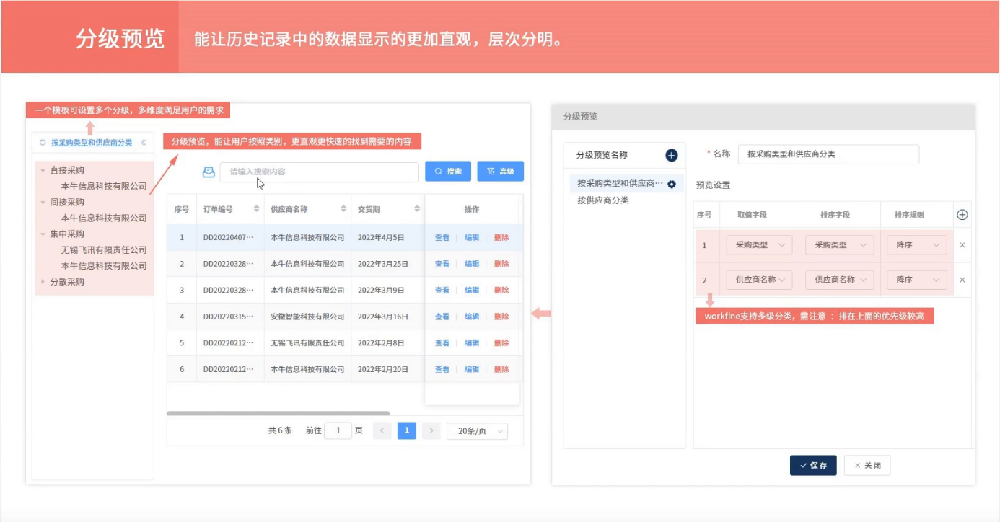​

回到Workfine设计器，在采购订单模板中，点击分级预览，点击加号，输入分级预览的名称，按采购类型、供应商分级；点击加号，添加取值字段，这个取值字段就是按哪个字段进行分类，根据需求选择采购类型，排序字段→采购类型，排序规则为降序；继续点击加号，添加第二个取值字段为供应商名称，排序字段→供应商名称，排序规则为降序。Workfine支持多个级别的分类，可以根据需求继续点击加号添加三级、四级的分类，不过在设置的时候需要注意，分类的优先级是从上到下，意思就是先按采购类型进行分类，然后再按供应商进行分类。设置完成后，点击新建，这样我们就添加了一个分级。  
再次点击加号，创建第二个分级，输入分级的名称，按供应商分级，点击加号，添加取值字段为供应商名称，排序字段→供应商名称，排序规则为降序，设置完成后，点击新建，这里我们设置了两个分级，其实在Workfine中可以设置多个分级，从而能满足用户不同维度的需求，设置完成后，关闭分级预览窗口，保存模板，前往应用端刷新测试。在库存管理模块下单击采购订单模板，在历史记录界面的左侧会出现分级预览的功能，通过分类能让我们快速的找到想要的数据，鼠标放在这里可以切换分级，也就是说，一个模板可以有多个分级，从而能满足用户不同维度的需求。

这节课我们主要讲解了分级预览，整个操作过程非常简单，希望通过这节课的学习以后，大家能根据实际的业务需求去灵活的设置分级预览，这节课就讲解到这里，谢谢大家的观看。

## [06、动态样式](https://community.bn100.com/video)

大家好，欢迎来到Workfine数字化课堂，这节课我们来学习动态样式，在业务系统中使用动态样式，可将业务单据中的部分信息进行隐藏。

动态样式有横向、竖向两种，所以在设置应用端动作时，首先就是要根据实际情况判断操作的方向是横向还是竖向，以及执行的动作是收缩还是展开，这里的横向、纵向其实就是按行按列的意思；然后以选中的操作字段为基准，设置上下左右的偏移量，在设置操作字段时，如果选择主表中的订单编号，那就是以这个单元格为基准，如果选择扩展表中的产品编码字段，那就是以这个区域为基准，如果在这个基础上设置向上偏移一行，向下偏移一行，那就是针对整个扩展表的范围。了解了动态样式的基本知识后，下面我们结合之前的采购订单模板来制作案例。

​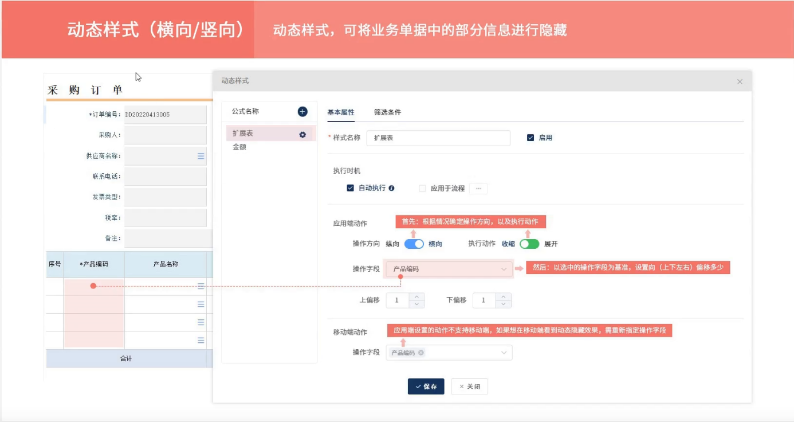​

回到Workfine设计器，结合采购订单模板，我们来实现两种情况。

一，只有系统管理员能看到扩展表中的金额，点击动态样式，添加动态样式，输入样式的名称，系统管理员查看金额；执行时机为自动执行；首先选择操作字段为扩展表中的金额；操作方向，竖向；执行动作为收缩；左偏移右偏移为零，意思就是，以扩展表中的金额字段为基准，按列进行隐藏；筛选条件，在系统变量中找到用户角色!=系统管理员，意思就是只有系统管理员能查看扩展表中的金额信息；  

设置完成后，点击新建，下面我们利用动态样式来继续实现第二种情况，利用按钮来显示/隐藏扩展表，在动态样式中继续点击加号，输入样式的名称→隐藏扩展表；执行时机为自动执行；操作字段，以扩展表中的产品编码为基准；按行收缩；向上偏移1，向下偏移1，就是将整个扩展表的区域进行隐藏，为了防止在应用端隐藏扩展表后，扩展表上下的边框还在，所以这个时候我们将向上、向下的偏移量，都设置为2，隐藏19到26行，设置完成后，点击新建。  
下面我们来给显示隐藏扩展表添加一个按钮，点击按钮/事件，添加按钮，设计名称为显示隐藏扩展表；按钮状态选择向上的三角形显示，别名为隐藏扩展表，按钮颜色为红色，打开按钮切换效果，选择切换的按钮为向下的三角形显示，别名为显示扩展表，颜色为绿色；当按钮的样式设置完成后，我们将按钮显示在表单中，勾选创建前、创建后；最后我们来给按钮绑定事件，在动态样式中找到隐藏扩展表，点击新建；选中单元格，右击，绑定按钮，选择刚刚制作的显示隐藏扩展表按钮，绑定后，保存模板，前往应用端测试。

在使用系统管理员账号登录后，找到采购订单模板，点击查看，我们会发现系统管理员账号能看到扩展表中的金额信息，点击隐藏显示扩展表，可实现扩展表的显示与隐藏；如果使用其他非管理员账户登录，我们会发现，扩展表中的金额不会显示出来，也就是说，只有系统管理员才能看到扩展表中的金额信息。

这节课我们主要讲解了动态样式，在刚才的两个案例中，我们都是设置的应用端动作，这里需要注意的是，设置的应用端动作不支持移动端，如果想在移动端实现动态样式，需要在移动端动作中重新指定操作字段，因为操作比较简单，这里就不再演示了，希望课后大家去尝试操作，这节课就讲解到这里，谢谢大家的观看。

## [07、按钮事件](https://community.bn100.com/video)

大家好，欢迎来到Workfine数字化课堂，这节课我们来学习按钮事件，在Workfine中按钮事件就是将手动执行的事件按要求组成一个命令按钮，然后用户通过点击按钮来实现事件的触发，通俗来讲，按钮事件其实就是添加按钮。

​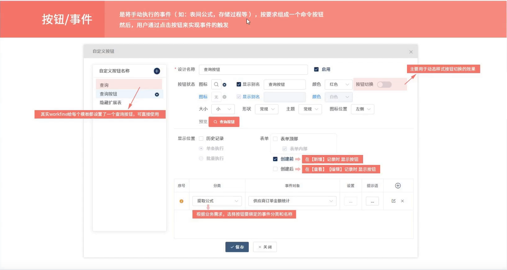​

在添加按钮前，我们先来了解一下添加按钮的工作界面，整个工作界面可以分为三个区域，上方这里是设置按钮的样式区域，包括按钮的图标、颜色、外轮廓形状以及图标的位置等等；中间这里是设置按钮的显示位置区域，是将按钮显示在历史记录界面中，还是将按钮显示在表单中，其中，创建前是指在新增记录时显示按钮，创建后是指在查看、编辑记录时显示按钮；下面这里是设置按钮绑定事件的区域，我们可以根据实际的业务需求，给按钮绑定对应的事件。认识了按钮的操作界面后，下面我们来看如何给模板添加查询按钮。

回到Workfine设计器，打开供应商查询模板，因为按钮是将手动执行的事件按要求组成一个命令按钮，所以首先我们需要将取数公式的执行时机勾选为手动执行。设置完成后，我们来给取数公式添加按钮，点击按钮事件，我们会发现在自定义按钮界面中已经有了一个查询按钮，其实Workfine给每个模板都配置了一个查询按钮，可以直接使用。

这里为了方便给大家演示按钮的添加过程，我们来新增一个查询按钮，设计名称为查询供应商信息；这里是设置按钮样式的区域，选择按钮的图标，按钮的显示名称，查询供应商信息，选择按钮的颜色为红色，设置完成后，这里可以预览到按钮的样式，这里是设置按钮的显示位置，我们将按钮显示在表单中，因为查询表不能保存，所以我们只需要勾选创建前，就是在新增记录时显示按钮，最后，我们给按钮绑定事件，点击加号，在分类中选择提取公式，事件对象选择刚才设置的取数公式，点击提示语可以设置相应的提示语，点击编辑按钮，还可以给取数公式继续添加筛选条件，这里就不再设置了，有兴趣的同学可以课后去尝试操作，设置完成后，点击新建，关闭窗口，当按钮添加完成后，我们在模板中选中相应的单元格，右击绑定按钮，选择刚添加的查询供应商信息按钮，确认，将鼠标点在表区域之外的任意单元格上，点击保存，前往应用端测试，在供应商查询模板上单击，就能看到刚才添加的按钮，单击按钮即可执行取数公式。

这节课我们主要讲解了按钮事件以及查询按钮的制作方法，其实在实际业务中，我们还可以给回写公式、动态样式、关联填报等事件添加按钮，希望课后大家能多去尝试操作，这节课就讲解到这里，谢谢大家的观看，

## 08、操作约束

### [操作约束：字段约束](https://community.bn100.com/video)

大家好，欢迎来到Workfine数字化课堂，这节课我们来学习操作约束，在Workfine中，通过操作约束，能防止用户进行错误的表单操作，比如，人事做过工资结算后，在人员信息表中不能删除对应的人员信息；再比如，当物料入库后，物料的信息不允许被修改，当物料出库时，出库的数量不能大于库存的数量，这些都属于操作约束的应用范围。

在Workfine中，操作约束有三种，分别是字段约束、表单约束和锁定条件。这节课我们来看什么是字段约束，字段约束就是通过设置约束条件，将业务单据中的某些字段进行锁定，防止被更改，就比如在修改采购订单时需要注意，如果这个订单已经有了相关的入库信息，那这个订单中的价格、数量等关键信息就不能再被修改，否则会导致系统出错，想要实现这个功能其实很简单，首先在订单中可以利用取数公式将入库后的订单在备注中填写有关联入库信息，然后通过字段约束，禁止修改已入库订单中的重要信息。

​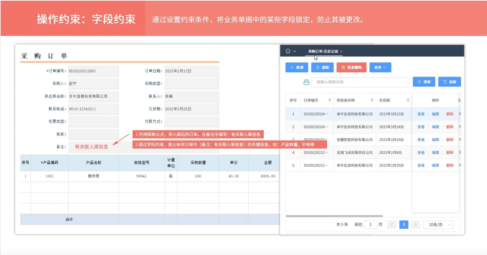​

了解了思路后，下面我们来看具体的操作。

回到Workfine设计器，在采购订单模板中添加取数公式，公示名称为有关联入库信息；数据来源为采购入库单；筛选条件为采购入库单中的订单编号等于本表中的订单编号；取值字段填充数据到主表，找到备注字段，点击编辑，输入备注中要填写的内容有关联入库信息；执行时机勾选为修改时执行。  
设置完取数公式后，下面我们来添加字段约束，点击操作约束，选择字段约束，输入自动约束的名称和提示内容为'有关联入库信息，无法修改'；不可操作字段就是禁止修改的字段，点击编辑，先全选主表和扩展表，然后取消不重要的字段，设置完成后，点击保存；禁止删除行列，这个主要是针对扩展表，就是禁止修改扩展表中的数据，因为采购订单是主表加扩展表，所以这里我们勾选禁止删除行列；筛选条件，当主表中的备注内容为有关联订单时，禁止修改这些重要的字段内容，设置完成后，点击新建，保存模板，前往应用端测试。  
在应用端填写采购订单后，如果这个订单还没有入库，是可以修改订单中的内容，一旦这个订单有了相关的入库信息，那再次修改时，则无法修改订单中的重要内容，这也是对入库后的订单起到一个保护的作用。

这节课我们主要讲解了字段约束，就是通过设置约束条件，将业务单据中的某些字段进行锁定，防止被更改，从而保证系统的安全性和可靠性。但是细心的朋友可能会发现，设置了自动约束后，虽然不能修改入库后订单中的重要内容，但是在历史记录界面中可以直接进行删除，删除入库后的订单也会导致系统出错，那如何通过操作约束，让入库后的订单不能被删除，我们会在下节课中进行讲解。这节课就讲解到这里，谢谢大家的观看。

### [操作约束：表单约束](https://community.bn100.com/video)

大家好，欢迎来到Workfine数字化课堂，这节课我们来继续学习操作约束，上节课我们主要讲解了什么是字段约束，这节课我们来学习表单约束，表单约束是针对整个业务单据的操作，通过设置约束条件，可禁止、删除、修改、审核、作废业务单据等操作。

​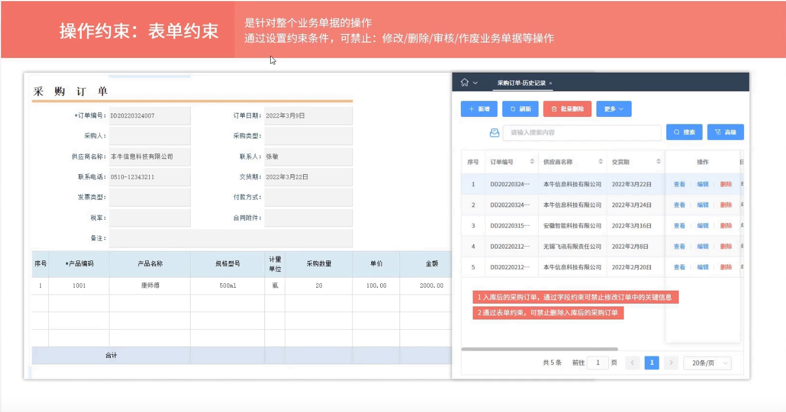​

在上节课的案例中，我们讲解了利用字段约束可禁止修改入库后订单中的重要内容，下面我们来看如何通过表单约束禁止删除入库后的采购订单。

回到Wokfine设计器，在采购订单中点击操作约束，选择表单约束，点击新增，输入表达式的说明，有关联入库信息禁止删除；执行时机，大家可以根据实际的业务需求去选择修改时、保存前还是审核时、作废时等等，这里我们根据需求选择删除前；自定义提示信息，有关联入库信息禁止删除；数据来源为采购入库；筛选条件，入库中的订单编号等于本表中的订单编号，设置完成后，点击新建，关闭操作约束窗口，点击保存，前往应用端测试。在应用端测试时，没有入库的采购订单可以直接删除，入库后的采购订单，点击删除时会提示有关联入库信息无法删除，从而保证了系统的可靠性和安全性。

这节课我们主要讲解了操作约束中的表单约束，是通过设置约束条件，可禁止、修改、删除、审核、作废业务单据等操作，需要记住的是，它主要针对的是整个业务单据的操作，这节课就讲解到这里，谢谢大家的观看。

### [操作约束：锁定条件](https://community.bn100.com/video)

大家好，欢迎来到Workfine数字化课堂，这节课我们来继续学习操作约束，在前面两节课中，我们讲解了操作约束中的字段约束和表单约束，这节课我们来学习锁定条件，锁定条件，就是当业务数据满足一定条件后，将整个业务单据进行锁定，防止被更改，需要注意的是，锁定后的业务单据只能查看，下面我们结合之前的案例来锁定供应商为本牛的所有采购订单。

​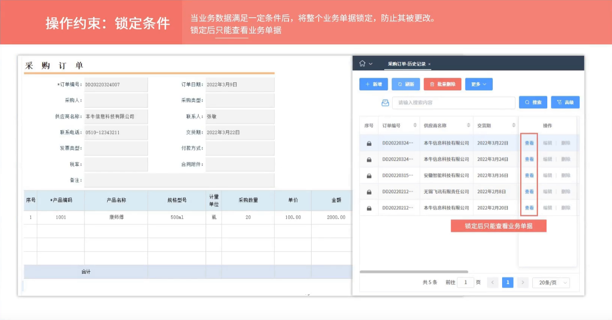​

回到Workfine设计器，在采购订单模板中点击操作约束，选择锁定条件，锁定条件是主表中的供应商名称为本牛信息科技有限公司，设置完成后，点击保存，保存模板，前往应用端测试，在应用端，我们会发现所有供应商为本牛的采购订单都被锁定，编辑和删除按钮为灰色，不能使用，只能查看订单，如果想要解锁，那我们需要回到设计器，在采购订单模板中找到锁定条件，删除锁定条件，这时需要注意，我们还需要点击右下角的清除锁才能解锁，最后，这里提示设置锁定条件，每隔五分钟验证一次，主要是针对模板中有回写数据的时候，锁定和解锁都需要等待五分钟。保存后，前往应用端刷新，这时我们会发现，刚才锁定的订单都已解锁。

这节课我们主要讲解了操作约束中的锁定条件，就是当业务数据满足一定条件后，会将整个业务单据进行锁定，防止被更改，需要注意的是，锁定后的业务单据只能查看。课程到这里，操作约束的三种类型我们就讲完了，希望在以后的工作中，大家能够根据实际的业务需求设置对应的操作约束，从而保证系统的可靠性和安全性，这节课就讲解到这里，谢谢大家的观看。

## [09、消息](https://community.bn100.com/video)

大家好，欢迎来到Workfine数字化课堂，这节课我们来学习消息提醒。在业务系统中，通过设置消息，不仅能让接收人员看到消息的内容、消息对应的表达内容，还能在查看消息时直接进行关联填报，如果利用钉钉、微信等移动APP，还能让消息提醒的更加及时。

​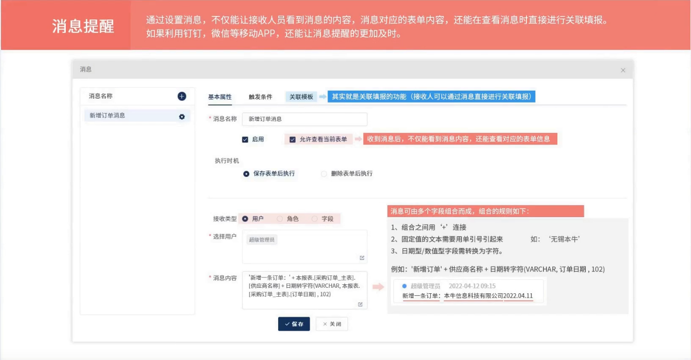​

在操作前，我们先来了解一下添加消息的工作界面，首先这里是消息的名称，以及在收到消息后是否允许查看消息对应的表单信息；执行时机有两个，大家可以根据实际需求选择是保存表单后发送消息，还是删除表单后发送消息；接收类型有用户、角色、字段三个选项，后期大家可以根据业务需求灵活选择；最后需要强调的就是消息内容，因为消息的内容可以由多个字段组合而成，那在组合的时候需要注意以下的规则，一、组合之间用'+'连接，二、固定值文本需要用单引号引起来，三、日期型，数值型字段需转换为字符。

认识了消息的操作界面以及注意事项后，下面我们来给采购订单添加消息，就是当用户新增采购订单后，Workfine会自动给系统管理员发送一条这样的消息，并且管理员在查看消息时，还能直接进行采购入库的关联填报。回到Workfine设计器，在采购订单模板中点击消息，添加消息，名称为新增采购订单，勾选允许查看当前表单；执行时机为保存表单后执行；接收类型，因为要给系统管理员发送消息，所以这里选择用户，点击编辑按钮，选择超级管理员；点击编辑按钮编辑消息内容，固定值文本用单引号引起来，新增一条订单，点击加号，点击供应商名称字段，点击加号，在函数类型转换函数中找到日期转换字符函数，将日期替换为订单日期字段，日期格式为102，设置完成后，点击保存；点击关联模板，关联模板其实就是关联填报的功能，选择关联模板→采购入库，填报方式为弹出框，设置要传递的字段，订单编号、供应商名称、联系人、订单日期，设置完成后，点击新建关闭消息窗口保存模板，前往应用端测试。当用户新增采购订单后，系统管理员会收到消息提醒，这里是消息提醒的内容，鼠标放在眼睛上单击，可以查看采购订单的详细内容，在编辑按钮上单击，可以直接进行采购入库的关联填报。

这节课我们主要讲解了消息，在业务系统中设置消息，能及时的提醒跟当前业务有关的人员，运用好消息提醒，能让业务关联人员的交互更加紧密，这节课就讲解到这里，谢谢大家的观看。

## 10、设置链接

### [链接1- 业务流转 自动生成单据](https://community.bn100.com/video)

大家好，欢迎来到Workfine数字化课堂，这节课我们来学习链接。首先来认识一下什么是链接，链接就是在操作当前表单时，通过传递参数，填报新单据或打开已有的单据。在Workfine中使用链接的目的是为了让工作更加方便快捷。在开发业务系统时，链接的应用主要有两种，一种是业务流转自动生成新单据，二是数据钻取，查询明细信息。

这节课我们主要来讲解连接的第一种应用，就是在业务流转时如何自动生成新单据，比如在应用端填写采购订单后保存，这里会出现关联填报的按钮，单击关联填报按钮，就能自动生成入库单据，这里的信息也不需要用户再去重新填写，给数据录入的工作带来了极大的方便。想要实现这种功能，我们先来看整体的思路，当采购订单信息填写保存后，通过链接将订单编号等其他字段内容传递到采购入库单中，然后在采购入库单中利用取数公式将扩展表中的信息从订单中提取过来，省去手动录入的过程，了解了思路后，下面我们来看具体的操作。

​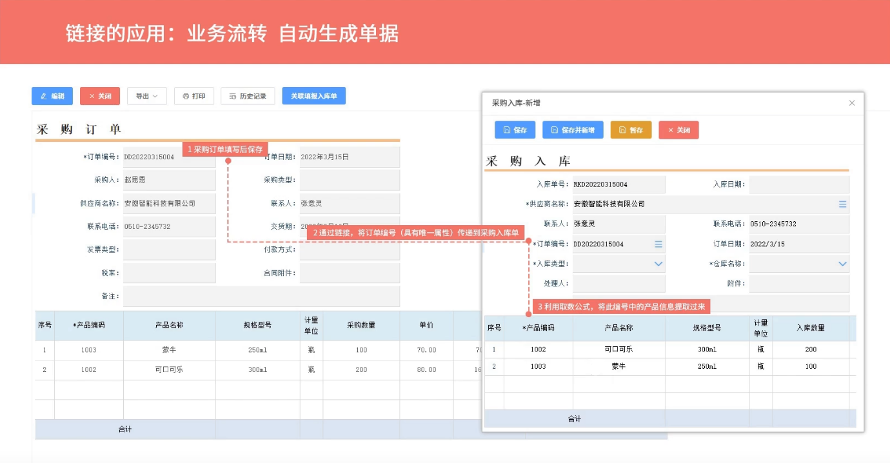​

回到Workfine设计器，在采购订单模板中点击链接，添加链接，这里的名称是链接的名称，这里的别名是在应用端中显示的按钮的名称；传参数据表为采购订单_主表；触发方式，选择表单触发，保存后显示，意思就是当订单填写完成并保存后，才会出现这个关联按钮；关联模板选择入库单，关联方式选择填报新单据，勾选历史记录触发，就是在历史记录界面上右击，也能实现关联填报；在填报方式中设置需要传递的字段，供应商名称，联系人，订单编号，和联系电话，设置完成后，点击新建，关闭连接的窗口，保存模板。

当采购订单中的链接设置完成后，下一步我们需要给入库单添加取数公式，打开入库单，点击表间公式，在取数公式类目中点击添加，公式名称为关联填报取数公式；数据来源为采购订单；筛选条件是原表中的订单编号等于本表中的订单编号；取值字段填充到扩展表，将扩展表中需要的字段对应填充；在公式执行中勾选执行时机为新建时执行，设置完成后点击新建，保存模板，前往应用端测试。在应用端填写采购订单信息后，点击保存，这里会出现关联填报入库单的按钮，单击，就可以关联填报采购入库单保存，因为在设置链接时勾选了历史记录触发，所以在历史记录界面右击也可以实现关联填报的功能。

如果想查看或修改订单中已有的关联填报，那我们只需要在链接中，找到关联方式，勾选有关联表示查看。在打开方式中，有三个选项，这三个选项的区别这里都有说明，我们就不再进行详细讲解了，这里根据需求选择查看。当一个订单中有多个关联填报时，我们还可以设置预览字段，以及传递的字段内容，设置完成后，点击保存，保存模板。前往应用端刷新，如果这个订单没有关联填报，我们可以通过右击直接进行关联填报，如果订单已有关联填报，我们通过右击可以查看这个订单中所有的关联填报，继续单击可以查看具体的填报内容，当填报内容有误时，可以点击编辑按钮对它进行修改，修改完成后点击保存即可。

这节课我们主要讲解了链接以及在业务系统开发中，在业务流转时如何自动生成单据，这节课就讲解到这里，谢谢大家的观看。

### [链接2- 数据钻取 查询明细信息](https://community.bn100.com/video)

大家好，欢迎来到Workfine数字化课堂，这节课我们来继续学习链接，上节课我们讲了如何利用链接在业务流转时自动生成新单据，这节课我们来讲解链接的第二种应用数据，钻取查询明细信息，比如，在供应商查询表中，点击查询按钮，可以看到所有供应商的订单总金额；在供应商的名称上单击，在订单明细表中可以看到这个供应商所有的订单信息；在订单编号上单击可以打开订单，查看订单的内容。

如果想要在业务中实现这种数据钻取，查询明细信息的功能，首先是要把思路理清楚，在供应商汇总表中，利用取数公式查出所有供应商的订单总金额，然后通过链接将扩展表中的供应商字段传递到订单明细表，在订单明细表中利用取数公式查出供应商所有的订单信息，最后通过链接将扩展表中的订单编号传递到采购订单，打开已有的关联填报。

​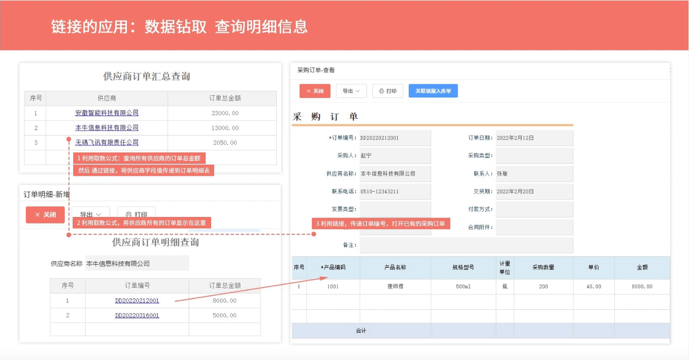​

了解了思路后，下面我们来看具体的操作，回到Workfine设计器，在供应商汇总表中添加取数公式，公式名称→供应商订单金额统计；数据来源为采购订单表；取值字段，数据填充到供应商订单统计的扩展表，在订单总金额中，点击编辑，将合计函数中的字段替换为扩展表中的金额，保存；勾选执行时机为手动执行。当取数公式设置完成后，下面我们来添加链接，链接名称为关联到订单明细表；传递参数表为扩展表；触发方式为自动触发，勾选供应商；关联模板，为查询表中的订单明细表；关联方式为填报新单据；在填报方式中，选择传递的字段为供应商名称，设置完成后，点击新建，关闭链接的窗口，保存模板。

打开订单明细表，添加取数公式，公示名称→提取供应商中所有的订单信息；数据来源为采购订单；筛选条件，原表中的供应商名称等于表中的供应商名称；取值字段，填充数据到扩展表，填充订单编号，订单日期，订单金额，点击编辑，在统计函数中找到合计函数，将字段替换为扩展表中的金额，保存；公式执行，勾选执行时机为新建时执行，点击新建，关闭。设置完取数公式后，我们来给订单明细表添加链接，链接名称为查看采购订单；传参数据表为扩展表；触发方式，选择订单编号字段；关联模板为采购订单；关联方式选择打开已有单据；在打开方式中，选择打开方式为仅查看；预览字段，勾选订单编号、供应商名称，订单日期；设置传递字段，设置完成后，点击新建，关闭链接窗口，保存模板后前往应用端刷新测试。在供应商汇总表中点击查询按钮，可以看到所有供应商的订单总金额，在供应商名称上单击，在明细表中可以查看这个供应商中所有的订单信息，在订单编号上单击，可以打开采购订单查看具体的内容。

这节课我们主要讲解的是链接的第二种用法，就是在业务系统中如何利用链接进行数据钻取，查询明细信息。最后给大家留一个思考，在实际应用中，汇总表的上方可以加上日期选择的功能，就是可以让用户根据需求按月来统计信息，最后再进行数据钻取查询明细，希望课后大家能利用取数公式努力去完成，这节课就讲解到这里，谢谢大家的观看。

## 11、打印选项

### [常规打印](https://community.bn100.com/video)

大家好，今天我们一起来学习Worfine的第2章知识点，第4节模板管理。我们接着来学习模板的深入设计。每一个应用程序呢，都会涉及到打印，Workfine的话，在这方面也不甘示弱，它有灵活的打印模式，有常规打印、循环打印，还有工资条式的打印。今天我们重点来学习常规打印里面的第一种模式，就是表字段内容和打印区域在同一个模板里面，也就是说我们把当前的模板呢，要打印出来，比方说打印一个简单的表单，或者说打一个简单的查询报表。

我们现在回到后端，打开客户信息表。这是一个简单的填写式的模板。我们要做打印呢，首先要进行一个设置，这里有一个打印选项，我们单击一下，系统提示我们呢，在打印之前先要设置一个打印区域。打印区域的设置呢，非常简单。我们只要这样框选中某个区域，假设我们这个区域要打印，选中好之后单击鼠标右键，我们选择这里的设置打印区域就可以了。最后，我们再单击这里的打印选项按钮，系统就弹出来了一个打印选项的一个设置和这里的预览效果。我们现在看第一个，这里有一个设置对象。我们当前只有一个工作簿Sheet1，所以这里展开之后呢，就只有一个唯一的选项，这里的启用就表示，我们在查看客户信息的时候呢，可以出现打印的一个按钮。我们把打印预览打勾，也就是说我们在打印之前可以预览一下打印的效果。这里的套打背景的话，我们在套打的时候再来单独的讲解。这里有一个打印模式，默认就是常规，下面还有两种呢，我们在后面的视频再讲解，今天我们就选择常规就可以了。这里的标题跨页，还有标题的行数呢，主要用于我们的扩展表，因为客户信息表呢，是一个简单的主表，所以这里就不需要进行任何的配置。这里有一个纸张的方向，这个是横向，这个是纵向，我们这里选择纵向就可以了。纸张的大小的话，默认是A4，我们可以根据自己的需要呢，来进行选择一个纸张。这里的页边距，我们也选择常规就可以了。当然，你也可以点这里的自定义来进行一个详细的页边距的设置，我们这里选择常规就可以了。还有这里的网格线，如果打勾，我们可以选一个颜色，如果是红色，点确定，如果我们点预览，就可以马上看到这个展示的效果。如果不需要，把这个取消掉。这里还有一个缩放，把这个打勾呢，就表示把所有的列调整为一页，这个用于什么呢？就是说如果我们这个模板，它的列数比较多，这里的话就可以压缩到一页来进行打印。这里还有一个居中方式，这里有垂直居中和水平居中，我们通过调节预览一下，看到展示的效果。大家根据自己的需求呢，来选择一个就可以了。配置好了之后呢，我们单击这里来保存。最后呢，我们再把当前模板呢，保存起来。

我们回到前端，点这里的基础信息管理，找到客户信息表，我们选中第二个客户，点这里的查看，在顶部有一个打印的按钮，我们鼠标左键单击一下。再单击Sheet1，这时候就出现了一个预览的效果，我们这里的目标打印机呢，可以选择连接好的打印机，点这里的打印呢，就可以了。通常情况下，如果我们要制作pdf，这里的目标打印机呢，就可以选择另存为pdf，点保存，我们选择一个保存的路径，再起个文件名，最后单击保存了就可以了。

我们现在再回到设计后端，来打开学生信息查询模板，来做一个查询模板的一个打印选项设置。一样的，我们也要先选择一个打印的区域，然后鼠标的右键，再选择设置打印区域。最后，我们再来单击打印选项按钮，这里的设置对象呢，也选择Sheet1，我们把打印预览呢，再勾上。这里我们不采用套打，所以这里不选择。打印模式呢，我们也选择常规。下面的纸张方向、大小，还有缩放、居中方式呢，我们采用默认值。重点是这里我们给大家讲一下，标题跨页，如果我们把标题跨页也打钩，也就是说从这里的课程表至上有哪几行要打印？比方说，现在标题行数是3，就会把序号姓名这一行以及上面的空行还有姓名这一行呢，打印出来；如果我们选择1，就表示把序号、姓名、身份证号这个标题栏的信息呢，一起打印出来。  
我们先保存一下来做一个演示，把当前模板保存一下。  
我们回到前端，点击这里的信息查询管理，点击学生信息查询，我们做一个提取公式查询，把所有学生信息查询出来，这样才能够显示多页。我们点击这里的打印，选择Sheet1，模板的第一页，所有的标题和扩展表数据都会全部打印出来。就是跨页的时候，刚刚我们跨行的行数是1，也就是说从16开始，向上一行会打印出来，下面也是，扩展表数据向上一行的数据。其实这就实现了带一行标题栏的跨页打印。

我们再回到学生信息查询模板，点击打印选项，把这里的标题行数改成3，点保存。改成3之后呢，也就是说，从第6行（这里是扩展表数据）向上3行（第5行、第4行、第3行）将会实现跨页的打印，也就是说，扩展表之上这3行，这个标题信息呢，将会实现跨页打印。我们保存当前模板。  
我们刷新之后点这里的查询，再来点这里的打印，选Sheet1，我们可以看看第二页就实现了16行之上的3行，序号、空行和姓名这一行。我们再往下看，35行之上，序号、空行和姓名。

我们最后再来简单的总结一下，今天学习的打印选项。像设置打印区域，相对来说比较简单，选中之后单击鼠标右键，就可以选择。打印一个简单的填写模板，相对来说还是比较简单的。对于查询模板，如果有多页，特别是一个扩展表，有多页要实现一个标题的跨页打印，我们还要设置一个标题的行数，就是从当前的扩展表的数据表示开始向上有几行要保留，大家把这个规则进来就可以了。打印呢，对于业务系统来说是一个常用的功能，希望今天我们的这个内容呢，大家能够熟练的掌握并应用。这一节呢，我们就简单的讲到这里。

### [常规分离打印](https://community.bn100.com/video)

大家好，今天我们一起来学习Worfine的第2章知识点，第4节模板管理。我们接着来学习模板的深入设计。在上一节呢，我们学习了打印选项的常规打印。今天我们接着来学习表字段内容和打印区域不在同一个模板的情况。我们现在回到设计端，打开的是销售订单的模板，我们想在新增记录辑记录的时候呢，用当前的这个模板，而在打印的时候用另外一个工作表。我们用这里的加号，创建了一个新的工作表，叫Sheet2。我们稍微把前面的主表字段呢，做了一个调整，也就是说我们希望在打印的时候呢，调用这里的工作表。所以接下来最主要的是两点，第一，怎么样传递数据，第二，怎么样设置打印。

我们选中订单编号这个单元格，输入一个等号，再选择工作表Sheet1这里对应的订单编号单元格数据，然后敲回车，可以看到这里报错了。我们选中它，发现它是从G4到H4，这是由两个单元格进行合并的。遇到这样的单元格，复制的时候呢，我们只需要填最前面的一个单元格数据，也就是说我们只要填写G4对应过来的这个单元格的数据就可以了。所以我们回到工作Sheet2，把这里的这个冒号后面H4全部删除，只保留G4单元格，然后敲回车，这样就好了。因为目前那边没有数据，所以这里的值呢，显示的是空值。同理，我们再把客户名称也设置一下，敲回车。我们再把收货地址也设置一下，等于收货地址，敲回车。还有联系人，也是一样的，先输入一个等号，然后再选择工作表Sheet1的这个联系人，敲回车。手机号，手机号呢，它也是多个单元格进行合并的，所以我们只保留F7，只留下F7，然后敲回车，这样就可以了。最后一个，制单人，我们选中，一样的也是等号，选择你的单元格，敲回车就可以了。接下来呢，主表字段的值呢，就传递过来了。

最主要是扩展表怎么样传递呢？所以我们在工作表Sheet2里面也要创建一个新的扩展表。我们这样选中13~16行，然后点这里的新建扩展项来创建一个新的扩展表，因为在工作表Sheet1里面呢，已经有了一个扩展表，为了区别我们在后面加个2，再去除掉这里的特殊字符，把每一个字段名呢，后面都加上一个2，主要是和工作表Sheet1呢，把它区别开来。我们再把这里的序号，这里的字段样式呢，改成整数型，我们再点保存就可以了。  
前面我们通过'='符号呢，把相关的主表字段值呢，传递到工作表2里面来了。那接下来我们要创建一个新的提取公式（取数公式），就是找到这个对应的订单编号，把这里的这个扩展表数据呢，再填写到这里来，所以我们还要创建一个新的提取公式（取数公式）。点加号，我们取一个名称，我们这里的公式名称起好之后呢，来选择一个执行时机，我们选择查看的时候执行，还有保存的时候执行。这里的数据来源呢，我们选择一个，销售管理系统里面的销售订单，把主表和扩展表选上就可以了，然后点保存。筛选条件，来源表里面的销售订单等于我们当前的销售订单。填充方式，  
我们这里选择扩展表2，就是这里的工作表Sheet2里面的这个扩张表。我们把来源表里面的扩展表字段值填写到扩展表2里面来。我们选中目标字段序号2，再选择来源表里面对应的一个表字段，我们全部选上，然后点这里的验证，正确之后点新建，最后关闭。

接下来呢，我们还要设置一个打印选项。我们选择要打印的区域，然后点鼠标的右键，再选择设置打印区域。再点击这里的打印选项，我们把打印预览打勾，打印模式常规，纸张方向纵向，A4纸，页边距常规，我们点击一下这里的预览。好了之后呢，我们点这里的保存。

我们新增加的这个工作表Sheet2呢，主要用于打印，所以平常我们在添加或者修改记录的时候，根本就用不到，所以我们可以把它隐藏起来。点这里的这个眼睛的图片按钮，点一下，这样呈关闭状态之后。我们再把当前的模板呢，保存起来。

我们回到前端，点这里的刷新，再来单击这里的查看，可以看到，刚刚我们新增加的工作表Sheet2被隐藏起来了。这个时候我们再来点这里的打印，这里选择Sheet2，选择这里的眼睛图标，这是预览，我们缩小一下，这样就可以看到我们最新的一个打印效果了。从而实现了我们在填写、修改记录的时候呢，用的是工作表Sheet1，而我们打印的时候呢，调用的是新的工作表sheet2。

我们在打印的时候呢，这里这个Sheet2的名称呢，我们也可以把它修改一下。我们回到设计端，把这里的Sheet2呢，给它改一下。我们改个名字叫销售订单，我们保存。我们再回到前端，点这里的查看，再来点这里的打印。可以看到我们就把工作表Sheet2呢，给它改成一个好听的名字了，点这里的预览。从而就实现了我们的填写模板呢，和打印进行了一个分离。最后，我们点这里的打印按钮进行打印。这样就可以了。

最后，我们再来总结一下，今天学习的当前模板和打印的工作表进行分离的一个操作。首先呢，我们要添加一个工作表Sheet2，把那个打印的格式呢，把它设置好。第二点呢，就把工作表Sheet1主表字段值呢，传递到Sheet2上面来。第三步，我们还要在工作表Sheet2呢，添加一个扩展表。然后用第4步编写一个提取公式呢，把它提取过来。第5步呢，就是我们在设置打印选项的时候呢，可以把这个工作表Sheet2再改个名称，最后再把它隐藏起来。如果我们还要设置更多的打印格式，在可以添加工作表Sheet3、Sheet4，甚至更多，然后设置不同的打印格式就可以了。这一节呢，我们就简单的讲到这里。

### [循环打印](https://community.bn100.com/video)

大家好，今天我们一起来学习Worfine的第2章知识点，第4节模板管理。我们接着来学习模板的深入设计。今天呢，我们开始学习打印选项里面的第二个打印模式，循环打印。

我们现在回到前端，打开的是学生信息查询模板，我们查询一下所有的女同学，把这里的性别呢，改成女，再点击查询按钮，我们点这里的打印，点预览，第一个是北海，把我们查出来的扩展表里面呢，第一行学生信息呢，就填写在这个固定的学生信息表里面；第二页，江美丽，是我们查询报表里面的第二个扩展信息，也把相应的姓名、性别，还有民族，还有照片呢，也打印在这个固定的这个学生基本信息表里面；我们再看下一页，那么打印的就是李四；再下一页就是张大海；最后是张三。这个就是今天我们要学习的循环打印，把我们查询出来的扩展表里面的每一行数据呢，都打印在一个固定的一个页面里面。

接下来呢，我们就详细的讲解一下操作的过程。我们现在回到设计端，打开学生信息查询模板。我们再点加号来添加一个新的工作表Sheet2，我们还要花一点时间呢，来调整一下工作表Sheet2相关的列的宽度，还有行的高度等等。把它调整好之后呢，我们还要选中姓名、性别、身高、民族，把所有的表字段选中，我们来设计，来新建一个主表项字段，我们去掉特殊的字符，我们再把这里的表字段和工作表Sheet1区别开来，我们都把表字段名字呢，都加上一个2。我们再来配置一下身高，把数据类型呢，改一下，改成数值型。还有相片改成图片。好了之后，我们点保存。我们选择工作表Sheet2要打印的区域，选中好之后，单击鼠标的右键，然后左键选择设置打印区域。我们现在来选择打印选项，我们这里把启用和打印预览呢，全部勾上；打印模式，我们选择循环打印；关联扩展表，我们选择Sheet1里面的扩展表；这里的筛选条件，我们点设置，这里的筛选条件呢，我们就不填了。因为我们在第一个工作表Sheet1里面呢，已经做了一个查询公式选择所有的女同学；我们来设置一下填值对照，把这里的每页显示条数呢，我们改成每页30条；现在把打印模板里面呢，对应的表字段，姓名2和工作表1里面的扩展表里面的姓名呢，把它对应起来，然后是民族，接下来是性别，还有身高，相片，接下来是身份证号码，还有特长。好了之后，我们就点击这里的保存按钮。这里的穿插公式，我们来看一下，目前呢，现在根据我们的这个打印的需求呢，还用不到这里的提取公式，所以这里我们就暂时不需要了。纸张方向呢，我们选择纵向。纸张大小还有页边距，我们保留居中方式呢，我们把垂直居中取消掉。然后点预览，我们来看一下效果。唉，感觉可以了之后呢，我们就点保存。我们在查询学生信息报表的时候呢，也不希望我们的这个打印模板呢，把它显示出来，所以呢，我们这里要做一个隐藏的操作，就点击下面这个眼睛的图片按钮，我们点一下鼠标的左键，它呈关闭状态，这样我们再把当前模板呢，保存起来。

前端刷新之后呢，我们来点击信息查询管理，我们选择第一个学生信息查询，这里呢，我们把性别改一下，改成是女，我们再来做一个查询，这样就查找到了所有女同学的学生信息。我们点打印，再点Sheet2的预览，我们看这里的第一个北海，就是我们查询模板里面的第一条记录；我们再往下走，第二条江美丽，是我们查询模板里面的第二个扩展表的内容；我们再看第三条记录，是我们查询模板里面的第三条记录；第4条就是张大海；最后一条是张三，和我们查询模板里面的张三呢，第5条记录是一一对应的关系。这样我们就实现了一个循环打印。同理，我们再把这里的性别改一下，改成是男，我们再来点查询，查询到有两条记录信息，我们再点这里的打印按钮，点预览。可以看到这里的第一条记录和扩展表的第一条记录是一一对应的关系。第二条记录呢，也是一样的。把所有的姓名、性别，还有民族、身高等信息呢，就打印到了我们固定的一个打印模板里面来实现了循环打印。

我们现在回到设计端，把系统的工作表的名称呢，我们来改一下。把这里的Sheet2呢，我们改成一个好听的名字，改成学生基本信息表。改好之后呢，我们单击保存。我们再回到前端，重新来选择一下性别，选择女，我们再点查询，当我们点打印的时候，这里的名称呢，就是出现了我们刚刚改过来的名称。我们点预览，我们感觉到没有任何问题，我们就点右上角打印按钮，出现了一个打印的界面，我们选择需要的打印机，最后点击这里的打印按钮就可以了。  

最后，我们再来总结一下，我们今天学习的循环打印。主要是演示了一个查询模板，根据不同的性别，男和女呢，来先做一个查询，然后根据查询出来的扩展表，我们再来做一个循环的打印。重点是这个区域，这里的填值对照呢，在左侧这个传递字段指的是我们Sheet1里面的扩展表的字段；这里的关联字段呢，指的是我们打印模板里面Sheet2的一个主表字段，在填值的时候呢，要注意一一对应的关系。今天我们这里的筛选条件呢，也没有用到。这里的穿插公式呢，也没有用到。大家可以根据自己的业务需求呢，以后来配置一个二次的筛选。或者再来做一个穿插公式的一个提取公式的应用都可以的。  

今天我们演示的循环打印呢，操作并不复杂。大家按照我们今天的演示，做一个练习就可以了。这一节呢，我们就简单的讲到这里。

### [套打](https://community.bn100.com/video)

大家好，今天我们一起来学习Worfine的第2章知识点，第4节模板管理。我们接着来学习模板的深入设计。前面我们利用打印选项呢，例举了两个常规打印，今天我们接着来学习第三种情况，我们以发货单为例来讲解怎样实现套打背景。

我这里有一张发货单（扫描件），我们双击打开，这个发货单呢，是某个有限公司找外面的印刷厂呢，批量印刷的，以前这个发货单都是用手工的方式进行填写。今天我们演示的套打功能就是调用这张发货单的扫描件来实现精确的一个定位打印。接下来呢，我们就详细的讲解一下套打的设置和操作过程。  

我们这张发货单扫描好之后呢，他的1:1的尺寸是，宽度21厘米，高度是14.85厘米，我们要把厘米呢，转换成我们显示器分辨率对应的一个像素。通常情况下，我们Windows的一个分辨率，96 dpi要把它转换成像素的话，这里有个公式，就是×0.3937×96，这个分辨率呢，就等于它的像素了。我们来讲一下这个公式怎么样转换过来的，让大家呢，简单的了解一下。我们说像素除以分辨率就等于英寸。1英寸的话，它是等于2.54厘米的；1厘米，那等于0.3937英寸。所以我们把这里的1厘米转换成英寸就是0.3937英寸，等于什么呢，X像素除以我们的分辨率96dpi，这样一转换的话，就得到了我们的1厘米呢，大约等于0.3937×96像素。所以把这个值呢，代到上面来，那么21×0.3937×96呢，就得到了我们的一个像素值了。  

我们现在用ps呢，来打开这个发货单，就是Adobe公司的Photoshop，我们点这里的图像，有一个图像大小，通过调整这里的高度多少像素呢，我们来让这个扫描件他的真实尺寸和我们平面的这个分辨率像素呢，1:1的对齐。我们这里的高度刚刚计算出来的，对应的像素是794，所以我们把这里的宽度改一下，改成794。还有这里的高度，561, 把它改一下。这里的分辨率呢，就96不变。点确定之后呢，我们就把扫描件对应的这个厘米呢，就转换成对应的像素。这张呢，是我调整好的一个1:1的这个尺寸，我在外面呢，加了一个红色的方框，以便我们在Workfine里面设置打印区的时候呢，能够精确地设置这张发货单的纸张尺寸。  

我们回到设计端，这是我们制作好的一个发货单模板。这里的相关数据要准确地打到我们印刷好的这个发货单的纸张上面来。我们点这里的加号来创建一个新的工作表，任意选择一个区域，点右键来设置打印区域；我们再点击这里的打印选项，把打印预览打钩；这里有个选项，套打背景，我们左键单击选择，找到我们用photoshop编辑好的扫描件，双击打开，这里有一个提示，我们点确定就可以了；打印模式，常规；方向，横向；这里的纸张呢，我们把它改一下，改成是自定义，宽度是210，高度148.5，我们就149吧；页边距5；这里缩放打勾，然后我们点保存。  

这里呢，我们就要花很多心思拉来认真地调节了。把第一行的这个位置呢，调到这个下划线这里来，然后放开。我们可以按住Ctrl键，将鼠标滚轮呢来进行放大，然后第二行这里进行对齐。第三行这样。然后第4行这样。然后右边的话，我们可以这样来调节，序号，这边对齐。第二列，然后是第三列。最后，我们再调这个发货单右下角的时候一定要注意，比方说实际上这根线要和下面这个红线呢进行重合。还有这一列呢完全对齐。这样设置好了之后呢，我们再来设置打印区域，这样选中才是1:1的打印区域，然后点右键，设置打印区域。  

接下来呢，我们再合并相关的单元格。这个发货单号如果够了，我们就不需要设置了；还有这里呢，发货日期，我们可以把这两个单元格进行合并，水平合并；收货人，水平合并。我们设置好了之后呢，要把工作表1的数据要传到工作表2来，所以我们先选中这里的发货单号，然后点一个=，我们再选择工作表1，找到发货单号，点这个单元格，然后敲回车就可以了；发货日期等于，选择Sheet1这里的发货日期，敲回车。我们之前讲过，如果有多个单元格合并，就只取前面第一个就可以了，所以我们把F3和冒号呢，删除掉。只留下E3，这样就正确。  

我们全部设置好了之后呢，再点保存。我们回到工作表1，把这里的发货单模板呢，保存起来。  

因为我们打印的发货单呢，不是A3、A4常规的尺寸，他需要制定一个纸张尺寸，鼠标右键点击左下角开始。我们选择这里的设置，我们找到这里的打印机，选择打印机和扫描仪，我们选择这里的打印服务器属性，来添加一个新的纸张尺寸。我们这里选择创建新纸张规格。这里起个名称，发货单套打，宽度是21厘米，我们的高度14.85，这里的左、右、顶端、底部呢，全部为0。然后我们点保存规格就可以了。然后点关闭。  

这个时候呢，我们回到前端。我们这里之前已经输入了一条记录，我们点查看。我们点这里的打印，点预览。我们只要放置好我们印刷好的这个发货单纸张，点这里的打印呢，就可以了。有一点要注意，我们先把目标打印机选好，然后呢，这里有更多设置。我们要选择这里的纸张尺寸，这个纸张尺寸呢，就要选择我们刚刚配置的一个发货单套打尺寸，最后点击这里的打印呢，就能够实现精确的定位、打印。  

最后，我们再来总结一下，我们今天学习的发货单背景的一个套打。首先呢，我们要扫描好印刷好的纸张，特别是扫描的时候呢，要把它放平，不要歪斜；第二点呢，我们用PS图像编辑软件来调整图像的大小，我们今天学习到一个厘米转像素的一个公式，厘米×0.3937×分辨率96就得到了一个像素值；第三点，我们在设置打印选项的时候呢，要选择套打，最主要的就是要耐心地调整这个单元格的间距，这里可能要花很多时间；第4点，我们演示了怎样把工作表Sheet1的主表字段值传递到Sheet2上面来，我们在之前的视频也讲到了，如果是扩展表的数据呢，可以用提取公式，今天我们没有具体演示，相关的扩展表的数据提取，可以看看我们之前上面的这个视频；最后是第5点。我们还要设置好打印机的自定义纸张尺寸。相对来说呢，今天我们学习的套打步骤比较多，大家只要从头到尾呢，认真的看一遍，基本上就能够掌握了。  

今天我们学习的打印呢，实际上也是一个常规的打印。只不过就是我们呢，打印工作表呢，它里面的这个表头，它是事先印刷好的，我们不需要再去手动的创建这样一个表格。同理，我们也可以把这里的工作表呢进行隐藏，这样我们在前端操作的时候呢，就不会显示这里的这个工作表了。我们也可以把这里的Sheet2呢，把名字改一下。具体的操作呢，大家下去可以更改。今天呢，我们就简单的讲到这里。

### [工资条打印](https://community.bn100.com/video)

大家好，今天我们一起来学习Worfine的第2章知识点，第4节模板管理。我们接着来学习模板的深入设计。今天我们再接着来学习打印选项里面的工资条式打印。我们现在回到前端，打开学生信息查询模板，我们点这里的查询，一共有7条学生记录信息。我们再点这里的打印按钮，选择Sheet1这里的打印预览。我们可以看到当前展示的打印效果呢，就是每一行扩张表的内容呢，都和我们的打印的标题呢，就是形成一个组合，也就是说，一个打印标题再一行扩展表的内容，再一个标题，再是第二行扩展表的内容，这就是我们今天要学习的工资条式打印。  

接下来我们讲一下具体的操作过程。我们回到设计端，打开的是学生信息查询模板。可以看到我们当前的模板呢，只有一个工作表，它的名字就叫Sheet1，我们先来选择一个打印的区域，按住鼠标左键，这样往下一拉到这个位置，然后单击鼠标的右键，左键选择设置打印区域；接着我们来选择这里的打印选项，我们把这里的打印预览启用；打印模式，我们来选择最后一个，工资条式打印；关联的扩展表呢，就是我们当前查询模板的这个扩展表；筛选条件，我们不需要设置；然后纸张方向，纸张方向大家可以根据自己查询报表的列的长度来选择横向还是纵向，这里选择默认值；这里的选项，我们只把缩放和水平居中选中；然后点预览，这样就呈现出来了，我们目前的打印预览的效果。最后，我们点击保存。我们也可以把当前的工作表呢，换一个名称，我们双击这里的Sheet1，给它取一个新的名字，就叫学生信息，好了之后敲回车。这个时候我们再把当前的模板保存一下。  

前端刷新之后，我们选择这里的信息查询管理，再点击学生信息查询。这个时候，我们点击这里的查询，执行提取公式（取数公式），把所有的学生信息呢，提取出来；接着，我们再选择这里的打印，大家可以看到这个时候我们的这个Shee1工作表名称呢，就变成了学生信息；我们再点击这里的预览，这样就实现了我们一个工资条式的打印效果。

我们现在回到打印选项，之前我们看到的效果呢，是把所有的学生信息打印出来了。这里的筛选呢，我们还可以做一个二次的筛选打印。我们点击这里的设置，假设我们现在要把所有的女同学打印出来，这个时候我们再来添加一个筛选条件，选择扩展表里面的性别字段，让它等于，点击这里的这个单引号，在单引号之间呢，输一个性别等于女，输一个女就可以了。最后，我们保存。再把这里的打印选项保存起来。我们再把当前的模板保存一下。  

前端刷新之后呢，我们单击这里的查询，我们可以看到这里的所有学生信息呢，既包含了所有的男同学和女同学。我们点击这里的打印，刚刚我们的打印选项呢，做了一个二次的筛选条件，设置性别等于女，我们来打印预览一下，点击这里的预览按钮，可以看到这个时候我们的打印效果呢，就把所有的女同学全部打印出来了。  

最后，我们再来总结一下，今天学习的工资条式打印，相对来说比较简单，主要是针对当前的模板进行操作，他不需要再添加另外的工作表进行配置。我们这里打印模式呢，选择好工资条式打印。这里的打印选项选好之后呢，我们再来关联一个扩展表。这里的筛选条件，也就是说，我们可以根据扩展表的内容呢，来进行一个二次的筛选。后面的纸张方向大小，大家可以根据不同的业务需求呢，来进行一个配置。这一节呢，我们就简单的讲到这里。

## 12、条码管理

### [条码打印基本概念](https://community.bn100.com/video)

大家好，今天我们一起来学习Worfine的第2章知识点，第4节模板管理。我们接着来学习模板的深入设计。今天我们再来学习其他菜单栏里面的条码管理。我们现在学习条码的相关基本概念。我们先来讲一下什么是条形码，条形码（barcode）呢，它是将宽度不等的多个黑条和空白，按照一定的编码规则排列，用来表达一种信息的图形标识符。像我们左侧的这个就是一维条码的类型，那么右侧就是二维条码的类型。Workfine里面的话是支持一维条码和二维条码的。

​​

我们现在看一下一维条码，在Workfine里面，主要包含了以下5种（Code 128、Code 39、CodaBar、EAN-13、MSI）。

我们先来讲一下Code 128和Code 39。Code 128和Code 39呢，他们是很相近的，他们都用于企业的内部管理、生产流程、物流控制等方面。他们的不同点呢，就在于Code 128比Code 39 能表现出更多的字符，还有单位长度里面的编码密度呢，更高一些。当单位长度里面不能容下Code 39编码或者编码字符超出了Code 39的时候呢，我们就选择Code 128。Code 128它可以解码全部的ASCII字符，然后它可以包含字母、数字，还有标点、符号等等。  

我们来说一下第三个，CodaBar（库德巴码），它的主要是以数字0~9，还有A、B、C、D4个大写字母，以及6个特殊的字符（- 、: 、/ 、. 、+、$），一共是20个字符。其中A、B、C、D只用作起始符和终止符。它主要用于我们的仓库、血库，还有航空的快递包裹上面的一个编码。  

像第4个，这个是欧洲物品编码（European Article Number）的一个缩写，简称为EAN-13的话，它主要就是说它最多可以打印13个字符。它主要用于超级市场，还有其他零售业，比方说我们去超市里面买一个东西，随便拿起来一看，在包装上面的话，它通常都有这个EAN-13这个编码的。  

那最后这个MSI呢，它也是一款数字条码，它主要是用于我们的超市，还有存储的仓库和其他储藏室上面的一个货架。就是说，通过货架上面的这个条码呢，就可以知道货架上的相关的商品，还有数量的信息，还有或者其他信息。  

这是一维码，我们再来说一下二维码。Workfine里面的话，二维码的话应用主要包含着三个（QRCode、PDF417、DataMatrix）。  

我们现在说一下第一个，QRCode这个二维码呢，它也是用特定的几何图形呢，按照一定的规律，在平面上用黑白相间的记录数据符号信息的一个图形。这个二维码呢，大家应该看到的比较多一些，这几年呢，相对来说也是比较流行的一个二维码的编码方式，它主要是同时用数字、字母进行一个编码，还可以用中文数字。所以它的用处比较广泛，像我们信息的获取，广告的推送，还有手机电商，手机直接购物、下单。还有我们的优惠券，比如说用户扫码，还有抽奖等等。手机支付用的比较多了，像我们的微信支付扫码，还有支付宝扫码，这个应用比较广泛。还有一些网站的话可以通过扫码登录。这个也是目前应用得比较广泛的、常用的这些QRCode这个二维码。

我们再来讲一下这个PDF 417，这就是我们看到的一个PDF 417的一个二维条码。他这个PDF的意思呢，就是说是便携数据文件（Portable Data File），它主要用于我们证件上的一些个人信息和照片的一个存储。就是我们在对香港地区恢复行使主权之后呢，像那个香港居民，他们新发的这个特区护照上面，就用的是二维码的PDF 417技术，就是说除了这个证件上的应用之外，像PDF 417二维码呢，它在工业生产，国防金融，还有医疗卫生等等其他领域也用的比较广泛。  

最后，我们再来说一下这里的DataMatrix，它特别适用于小零件的标识以及直接印刷在实体上面。像我们看到的这个，就是一个DataMatrix二维码。

最后，我们再来谈一下Workfine提供的条码管理功能，第一个功能呢，它可以实现自动填充；第二个是新建单据；第三个是查看单据；第四个是纯文本。

我们先来说一下第一个自动填充，它指的是在新建单据的过程当中呢，它能够通过扫码呢，自动将某些数据填充到当前的单据当中来。比方说我们在做入库单的时候可以扫码这个物料编码呢，自动将物料信息填充到入库单的物料信息当中。  
第二个是新建单据，我们通过扫码，直接形成一个表单，然后传递相应的值，这个功能呢，和我们之前讲的关联填报这个功能比较类似。比如，我们可以通过扫码采购订单呢，可以生成采购入库单。  
第三个是查看单据，就是我们通过扫码呢，能够查询出与传递值一致的这个单据信息。这个功能呢，和我们之前讲的超链接很类似。比如，我们通过扫码打印的这个采购订单，就能够查询出当时系统内建立的一个采购订单信息。  
最后一个是纯文本。他是唯一可以通过任意扫码设备扫描的这个条码。他的这个条码字段中存储的这个信息呢，可以通过excel公式，或者通过提取公式的组合来生成。生成的条码扫描出来的信息与设置信息一致。

我们会在后面的视频讲解给大家详细的讲解Workfine这4个方面的一些功能。今天呢，我们就简单的讲到这里。

### [新增单据条码](https://community.bn100.com/video)

大家好，今天我们一起来学习Worfine的第2章知识点，第4节模板管理。我们接着来学习模板的深入设计。今天我们接着讲其他菜单里面的条码管理。我们今天以集成钉钉为例，通过扫码呢来实现新增单据的操作，也就是说我们可以通过扫码来实现新增一条记录。  

在此之前呢，我们要做好相关的准备工作。我们的服务器的部署，需要放到广域网里面去，要有固定的ip地址，可以租用云服务器。另外，我们还要申请一个新的域名，和固定的ip地址进行绑定。然后我们还要申请企业的钉钉，或者是企业的微信。最后，我们在模板设置的时候呢，还要进行一个移动端的设置，把移动端开起来，然后配置相关的表字段信息。

假设我们前期准备工作全部做好了，接下来我们就讲一下在Workfine里面怎样通过扫码实现新增单据的操作。我们现在也是在操作呢，是在我们的云服务器上进行的，我们申请好了这个域名，然后绑定了一个ip地址。另外，我们也申请了钉钉和企业微信。我们点这里的系统设置，在移动设置选项里面，我们已经配置好了我们的企业微信还有钉钉，我们在模板管理里面呢，我们将以学生信息表为例，在移动设置选项，我们也开启了移动端，并且绑定了学生信息表的相关表字段。

这些工作准备好了之后，我们点这里呢，其它，选择条码管理。我们点加号，这里的条码名称，我们就输一个新增一条学生信息；条码类型，我们选择二维码，我们选择第一个，Qr code；这里的功能呢，我们选择第二个新增单据，我们选择模板，就是我们当前打开的学生信息表，我们找到最下面的这个学生信息管理系统，再选择学生信息表，然后点保存；这里的处理方式默认是标签页，我们也可以选择弹出框；然后我们还要配置一个传递字段和关联字段，我们点加号，展开传递字段，选择姓名，关联字段也选择姓名，我们再继续添加，再点加号，我们选性别，也传递过来。我们再传一个身高。这样配置好了传递字段和关键字段之后呢，我们点新建。保存成功之后，我们点关闭。我们在这个单元格输入，新增一条学生信息；我们再选中这4个单元格呢，把它进行合并；合并完了之后呢，我们选择鼠标的右键，选择绑定条码，左键选择我们刚刚创建的这个新增一条学生信息，然后点确定。我们把这里的样式调一下，改成红色加粗。最后把当前模板呢，保存起来。  

我们现在回到前端。找到这里的学生信息表。可以看到，当前我们的历史记录呢，是没有任何信息的，我们现在来新增一条记录。点这里的新增，这里我们就可以看到我们刚刚绑定的这个二维码。我们将以钉钉为例，所以在这里呢，我们不要手动的来填写任何信息，我们进入我们的钉钉，然后通过钉钉里面来扫这个二维码，从而实现学生信息的新增操作。这个时候，我们拿出我们的手机，打开钉钉，找到我们绑定好的Workfine这个应用，然后跳出一个登录界面，我们直接绑定登录就可以了。在下方的菜单呢，我们点业务。然后找到右侧有一个扫一扫这个扫码功能。这个时候呢，我们扫描我们在表单里面创建好的这个二维码，然后系统就自动跳到了学生信息表的这个新增的页面。这个时候呢，我们点这里的姓名来输入相关的信息，我们输入测试；性别呢，我们输入男；身高，我们是一个1米68；民族，我们输一个汉。好了，我们单击保存。系统显示保存成功，我们再单击学生信息表，可以看到这里有一条记录呢，就已经新增成功了。刚刚是通过我们的手机操作呢，新增了一条记录。这个时候，我们把当前的这个窗口关闭掉。可以看到这里有一条记录信息，我们点查看。刚刚这里的姓名测试、性别男，还有身高1米68，民族汉呢，就是通过我们手机钉钉扫码录入的，也就是说，我们通过扫码呢，实现了新增一条学生信息记录。  

最后，我们再来总结一下，我们今天学习的条码管理功能，新增单据。我们选择好模板之后呢，关键是这里的传递字段和关键字段呢，一一对应起来就可以了。特别是前期准备工作是很重要的。这些所有的云服务器 ip地址，还有域名，以及绑定钉钉，还有移动端的设置呢，都要事先准备好。所以今天的内容呢，操作很简单，但是要包含前面大量的一些准备工作。大家可以观看我们已经制作好的广域网域名的申请和绑定以及移动端钉钉和企业微信的相关视频教程。所以大家要花一定的时间呢，来熟练并掌握。这一节呢，我们就简单的讲到这里。

### [查看单据条码](https://community.bn100.com/video)

大家好，今天我们一起来学习Worfine的第2章知识点，第4节模板管理。我们接着来学习模板的深入设计。今天我们接着来学习其他菜单里面的条码管理功能。前面我们学习了Workfine的新增单据条码功能，重点讲到了我们的前期准备工作，要部署在云服务器，还要设置一个固定的ip地址，和我们的域名呢，进行一个绑定操作。移动端呢，我们还要绑钉钉和企业微信。模板的移动端设置呢，还要把它开起来，并配置相应的表字段。

我们今天要讲的条码功能呢，是查看单据，也就是说我们可以通过扫码呢来实现查看表单里面的某条记录信息。假设我们前面的这些准备工作全部已经做好了。那么接下来我们就详细地演示一下具体的操作过程。我们现在登录的是服务器端，这是我们配好的一台云服务器，包括我们的域名全部绑定好了。还有这里的系统设置，我们点移动设置，这里绑定好了企业微信和钉钉。我们回到模板管理，这是一个学生信息模板，我们点这里的移动设置，移动端也开起来了，也绑定了我们的学生信息表相关的一些字段信息。

前期这些工作准备好了之后呢，我们就点这里的菜单，选择条码管理，我们点这里的加号，输一个条码的名称，查看单据记录信息；我们条码的类型，选二维码。默认也是第一个Qr code；然后这里的功能我们就要选择查看单据；我们这里的模板呢，就选择我们当前的学生信息表。选好之后，我们点保存；这里有个处理方式，标签页或者弹出框；接下来我们再创建一个传递字段和关联字段，我们点加号，我们点击传递字段的下拉框，我们要选择学生信息表里面的一个主键，而且这个主键呢是具有唯一性的，我们选择身份证号，因为每个学生的身份证号是具有唯一性的，我们选择了身份证号呢，有点类似于我们之前学习的超链接，而且这个表字段是一个组件，他要具有唯一性，这个时候，我们的关联字段呢，也要选择身份证号。好了之后呢，我们点新建。最后点关闭。同样，我们在这个单元格呢，来输入一个名称，就叫查看单据记录信息，这4个单元格呢，已经合并了，我们点右键，绑定条码，就选择我们刚刚配置的查看单据记录信息这个条码，然后点确定。最后，我们再把当前的模板保存起来。

我们回到前端，我们把当前的学生信息表呢，刷新一下，可以看到有两条记录。我们第一条张三，点查看，这里就有了一个查看单据记录的二维码。我们打开手机上的钉钉，运行我们配置好的Workfine应用，再点击业务菜单，找到右侧的扫码扫一扫功能，我们扫一扫当前张三对应的表单上的二维码，就得到了对应的张三呢，该条记录的所有信息。同理，我们回到历史记录，找到第二条记录测试，点这里的查看，我们用钉钉再来扫一下这里的二维码，可以看到通过扫码呢，同样可以查询当前的技术信息。

最后，我们再来总结一下，我们今天学习的查看单据的条码。首先呢，我们这里的传递字段呢，要选择身份证号，这里的关联字段呢，也要选择身份证号一一对应起来。我们回头来看看我们这里的数据管理器。字段名称，身份证号。这里呢，主键是打勾的，而且必填项呢，我们也打勾，也就是说，身份证号保证了它的主键，也就确定了他在学生信息表中呢，它是具有唯一性的，我们通过扫码查看单据呢，才能够得到唯一的准确的信息。大家可以根据建立其他的业务表单呢，来测试一下这里的查看单据。这一节呢，我们就简单的讲到这里。

### [自动填充条码](https://community.bn100.com/video)

大家好，今天我们一起来学习Worfine的第2章知识点，第4节模板管理。我们接着来学习模板的深入设计。今天我们来学习其他菜单里面的条码管理。我们今天来学习条码管理的自动填充功能。和前面讲的新增单据和查看单据一样，我们前期都要做好相关的准备工作，我们布置好云服务器，还要申请好域名和绑定这个云服务器的ip地址，绑定钉钉，绑定企业微信。最后，我们的模板呢，也要开启移动端的设置和配置相关的表字段。  

接下来我们就详细地演示一下今天我们学习的自动填充功能。我们现在打开设计端，我们找到这里的系统设置，点这里的移动设置，我们把相关的企业微信和钉钉呢，全部绑定好。我们再回到模板管理，我们打开我们当前的学生信息表，找到设计菜单，点这里的移动设置，同样也要把学生信息表呢，把移动端开起来。并且设置好这里的相关的表字段信息。今天我们的演示呢，同样也会用到缴费信息表，所以我们在移动端点这里的设计，点击移动端设置，也要把这里开起来，还有相关的表字段配置好。考试成绩表呢，也是一样的，我们也要点这里的移动端设置，把这里启用，然后这里的字段呢，配置好。否则的话，我们在用钉钉演示的时候呢，这些缴费信息表和考试成绩表单就不会出现了。所以前期呢，我们这里要先设置好移动端的配置。我把学生信息表、缴费信息表，还有考试成绩表单放在一起了，他们都包含了姓名，性别，还有身份证号，我们为什么要设置一个自动填充的二维码呢？也就是说，如果我们对当前的学生信息表绑定了一个二维码，它包含了这个学生信息的姓名，性别，还有身份证号这些信息，我们进行缴费信息表和考试成绩表填写的时候呢，我们就扫这个二维码，就会准确的调用学生信息表里面对应的姓名，性别，还有身份证号等信息。这个呢，就有点类似于我们之前学习的关联填报功能。

我们现在打开学生信息表，点其他，我们找到条码管理。我们点这里的加号来创建一个新的条码名称，就叫自动填充；条码类型，我们选择默认的二维码QRCode；这里的功能我们就选择默认的自动填充；接下来我们添加传递字段和目标字段，我们点加号，我们选择学生信息表里面的姓名，目标字段需要我们手动来填写，姓名，我们再点加号，点这里的传递字段，选性别，目标字段，手工输入性别，我们再点加号，选择身份证号，目标字段，我们也输入身份证号。这里的传递字段是我们通过手动的方式进行选择的，而我们的目标字段呢，是需要我们手动的来输入，为什么需要手动输入呢？因为我们当前的学生信息表，传递字段有三个，姓名、性别、还有身份证号，而我们的目标字段不能够准确地确定是传递到缴费信息表还是考试成绩表，所以我们只有手动的输入目标字段，缴费信息表和考试成绩表里面对应的字段名称，姓名、性别、身份证号，从而实现数据的传递。好了之后呢，我们点新建，最后点关闭。我们现在在这个单元格呢，再输一个文字就叫自动填充，我们把4个单元格已经合并掉了，点右键，我们选择绑定条码，我们选择自动填充，点确定。最后，我们再把当前的学生信息表呢，保存起来。

我们现在回到前端。我们点刷新，然后找到张三的这一条记录，点这里的查看，这个时候，在学生信息表里面就有了张三的这个自动填充的二维码。这个时候呢，我们用手机拿出来打开钉钉，我们找到缴费信息表，然后扫描这个自动填充的二维码，看能不能够把当前的姓名为张三，性别为女，还有身份证号的信息呢，传递到缴费信息表。我们打开钉钉里面的Workfine，单击下方的业务菜单，再点击上面的缴费信息表，我们点击右下角的加号来创建一条新的缴费信息，再点击右上角的扫码功能，找到张三的自动填充二维码。这时候呢，张三的姓名、性别还有身份证呢，就传递过来了。我们可以单击下方的保存按钮呢，来把当前记录呢，保存起来。我们再回到业务菜单，点击考试成绩表。我们也点右下角的加号来创建一条新的考试成绩单，我们点扫码功能，扫一扫张三的这个自动填充二维码。这时候呢，她的姓名、性别、还有身份证号呢，也传递过来了。我们输入语文成绩，然后点保存。

我们现在回到前端来查看一下，我们刚刚用手机里扫描输入的缴费信息表，可以看到这里的姓名张三、还有性别女以及身份证号码呢，就自动填充进来，我们点查看，我们可以看到这里的姓名、性别，还有身份证号码呢，就和学生信息表里面的信息呢，是一致的。同理，我们再来看一下考试成绩表，我们扫描的也是张三的自动填充二维码，我们来查看一下。同样把姓名、性别，还有身份证号呢，也传递过来了，这里的语文成绩100呢，是我们刚刚在手机上录入的。

最后，我们再来总结一下，我们今天学习的自动填充二维码。特别需要注意的地方就是这里的传递字段和目标字段，因为是一对多的关系，所以我们当前的学生信息表呢，是通过下拉来选择传递字段的，我们今天选择的是姓名，性别，还有身份证号。而我们的目标字段呢，是通过手动的方式录入了姓名，性别，还有身份证号，也就是说，我们这里的传递字段，如果要自动填充到别的模板里面去。那么在别的模板里面呢，它的相关的表字段名称呢，也要和这里的传递字段名称相同。我们回到设计端，找到这里的数据管理器，也就是说，我们的目标字段的名称一定要用这里的这个名称，姓名、性别、身份证号，大家注意，不能有空格或者是其它特殊的字符，我们要用这里的去除符号呢，把它清除掉。只要保证这里的数据管理器里面的字段名称相同呢，就可以了。大家以后可以根据自己的业务呢，来灵活的设置自动填充二维码。今天呢，我们就简单的讲到这里。

### [纯文本条码](https://community.bn100.com/video)

大家好，今天我们一起来学习Worfine的第2章知识点，第4节模板管理。我们接着来学习模板的深入设计。今天我们再来学习其他菜单里面的条码管理。我们再来详细的讲解一下条码管理里面的纯文本这个功能。在我们进行演示操作之前，我们也要做好相关的前期准备工作，包括我们的云服务器的搭建，域名的申请和固定ip地址的绑定。我们移动端还要绑定钉钉和企业微信。我们前端模板呢，还要进行移动端的设置，把它开起来，然后进行表字段的一个配置。

我们现在登录的是我们的云服务器。打开模板呢，是当前的学生信息表。我们找到这里的设计菜单之后呢，再点击这里的其他，选择条码管理，我们点加号，创建一个新的条码名称，我们输一个一维码（纯文本）；条码类型，我们选择一维码，这里我们就选第一个Code 128作为一个演示；这里的功能呢，默认就选中了纯文本，点新建。这样呢，我们就创建好了一个一维码，并绑定它的功能呢，是纯文本。我们再点这里的加号，我们输一个名称，二维码（纯文本）；这个时候，我们把条码的类型呢，选择二维码，我们选择默认第一个QRCode；这里的功能呢，我们选最后一个纯板，点新建。这样我们就创建了两个纯文本，分别是一位码和二维码呢，来进行绑定的。我们点关闭。  
我们在这2个区域呢，分别事先合并了4个单元格，这里是一维码（纯文本），我们绑定我们刚刚配置的一维码，点右键，选择绑定条码，我们选中一维码（纯文本），点确定就可以了。同理，我们选择这个合并的单元格，点右键，再点绑定条码。我们选择最后一个，二维码（纯文本），点确定。因为一维码我们选择的是Code 128，所以它的值呢，不能含有中文，这里我们演示绑定身份证号码为例，我们选择这个单元之后呢，输一个等于，然后选中这个身份证号。因为这个身份证号呢，它是由多个单元格合并起来的，所以我们要把后面的这个单元格呢，删除掉，只保留B8这个单元格的数据，敲回车。也就是说，我们这里一维码（纯文本）呢，就和身份证号码呢，就绑定上了。同理，我们再来绑定这个二维码（纯文本），我们选中之后呢，输一个等号，我们可以绑定中文姓名。我们也可以用多个字符串呢，把它连接起来。我们输一个连接符，再点性别这个表字段，我们再输一个连接符，再身份证号码，敲回车，这里报错呢，同样是因为我们的身份证号，它是几个单元格合并的，所以我们要把最后面这个单元格呢，只保留前面第一个单元格的名称B8，敲回车就可以了。这样我们的一维码（纯文本）就绑定了身份证号码，而我们的二维码（纯文本）绑定的是姓名、性别，还有身份证号码。我们把当前的模板呢，保存起来。  

我们现在回到前端，点这里的刷新。我们选择第一条记录张三，点击这里的查看，可以看到我们这里的一维码（纯文本）绑定的是张三的身份证号，所以在一维码（纯文本）的下方呢就显示了这个身份证号的信息。接下来，我们打开微信来扫一下这个二维码（纯文本），来看看能不能识别到姓名是张三的相关信息。我们打开手机端的微信，点击右上方的加号，选择扫一扫，扫描刚刚张三的这个二维码（纯文本），这个时候就显示已扫描到以下内容。姓名张三，性别女，还有，后面是他的身份证号信息。同理，我们打开支付宝，点击右上角的加号，点击扫一扫，同样呢，也可以识别到二维码的内容，姓名张三，性别女，还有后面是身份证号的信息。  

最后，我们再来总结一下，我们今天学习的纯文本条码功能。相对来说呢，比起新增单据、查看单据，还有自动填充呢，相对来说比较简单。它唯一的一点就是，可以通过任何形式呢进行扫码，都可以得到事先我们对应的设置信息。而我们的新增单据、查看单据，还有自动填充呢，必须进入到我们的系统内部呢，才能够进行扫码，得到相关的信息。大家可以根据我们今天的演示呢，也对纯文本的这个条码功能呢，来做一个测试。这一节呢，我们就简单的讲到这里。

# 决策分析

## [01、决策基本概述](https://community.bn100.com/video)

大家好，欢迎来到Workfine数字化课堂，从这节课开始，我们来学习决策的知识点。那什么是决策呢，决策是一个可视化工具，它能实现企业业务数据的多维度分析。比如在这个人力资源看板中，我们可以很清晰的看到企业员工的总人数，以及男性员工和女性员工的人数，这里是员工的婚育占比、职级分析和部门岗位分析，右侧是从学历、政治面貌、职级、专业四个方向来分析企业员工的人员构成，这就是决策，就是从不同的角度来统计分析企业的业务数据。那在Workfine中建立决策非常简单，总共分为三步，第一步建立决策模板，第二步是根据需求在模板中添加决策元素，第三步是设置决策的查看权限和展示位置。

​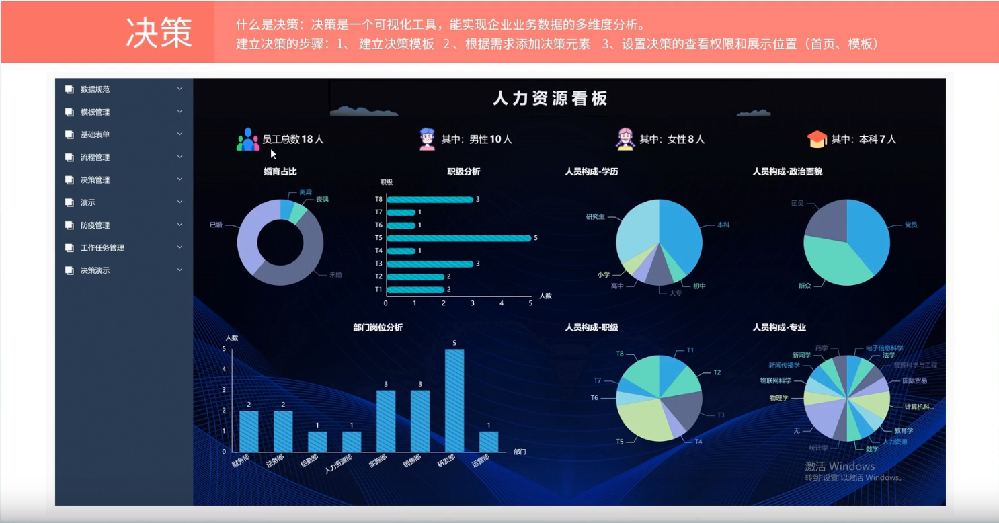​

了解了什么是决策以及经济决策的步骤后，下面我们结合之前的案例采购订单来制作一个简单的决策。回到Workfine设计器，在决策分析界面中先建立决策分组，采购订单决策，选中分组，我们来建立决策：  
第一步，新增决策模板，名称为采购订单数据分析，布局的类型，选择应用端，点击新建；  
第二步是根据需求添加决策元素，点击上方的添加资源框，将鼠标放在图表上，单击，点击新增，在右侧的类型中选择柱形图，在图表中心的基本属性中修改图表的名称→供应商数量统计，在下方给图表选择一个合适的配色，设置完成后，在数据的类目中，点击编辑按钮，设置图表的数据源，数据来源为库存管理中的采购订单_主表，在填充方式中选择柱形图的分类，填充采购类型，选中柱形数据，填充供应商的名称，然后点击编辑按钮对供应商的名称进行计数，设置完成后，点击保存，保存，然后选中图表，将图表放大，移动到合适的位置；  
当第二步完成后，我们来看第三步，设置角色的查看权限及展示位置，将鼠标点在资源框以外的地方，在右侧的模板中心找到查看权限，点击编辑按钮，这个是添加查看权限，我们可以根据实际的业务需求在这里勾选相应的角色，在这里我们选择系统管理员，也就是说给系统管理员添加决策的查看权限，保存后这里有一个选项是首页显示，勾选后，我们的决策就会在应用端的首页中展示出来，保存后，保存决策，前往应用端测试。

当系统中有多个决策都展示在首页时，我们可以在这里（左上角）切换决策，选择采购订单数据分析，就能看到我们刚才建立的决策，这就是将决策展示在应用端的首页。如果想将决策展示在模板中，我们需要在模板设计中，新增模板，模板的名称为供应商数据分析，所属分组选择决策，模板的类型，这里选择决策，选择决策，在采购订单决策中选择刚才建立的决策，点击新建，设置完成后在应用端刷新，在决策的类目中找到供应商数据分析、决策，分析后就能看到刚才建立的决策。

这节课我们主要讲解了什么是决策以及建立决策的步骤，在Workfine中建立的决策模板就像一张画布，我们可以根据业务需求在画布上添加需要的决策元素，当决策元素添加完成后，我们还要根据需求设置决策的查看权限，并将决策展示在合适的位置，可以展示在首页，也可以展示在模板中。

课程最后，大家可能会发现我们刚才制作的决策不够美观，那如何美化决策呢，我们来看一下思路，回到刚才制作的角色模板中，想要美化决策，我们可以从三个方向来设置，一是整个模板的美化设置，二是资源框的美化设置，三是决策元素的美化设置。  
我们先来看第一个整个模板的美化，我们将鼠标在资源框以外的地方，单击在右侧出现的模板中心，可以设置整个模板的整体配色、背景，比如，我们在这里选择背景的方式为图片，单击选择图片，选择一个合适的背景图片，还可以根据需求在这里设置背景的铺满以及背景的特效，设置完成后，这个就是对整个模板的美化。  
然后我们来看第二个对资源框的美化设置，将鼠标放在资源框的上方，在上方出现的属性中单击，在这里我们可以设置资源框的背景以及边框的样式，这里呢，我就不设置了。  
然后第三步是设置决策元素的美化，选择决策元素，在右侧的图表中心，我们来美化一下图表，在基本类目中，我们将标题中的字体颜色修改为白色，这里的字体颜色就变成了白色，然后在属性类目中，我们将数据轴和分类轴的框线和字体颜色都设置为白色，换那种，柔性颜色为白色，然后在数据轴中找到轴线的颜色，设置为白色，设置完成后，保存，前往应用端刷新，这时我们就能看到美化后的决策。

对于决策的美化，这里呢，我们只是介绍了一个思路，希望课后大家多去尝试操作，多去思考，这样才能在以后的工作中制作出美观的决策，这节课就讲解到这里，谢谢大家的观看。

## [02、决策元素-文字 图片](https://community.bn100.com/video)

大家好，欢迎来到Workfine数字化课堂，这节课我们来学习决策中的文字和图片。在决策中通常都会用到文字和图片，在决策模板中添加了文字和图片后，我们还可以根据实际的业务需求给文字和图片添加相应的动作。比如在这个决策中，当我们在采购订单上单击时，能弹出新增采购订单的窗口；当我们在订单明细上单击时，能打开采购订单的历史记录界面；当我们在下方的图片上单击时，能打开Workfine的官网。

​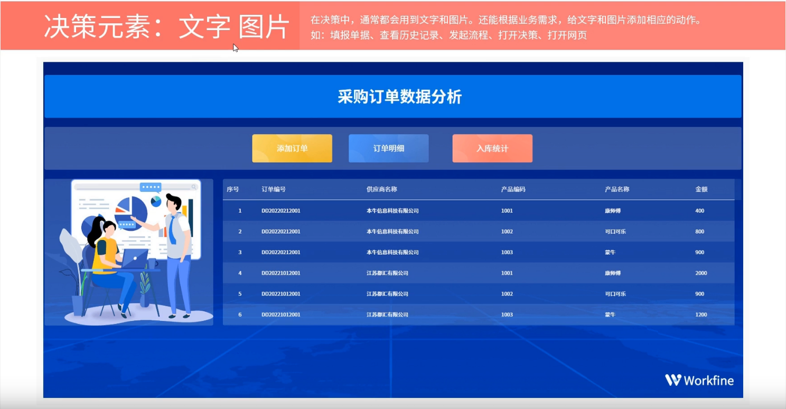​

了解了决策中的文字和图片后，下面我们来看具体的操作，回到Workfine设计器，在决策分析界面中选中之前的决策分组，建立决策→文字、图片元素；当模板建立完成后，我们在模板中心先给模板添加一个背景，方式选为图片，选择一张合适的背景图片；然后根据需求添加文字元素，添加资源框，在文字上单击，在资源框的上方单击后输入决策的标题→采购订单数据分析，选中文字后，在上方出现的工具箱中可以设置字体的格式和对齐方式，将字体放大加粗显示，并将文字设为白色，让文字在资源框中水平垂直居中；设置完成后，调节资源框的大小和位置，然后将鼠标放在资源框上，在上方出现的属性上单击，我们给资源框添加一个背景，选择纯色，颜色为蓝色；再次添加文字元素，输入文字→新增订单，选中文字后，调节字体的格式和对齐方式，然后在右侧给文字添加相应的动作，根据需求这里选择填报单据，填报方式选择弹出框，添加来源模板，在库存管理中选择采购订单，调整资源框的大小和位置，然后将鼠标放在资源框上，点击属性，给资源框添加背景，选择图片，选择图片，在这里可以使用系统中自带的图片，也可以根据需求点击本地图片上传电脑中准备好的图片；再次添加文字元素，输入文字→订单明细，选中文字后，设置字体的格式和对齐方式，然后在右侧给文字添加相应的动作，查看历史记录，添加来源模板为库存管理中的采购订单，调节资源框的大小和位置，给资源框添加背景，上传电脑中已经制作好的背景；同样的方法可以继续向角色中添加文字元素，这里就不再进行演示了。

下面我们来看如何添加图片元素，添加资源框，在图片上单击，在电脑中选择已经制作好的图片，调节资源框的大小和位置，将鼠标放在资源框的属性上，单击给资源框添加一个背景，选择纯色，颜色为白色，并降低透明度；再次添加图片元素，这次选择已经制作好的logo图片，给logo图片添加动作，打开网页，选择网址的前缀，输入网址，调节资源框的大小和位置。

为了让决策更加美观，我们再次添加一个文字元素，但是呢，不输入任何的文字，将资源框的位置和大小进行调节，设置资源框的属性，将背景设置为纯色，颜色为白色，并降低透明度，然后将这个资源框的层级置于底层。

当模板中的元素都添加完成后，我们将鼠标点在资源框以外的地方，在模板中心来设置决策的查看权限，给系统管理员添加查看权限，然后将决策展示在应用端的首页，设置完成后保存，保存决策，前往应用端测试。

切换到文字、图片元素，就能看到我们刚才建立的决策，在新增订单的文字上单击时可以打开新增采购订单的窗口，在订单明细上单击可以打开采购订单的历史记录界面，在下方的logo图片上单击可以打开相应的网站。

这节课我们主要讲解了决策中的文字和图片，以及如何给图片和文字添加相应的动作，在决策中给文字和图片添加的动作，还有发起流程，打开决策等等，这里就不再进行演示了，希望课后大家多去尝试操作，这节课就讲解到这里，谢谢大家的观看。

## [03、决策元素-图表](https://community.bn100.com/video)

大家好，欢迎来到Workfine数字化课堂，这节课我们来学习如何在决策中添加图表，在决策中最常用的就是图表，图表可以直观的展示统计信息，有助于我们快速有效的表达数据关系。在Workfine中有柱形图、折线图、组合图、KPI、饼图、甘特图等几十种图表类型，大家在做决策时可以根据需求选择相应的图表类型。在决策中添加图表很简单，但是有一点需要注意，就是图表可以跟数据规范设置联动效果，比如在这个决策中，当下面的图表与上面的下拉设置联动后，用户可以在这里选择下拉的内容，让图表动态展示不同的数据。

​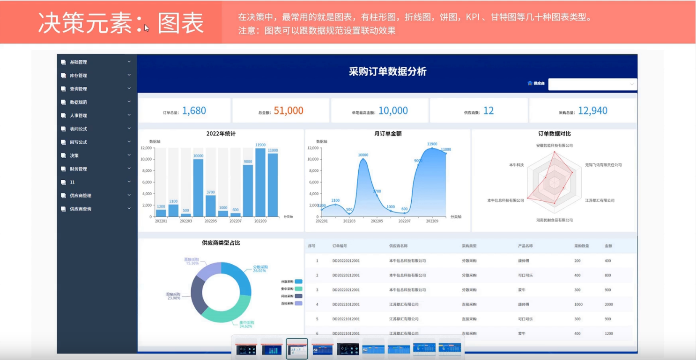​

了解了图表的基础知识后，下面我们来看如何在决策中添加图表，并设置图表的联动效果。回到Workfine设计器，添加决策模板→图表元素，添加资源框，在图表上单击新增图表，右侧在图表中心我们可以看到图表的类型有很多，后期大家可以根据需求选择相应的图表类型，比如这里我们选择折线图，在基本属性中，我们先来设置图表的名称，这里需要注意的是，在这个决策模板中，图表的名称不能重复；这里是标题的样式，我们可以隐藏或显示标题，也可以设置标题的字体格式、标题的对齐位置和标题的背景颜色；这里是图例，在这里我们可以显示或隐藏图例，图例字体的设置，图例的展示位置和图例的背景颜色；这个是图表的配色，在这里我们可以给图表选择一个合适的配色效果；最后是工具集的展示位置；在数据中给图表选择数据源，添加数据源，在库存管理中选择采购订单，填充方式选择折线_分类，填充扩展表中的产品名称，选择折线_数据填充扩展表中的金额，然后点击编辑对金额汇总，保存；最后，在属性中可以修改折线图的各种属性，这里是通用选项，可以调节整个直线图在资源框中的位置以及大小，再往下可以设置分类轴和数据轴的轴线、字体以及展示位置等等，这里的选项比较简单，这里就不再一一进行展示了。

这里需要提到的是上方有个折线属性，当我们单击后会出现三个选项，在折线上单击，我们可以看到在这里可以修改折线的展现样式、区域填充，我们将展现样式中的折线修改为曲线，这时可以看到原来的折线变成了曲线；区域填充，当我们选择自动时，我们会发现这里的区域被填充上了渐变色，如果想要修改这里的颜色，我们可以在折线下方名称的右侧修改颜色，比如修改为红色，确认后，我们会发现这里的折线以及区域的颜色也变成了红色。当图表美化完成后，我们调节资源框的大小和位置。这就是如何在决策中插入图表元素。

当图表元素建立完成后，添加资源框，在其他类目中选择数据规范→下拉，在数据中选择供应商下拉，数据模式为单选，在通用选项中可以设置下拉的前缀→选择供应商，设置完成后，调节资源框的大小和位置，保存模板。

下面我们来看如何给图表和数据规范建立联动效果，将鼠标在资源框以外的地方单击，在右侧的模板中心找到联动设置，新增联动，名称为供应商产品金额统计，触发来源选择数据规范中的下拉，联动目标选择图表元素决策，选择图表，我们来设置筛选条件，下拉中的值等于主表中的供应商名称或者下拉中的值为空，保存。

最后，我们来设置决策的查看权限和展示位置，给系统管理员添加查看权限，然后将决策展示在应用端的首页，再次保存模板，前往应用端测试。切换到图表元素决策，在这里就能看到我们刚才建立的决策，当我们在下拉中选择供应商时，下方的图表会动态展示相应的数据。

这节课我们主要讲解了如何在决策中插入图表并设置联动效果，至于如何实现这种决策效果，我们就不再演示了，希望课后大家多去思考，多去尝试操作，这节课就讲解到这里，谢谢大家的观看。

## [04、决策元素-其他](https://community.bn100.com/video)

大家好，欢迎来到Workfine数字化课堂，这节课我们来学习在决策中添加其他元素，包括数据规范、流程、业务和工具集，这些知识点相对比较简单，所以我们放在一起讲。

​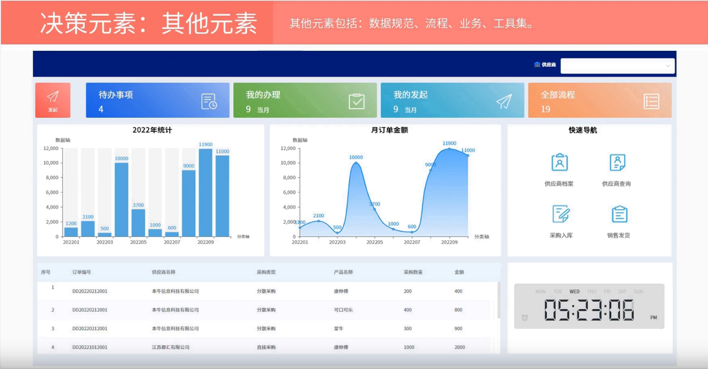​

回到Workfine设计器，打开上节课的图表元素案例，添加资源框，在其他选项中找到数据规范。我们先来看在决策中能添加的数据规范有哪些，有日期、下拉列表和复选框。这些数据规范的添加方法比较简单，我们以下拉为例来进行讲解，剩下的大家课后去练习。添加下拉后，在右侧的属性中，我们可以选择绑定系统中的哪个下拉，比如采购类型，还可以在数据模式中将下拉设置为多选，在上方可以给下拉添加前缀采购类型以及前缀的展示样式，这里的选项保持默认，当下拉规范设置完成后，保存模板前往应用端查看，这个就是我们刚才添加的下拉规范，这里是下拉的前缀，单击下拉，可以对内容进行多选。在决策中添加数据规范的主要作用是什么呢，使数据规范能与图表设置联动效果，也就是说，当用户在切换数据规范的内容时，相关联的图表为动态展示相应的数据。在上节课我们已经讲过了下拉规范与图表的联动设置，这里呢，就不再做过多的讲解了。

在决策中可以添加的流程元素有流程统计和流程列表，我们先添加流程统计，适当调整资源框的位置和大小，然后再次添加流程，流程列表，调节资源框的大小，选中流程列表后，在右侧的属性中可以设置标签样式、表内样式以及流程列表的背景色，设置完成后，保存模板前往应用端查看。这个是我们刚才添加的流程统计，上方有发起流程、待办事项、我的办理、我的发起以及全部流程的数量，下方是添加的流程列表，上面有代办事项的流程列表，有提交未处理的流程列表等等。所以说，在决策中添加流程元素，能让用户更加直观的处理工作流信息。

在决策中可以添加的业务元素有导航和数据列表，我们先来添加导航，将鼠标放在资源框上，右上角会出现添加图标的按钮，每单击一下就会添加一个图标，不需要的图标还可以删除，将鼠标放在图标的中心位置，按住左键可以调节图标的位置，选中图标后，在右侧的属性中找到交互设置，可以修改图标的名称并添加相应的动作，比如我们将名称修改为新增订单，将动作设置为填报单据，方式为弹出框，添加来源选择库存管理中的采购订单，也就是说，当用户在这个图标上单击时，能弹出新增采购订单的窗口，如果想让图标变得更加美观，我们可以在上方修改图标的图形以及显示方式，将形状修改为矩形，清空背景颜色、边框颜色，将图标的颜色加深。  
设置完成后，再次添加资源框，在业务中选择数据列表，在右侧的属性中选择要展示哪些数据，点击编辑按钮，选择数据源，我们选择库存管理中的采购订单，主表和扩展表；在填充方式中添加列表中要展示的字段，订单编号、供应商名称、产品编码、产品名称、采购数量、单价和金额，这里还有列表动作，可以根据需求进行选择性设置，如果我们想用户在数据列表上单击时就能查看采购订单的详细信息，那我们就可以设置列表动作，将动作类型设置为查看单据，关联模板，选择库存管理中的采购订单，打开方式我们选择弹出框，触发方式选择整行，传递字段为订单编号，设置完成后保存，适当调整资源框的大小，保存模板，前往应用端测试。

这是我们刚添加的导航，在图标上单击就能打开新增采购订单的窗口，这里是采购订单的数据列表，因为设置了列表动作，所以我们在数据行上单击时，就能查看采购订单的详细信息，当数据列表中的内容比较多时，我们还可以将数据列表的展示类型设置为分页或者是滚动，这时，数据列表就是以滚动的方式展示。

最后我们来看工具集中的时钟，显示的是系统当前的时间，在右侧还可以切换时钟的样式。

这节课我们主要讲解了决策中的数据规范、流程、业务和工具集，我们只演示了一部分的操作，里面还有更多的细节没有讲到，希望课后大家多去思考，多去尝试操作，这节课就讲解到这里，谢谢大家的观看。

# 流程审批

## [01、流程审批](https://community.bn100.com/video)

大家好，欢迎来到Workfine数字化课堂，从这节课开始，我们来学习流程审批。那什么是流程审批呢，流程审批就是指某项具体的业务需要不同的人审核完成后才能生效，这些不同的人一般分属于不同的工作岗位。比如我们熟悉的请假过程，一般先由员工提交请假申请，然后由相应的部门主管审批，最后由人事进行审批，这就是一个简单的流程审批。

了解了流程审批的概念后，下面我们来看流程的组成部分，在Workfine中绘制流程图非常简单，在添加流程后，只需要根据需求将左侧中需要的节点拖到画布上，然后用连接线连接节点即可，所以说在Workfine中，流程图是由流程节点和连接线组成，这里需要注意的是，一个完整的工作流程图必须要包含一个开始点和结束点。

​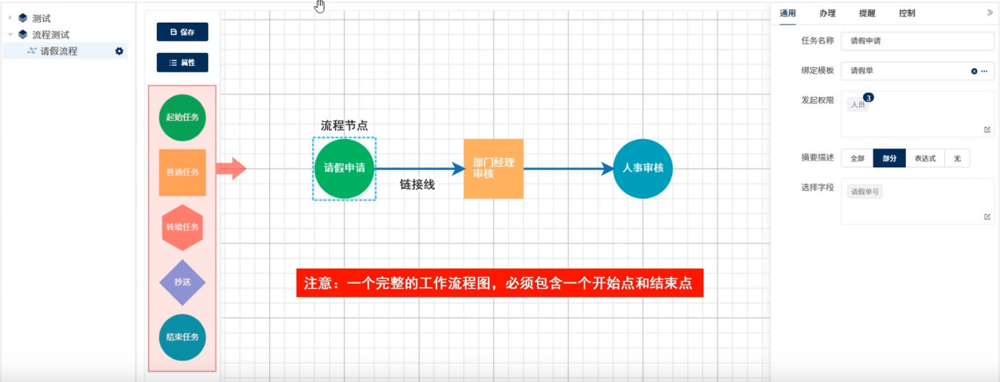​

当流程图绘制完成后，这个流程还不能正常运转，我们必须要给节点和连接线设置相应的属性后，流程才能正常的运转。那如何设置流程的属性呢，在流程图中选中连接线时，右侧会出现连接线的判断条件，也就是说，当流程设计有分叉的时候，流程会根据临界性的判断条件来决定流程的走向，当我们选中节点时，右侧会出现与这个节点相关的所有属性，当然，Workfine已经按照类别将这些属性分门别类的放在通用、办理、提醒、控制四个类目中，这里给大家列出了节点的必填属性，因为后面的案例中都会用到这些属性，所以这里我们就不再单独介绍了，有需要的朋友可以暂停观看，或者去文档教程中查看流程属性参数表，了解更多的流程属性。

​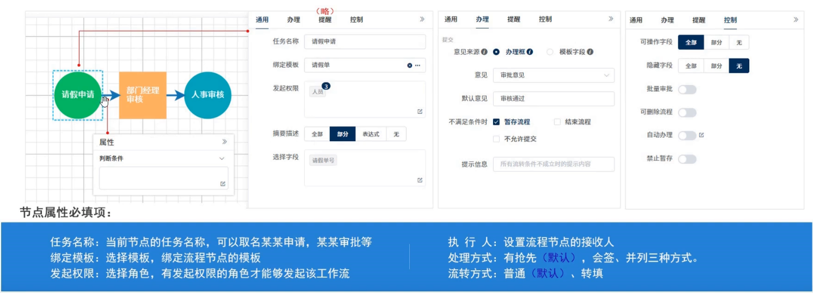​

了解了流程的基础知识后，下面我们来看如何在Workfine中建立请假流程，回到Workfine设计器，进入流程审批界面，点击加号新增分组，输入分组的名称→人事管理流程，再次点击加号新增流程，输入流程的名称→请假申请，将流程放在刚建立的分组当中，点击新建，然后根据需求将左侧的节点拖到画布中，在节点的名称上拖动鼠标，可以移动节点的位置，在节点的周围拖动鼠标，可以添加连接线。

当流程图绘制完成后，还需要设置流程的属性，这样流程才能正常的运转，因为在这个案例当中，对流程线没有要求，所以我们只需要设置节点的属性，选中开始节点，在通用类目中，修改任务的名称为请假申请，然后绑定模板，请假单，发起权限就是指定谁可以发起流程，根据实际情况，这里我们选择员工；然后选择中间节点，修改任务的名称为部门主管审批，办理对象就是这个流程节点的接收人，我们选择指定角色，选择角色为主管，与上一步处理人也就是员工的关系为同一部门；选中结束节点，修改任务的名称为人事审批，办理对象指定角色，选择角色→人事，其他属性保存默认，当流程的属性设置完成后，我们保存流程。在测试流程前，还需要提醒大家一下，不要忘了给请假单模板设置权限，让相关人员拥有相应的模板权限。

在测试流程时，我们先使用市场部员工王明的账户进行登录，登录成功后，点击上方的闹钟，进入流程审批界面，点击发起，选择刚建立的请假申请流程，填写相应的信息后，发起流程，然后退出账户；使用市场部主管的账号登录，进入系统后点击闹钟，进入流程审批界面，就能看到刚才部门员工提交的请假申请流程，在这里，我们可以根据实际的情况对流程进行办理回退，或者查看流程的进度，点击办理，设置部门主管的意见为同意，提交，然后退出账户；使用人事的账号进行登录，进入流程审批界面，找到刚才提交的请假流程，点击办理，提交，提交后流程结束。当然对于不符合要求的流程，也可以点击回退，默认是回退到上一步，也可以在我的办理中查看刚才流程的内容，以及流程的进度和流程图，希望课后大家多去尝试操作，这里就不再一一演示了。

通过这节课的学习，我们会发现Workfine通过流程审批能实现企业的办公自动化，所以在开发业务系统时，我们除了要设计表单外，还需要设计流程，然后将工作流与表单相结合，设置好每个节点的任务名称、办理人、流转方式等，就可以发起流程，这节课就讲解到这里，谢谢大家的观看。

## [02、处理方式](https://community.bn100.com/video)

大家好，欢迎来到Workfine数字化课堂。这节课，我们来继续学习流程审批的知识点，流程的处理方式。在Workfine中，流程的处理方式有三种，分别是抢先、会签和并列，其中抢先为系统默认的方式。

​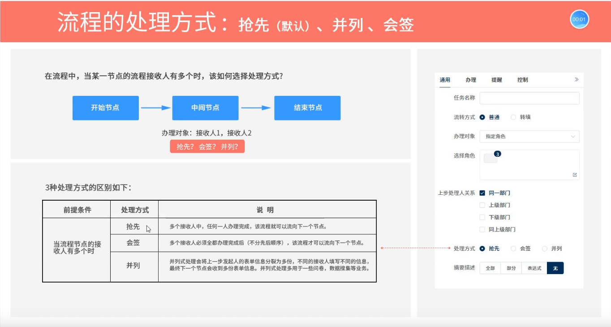​

|前提条件|处理方式|说明|
| -------------------------------------------------------| ----------| ------------------------------------------------------------------------------------------------------------------------------------------------------------|
|当流程节点的接收人有多个时|抢先|多个接收人中，有任何一人办理完成后，该流程就可以流向下一个节点|
||会签|多个接收人必须全部办理完成后（不分先后顺序），该流程才可以流向下一个节点|
||并列|并列式处理会将上一步发起人的表单信息分裂为多份，不同的接收人填写不同的信息，<br />最终下一个节点会受到多份表单信息。并列式处理多用于一些问卷、数据收集等业务。|

下面我们通过一张图带大家快速掌握这三种处理方式的区别。在这张图中，我们可以看出，不管哪种处理方式，他们都有一个共同的前提条件，就是当前节点的接收人为多个，就比如在上面这个案例中，中间节点的接收人就是多个。抢先是指多个接收人中，有任何一人办理完成后，该流程就可以流向下一个节点，如果这里选择抢先，那接收人1、2中有一人办理完成后，流程就会走向下一个节点；会签是指所有的接收人不分先后顺序，必须全部办理完成后，流程才会流向下一个节点，如果这里选择会签，那必须要接收人1、2全部办理完成后，流程才会走向下一个节点；并列是将上一步发起人的表单信息分列为多份，不同的接收人填写不同的信息，最终下一个节点会收到多份表单信息，并列处理多用于一些调查、问卷、数据搜集等业务，当这里选择并列后，如果有一人办理完成，下一个节点会收到一份表单信息，如果有两人办理完成，那下一个节点就会收到两份表单信息。这就是三种处理方式的区别，在以后的工作中，我们需要结合实际的情况，给流程选择正确的处理方式。

下面我们来看具体的案例，仓库评分流程，整个流程的设计思路是，由系统管理员发起评分流程，然后由部门主管进行评分，最后再返回给系统管理员，这里大家想一下，如果系统管理员想收到所有部门主管的评分表，那应该给中间节点的处理方式设置为并列。

好，下面我们来看具体的操作，回到Workfine设计器，进入流程审批界面，点击加号，新增流程，输入流程的名称，仓库评分流程；然后根据需求将需要的起始任务、普通任务、结束任务拖动到画布上，用连接线连接；然后选择起始任务，修改起始任务的名称为发起评分流程，绑定模板，选择仓库检查评分表，发起权限，选择系统管理员；然后选择中间节点，将任务的名称修改为部门主管评分，办理对象指定角色，选择角色为主管，这里的处理方式选择并列；然后选择结束任务，修改结束任务的名称，流程结束办理对象，因为并列之后要返回到系统管理员，也就是流程发起人，所以这里可以选择流程发起人，其他属性保持默认，设置完成后，保存流程，前往应用端测试。

在测试流程时，首先使用系统管理员账号登录，进入流程管理界面，点击发起流程，选择仓库评分流程，直接发起，退出账号后；使用市场部主管的账号登录，进入流程管理界面，找到刚才的流程办理，取消，然后退出账号；最后使用系统管理员的账号登录系统，在流程管理界面中，我们可以看到市场部门管李密提交的评分内容，也可以点击进度查看整个流程的进度情况，在这里我们会发现提交的有一人，未提交的有两人，所以说，并列式处理就是当流程节点有多个接收人时，会将上一步发起人的表单信息分列为多份。

这节课我们主要讲解了流程的处理方式，希望通过这节课的学习，大家能熟练掌握抢先会签和并列的区别，好，这节课就讲解到这里，谢谢大家的观看，

## [03、流转方式](https://community.bn100.com/video)

大家好，欢迎来到Workfine数字化课堂，这节课我们来继续学习流程审批的知识点——流转方式。在Workfine中，流程的流转方式有普通和转填两种，其中系统默认的流转方式为普通。

​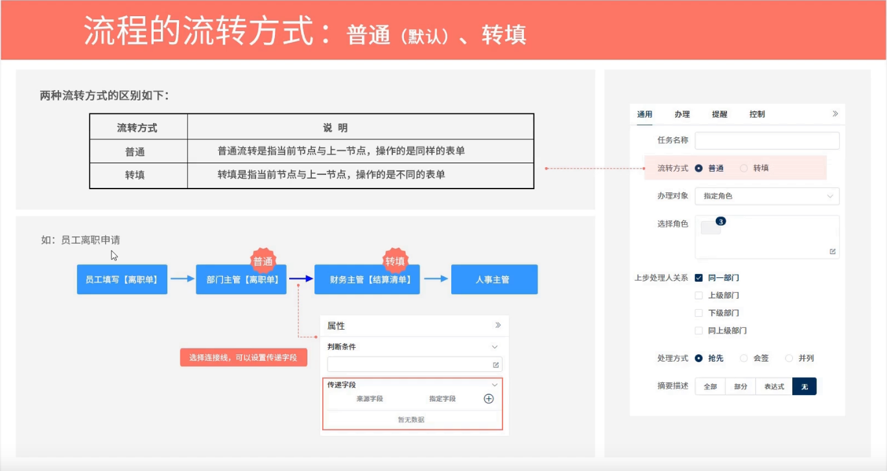​

下面我们通过一张图带大家快速区分一下这两种方式，普通流转是指当前节点与上一节点操作的是同样的表单，而转填是指当前节点与上一节点操作的是不同的表单，这个比较好理解。那下面我们再结合实际的案例来看一下，在员工离职申请中，首先由员工填写离职申请单，然后由本部门主管进行审批，审批完成后，由财务主管填写结算清单，最后流程到人事主管这里结束。在这个流程中，部门主管与上一节点操作的是同一个表单，也就是离职申请单，所以这个节点的流转方式为普通，从财务主管这里开始，要填写结算清单模板，他与上一节点使用的是不同的表单，所以这一节点的流转方式为转填，其实转填就是表单模板变了，在转填时除了要选择新模板之外，还可以选中连接线，在属性中设置传递字段，将上一步的表单信息传递到转填的表单中，这就是普通和转填两种方式的区别。

下面我们来看如何在Workfinework发中建立这个员工离职申请流程，回到Workfine设计器，在流程审批界面中新增流程，离职申请，然后根据需求将起始任务、普通任务、转填任务以及结束任务拖到画布中，并用连接性连接；然后选中开始节点，修改任务的名称为离职申请，绑定模板，离职申请单，发起权限选择公司员工；然后选择普通任务，修改任务的名称为部门主管审批，流转方式，因为这一节点与上一节点使用的是同一个模板，所以流转方式为默认的普通，办理对象选择指定角色，添加角色主管，与上步处理人的关系为同一部门；选择转填任务，修改任务的名称为财务主管结算，因为这一节点与上一节点使用的是不同的模板，所以流转方式为转填，然后绑定模板，财务清算单，办理对象选择指定角色，添加角色主管，然后点击修改，取消其他主管，只留下财务主管；当转填的节点属性设置完成后，我们选择连接线，在属性栏中设置传递字段，点击加号，将离职申请单中的字段内容传递到转填表单中，姓名到姓名，再次点击加号，选择部门到部门；然后选择结束任务，修改任务的名称为人事主管，流转方式为普通，办理对象选择指定角色，选择主管，点击编辑按钮，只留下人事部主管，其他属性保持默认，设置完成后，保存流程，前往应用端测试。

在测试流程时，请使用市场部员工的账号登录，发起离职申请，填写相应的信息后，发起流程，退出登录；使用市场部主管的账号登录，找到流程后，点击办理，这一步，我们看到的是离职申请单，将部门主管意见修改为同意后提交，然后退出登录；使用财务部主管的账号登录，找到刚才的离职申请流程，点击办理，这时我们会发现，模板变成了结算清单，并且，上一个模板中的姓名和部门字段内容被传递过来了，填写相应的内容后，点击提交。

这节课我们主要讲解了流程的流转方式，通过这节课的学习，希望在以后的工作中，大家能够根据实际的业务需求给流程设置正确的流转方式，这节课就讲解到这里，谢谢大家的观看。

## [04、流向条件](https://community.bn100.com/video)

大家好，欢迎来到Workfine数字化课堂，这节课我们来继续学习流程审批的知识点——流向条件。当流程设计有分叉的时候，流程会根据连接线的判断条件来确定流程的流向。就比如我们给之前的请假流程添加一个条件，就是请假天数在三天内的，只需要部门主管审批；如果请假天数大于三天，部门主管审批后，还需要总经理审批，那这个时候我们该如何给流程设置流向条件呢，下面我们来看具体的操作。

回到Workfine设计器，在流程审批界面中打开之前的请假申请流程，我们在这个基础之上进行修改，根据需求，当部门主管审批完成后，流程就有分叉了，所以在这里我们增加一个普通节点，并使用连接线连接，然后选中节点修改任务的名称为总经理审批，办理对象选择指定角色，选择角色总经理。

当节点的属性设置完成后，我们来设置流向条件，选中部门主管到人事的连接线，在右侧的判断条件中设置判断条件，请假天数小于等于3，选择部门主管到总经理之间的连接线，设置判断条件，请假天数大于3，设置完成后，保存流程前往应用端测试。

在测试流程时，我们使用市场部员工的账号登录，进入流程管理界面，发起两个请假流程，第一个请假天数小于三天，第二个请假天数大于三天，然后退出账号；使用市场部主管的账号登录，在流程管理界面中，找到刚才的请假流程，点击办理，然后退出账号；使用人事的账号登录，在流程管理界面中，我们会发现只有一条请假申请，点击办理，可以看到是请假天数小于三天的流程，因为大于三天的那个请假流程，还需要总经理办理完成后才能走到这里。这就是流程的流向条件，会根据连接性的判断条件来确定流程的流向，这里呢，就不再继续演示了，希望课后大家多去尝试操作。

这节课我们主要讲解了流程的流向条件，希望通过这节课的学习，大家在以后的工作中能设计出符合要求的审批流程，这节课就讲解到这里，谢谢大家的观看。

## [05、流程抄送](https://community.bn100.com/video)

在Workfine中，我们可以给流程添加抄送功能，抄送的位置可以是流程的结束节点，也可以是流程的中间节点，当流程中添加了抄送节点后，我们还需要给抄送节点设置抄送对象和抄送字段。了解了流程抄送的基础知识后，如果我们想实现这样一个案例，就是员工提交请假申请后，由部门主管审批，审批完后把它抄送给人事主管。那该如何实现呢，下面我们来看具体的操作。

回到Workfine设计器，在流程审批界面中新增流程，请假流程（抄送），我们先把请假流程做出来，将起始任务、结束任务拖到画布中，用连接线连接；然后选择起始任务，修改任务的名称为请假申请，绑定请假单模板，发起权限，公司员工；然后选择结束节点，修改任务的名称为部门主管审批，办理对象指定角色，选择角色为主管，与上步处理人的关系为同一部门；当流程设置完成后，我们来添加抄送，根据需求是部门管理员审批完成后把流程送给人事主管，所以在这里我们添加一个抄送，并使用连接线连接，选中抄送节点，我们来设置抄送的对象为指定角色，主管，点击编辑按钮，只保留人事部，保存后设置抄送字段，抄送字段就是指哪些字段内容是人事经理可以看见的，我们点击全选，就是人事主管能看到请假单中所有的字段内容，保存，设置完成后，保存流程前往应用端测试。

在测试流程时，请使用市场部员工的账号登录，进入流程管理界面，点击发起，请假抄送流程，发起流程后退出账号；然后使用市场部主管的账号登录，找到刚才的流程，点击办理，提交，然后退出登录；最后使用人事主管的账号登录，在流程管理界面中，我们会发现抄送的流程不在代办类目中，而是在待阅类目中，并且这里没有办理按钮，我们可以查看流程的内容和流程的进度，因为抄送字段选择了全部，所以这里我们可以看到请假单中所有的字段内容，点击阅览，标记为已阅，支持流程结束，点击我的办理，在已结束类目中可以查看刚才抄送的流程已经结束，这就是流程的抄送。

## [06、批量审批](https://community.bn100.com/video)

在Workfine中开启批量审批模式，并选择相应的回写公式后，就能实现用户批量审批自己的代办流程。

​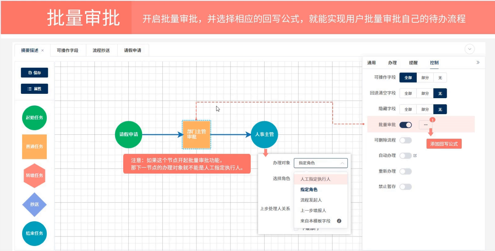​

在设置批量审批时，有一点需要注意，就是如果当前这个节点开启了批量审批，那下一节点呢，办理对象就不能是人工指定执行人，否则，批量审批会失败，这个知识点一定要记住。

下面我们来看如何给之前请假案例中的部门主管添加批量审批的功能。回到Workfine设计器，我们先给流程中使用的请假单模板添加回写公式，公示的名称为部门主管审批，执行时机选择手动执行，操作类型为修改记录，回写目标，选择请假单，数据来源为本表数据，筛选条件，请假单号等于请假单号，取值字段，找到部门主管意见，点击编辑，同意，设置完成后，点击新建，保存模板。当回写公式添加完成后，回到流程审批界面，找到之前的请假流程，选中部门主管节点，在控制类目中，开启批量审批功能，点击这里添加刚才的回写公式，部门主管审批，设置完成后，保存流程前往应用端测试。

在测试流程时，首先使用市场部员工的账号登录，进入流程管理界面，发起多个请假流程，这里我们发起了三个请假流程，然后退出账号；使用市场部主管的账号登录，进入流程管理界面，在代办类目中点击请假流程下方会出现批量审批的按钮，点击批量审批，选中要办理的流程后，再次点击批量审批，确定，批量审批任务完成，这就是流程的批量审批。

## [07、办理对象](https://community.bn100.com/video)

办理对象是指流程流转到当前节点后有办理权限的人员。

​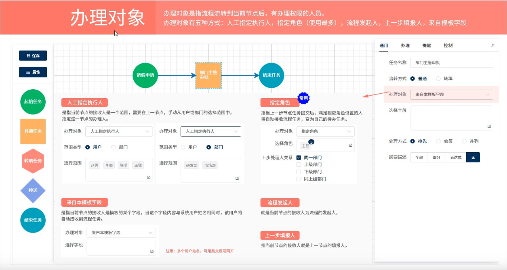​

在Workfine中，办理对象有五种，下面我们结合之前的请假流程来区分一下这五种办理方式。

人工指定执行人是指当前节点的接收人是一个范围，需要在上一节点手动从用户或部门的选择范围中指定这一节点的办理人。那下面我们将部门主管的办理人设置为人工指定执行人，来看一下效果。在请假流程中选中部门主管节点，将办理对象设置为人工指定执行人，范围类型我们以用户为例，点击选择用户范围，这里我们选择三个用户设置完成后保存流程，前往应用端测试。在测试流程时，我们使用员工账号登录系统，进入流程管理界面，发起请假流程，在发起流程时，我们会发现在提交窗口中，需要我们从这三个用户范围中手动指定下一节点的执行人，如果这里我们选择李密，那下一节点的接收人就是李密，这就是人工指定执行人，至于范围、类型，是选择用户还是选择部门，大家可以根据实际的业务需求来决定。

指定角色是最常用的方式，在我们之前讲解的案例基本上都是使用这一方式，需要注意的是，当我们指定了角色后，还能指定当前角色与上一节点处理人之间的关系，是同一部门呢，还是上下级部门，因为在之前的案例中我们已经使用过多次，所以这里就不再演示了。

来自本模板字段是指当前节点的接收人是模板中的某个字段，当这个字段的内容与系统用户姓名相同时，该用户会自动收到流程任务，那下面我们将部门主管节点的代理人设置为来自本模板字段来看一下，在请假流程中，选中部门主管节点，将办理对象修改为来自本模板字段选择字段，勾选下一节点接收人，设置完成后，保存流程，前往应应端测试。在使用员工账号登录后，进入流程管理界面，点击发起，请假流程，在填写信息时，我们不要忘了要输入下一节点的接收人，当下一节点的接收人为多个时，姓名之间可以用英文的逗号隔开，提交后，那下一节点的接收人就是李密，这就是来模板字段。

流程发起人就是指当前节点的接收人是该流程的发起人，这个很好理解，如果是张三发起的流程，那这一节点的接收人就是张三。上一步填报人是指当前节点的接收人是上一节点的填报人，如果上一节点的填报人是张三，那这一节点的处理人就是张三，这两个比较容易理解，我们就不再做案例演示了。

希望课后大家多去尝试操作，也希望通过这节课的学习，大家在以后的工作中能根据实际的业务需求，给流程的节点设置正确的办理对象。

## [08、意见来源](https://community.bn100.com/video)

意见来源，流程进度中的意见和意见说明来源于意见办理框或者模板字段。什么意思呢，就是在流程进度中显示这样的流程意见和意见说明，想实现这种效果非常简单，只需要设置意见来源就能实现。在Workfine中，意见来源有两种，分别是办理框和模板字段，其中，办理框是指审批时在弹出的办理框中编辑意见和意见说明，而模板字段则是在表单中编辑审批意见和说明。

​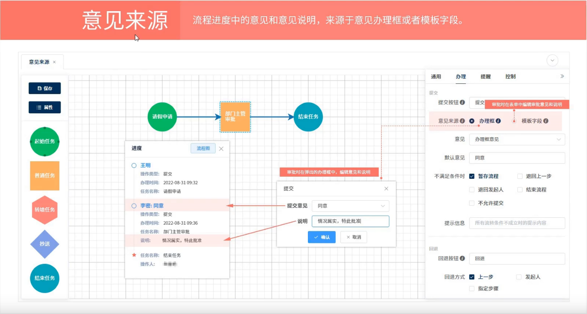​

那下面我们结合之前的请假流程，给开始节点和部门主管节点设置意见来源，回到Workfine设计器，打开之前的请假流程，选中开始节点，在办理框中设置意见来源，我们将意见来源的类型设置为模板字段，意见选择模板中的请假类型字段，说明选择表单中的请假理由；设置完成后，选中部门主管节点，在办理框中，设置意见来源为办理框，点击意见，选择办理框意见，这个下拉的值就是同意/不同意，默认意见使用的是下拉的第一个值；当开始节点和中间节点都设置完成后，保存流程前往应用端测试。

在测试流程时，先使用员工账号登录，进入流程管理界面，发起请假流程，填写请假单的内容，当内容提醒完成后，点击发起，提交，然后退出账号；使用部门主管的账号登录，找到刚才的请假流程，点击办理，点击提交时，在弹出的对话框中编辑提交的意见和说明，设置完成后确认。在我的办理中找到刚才的请假流程，点击进度，这时我们就能看到在流程的节点上显示了该节点的提交意见和说明内容，这就是流程的意见来源，希望课后大家多去尝试操作。

# 数据集成

## 01、视图

### [1、常规视图](https://community.bn100.com/video)

大家好，欢迎来到Workfine数字化课堂，从这节课开始，我们来学习数据集成的视图。那什么是视图呢，视图可以理解为一个虚拟的数据表，它是由一个或多个实际表获得。视图的作用是对最基础的数据进行一定形式的处理，使其满足不同业务的要求。在Workfine中，视图分为两种，一种是常规视图，一种是组合视图，比如这里有两个基础表，A表和B表，常规视图是通过关联横向生成一个新的表，而组合视图是通过组合纵向生成一个新的表。

​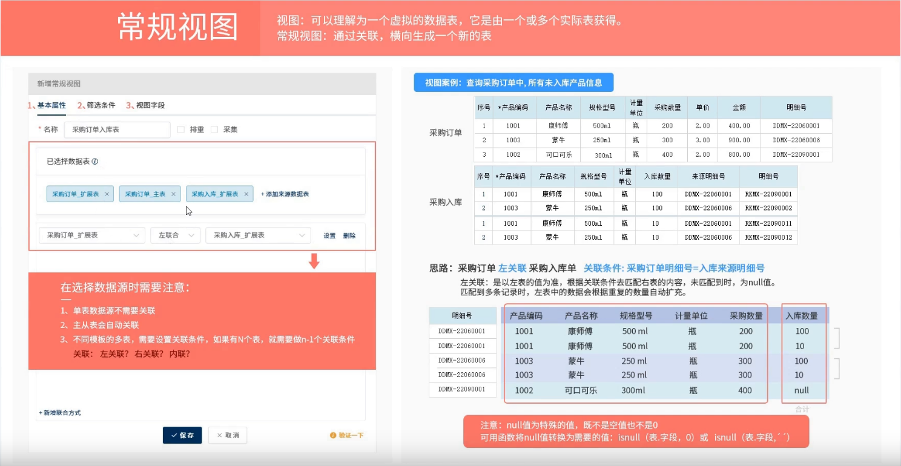​

那这节课我们主要来学习常规视图，在建立常规视图时，我们可以根据需求将选择的数据源横向生成一个新的数据表。那在选择数据源时，有一个知识点需要注意，就是设置数据源的关联和关联条件，如果数据源选择的是一个单表，不需要做关联；如果数据源是一个主从表，也就是统一模板的主表加扩展表，它会自动关联，也不需要我们做关联；如果数据源是来自多个不同模板的表，那我们就需要根据实际的业务需求设置数据表之间的关联和关联条件。至于关联和关联条件，我们单独做了一个视频教程，有需要的朋友可以去看一下，这里呢，就不再单独介绍了。当数据源设置完成后，我们就可以通过筛选条件将需要的字段填充到新的表中，这样就能生成新的数据表。

下面我们通过一个案例来看一下常规视图的应用，在系统中有了采购订单和采购入库单，在入库时还有分批入库的情况，那现在我们想查出所有未入库产品的信息，应该怎么操作呢？解决思路就是用采购订单左关联采购入库单，那左关联是以左表的值为准，先把左表的值放在新的数据表中，然后根据关联条件去匹配右表中的内容，匹配到的就将数据放在新的数据表中，匹配不到时为null值，如果在右表中匹配到多条记录时，左表中的数据会根据重复的数量自动扩充，最终形成一个这样的虚拟表，在这个新的表中，左侧是采购订单中的字段内容，右侧是入库单中的字段内容。在这个基础上，我们还可以对入库的数量进行汇总，在汇总时有一点需要注意，就是这里的null值既不是零值，也不是空值，所以在汇总前，我们需要用函数将那值转化为零之后再汇总，了解了思路后，下面我们来看具体的操作。

回到Workfine设计器，进入数据集成界面，在左侧添加视图的分组，库存视图，然后选中分组，新增常规视图，视图的名称为采购订单到入库；选择数据源，在库存管理中选择采购订单的主表加扩展表，然后选择采购入库单中的扩展表；这是一个主从表，会自动关联，而采购订单和采购入库是属于两个不同的模板，我们需要数据表进行关联，用采购订单扩展表走关联采购入库单扩展表，设置关联条件，采购订单中的明细号等于采购入库单中的来源明细号；设置完成后，点击视图字段，将需要的字段填充到新的数据表中，在采购订单主表中点击订单编号、订单日期，然后在采购订单扩展表中将产品编码、名称、规格、型号、计量单位、采购数量添加到新的表中，然后将入库单中的入库数量添加到新的数据表中，设置完成后，点击新建，点击数据预览，就可以看到所有订单中的入库信息。

那下面我们可以根据订单对相同的产品进行入库数量的汇总，点击修改，在视图字段中找到入库数量，点击编辑，将null值先转换为零值，然后再对数量进行合计，设置完成后，点击保存，点击数据预览，可以看到，现在呢，已经按照订单对相同的产品进行了入库数量的汇总。

设置完成后，打开查询表，我们可以利用取数公式将订单中所有未入库的产品信息提取出来，数据源选择刚才建立的常规视图，筛选条件为视图中所有入库数量小于采购数量的产品信息，取值字段填充到扩展表，然后将执行时机设置为手动执行，点击新建，关闭表间公式窗口，保存模板，前往应用端测试，在查询表中点击查询按钮，即可查出订单中所有未入库产品的信息。

这就是常规视图，通过关联横向生成一个新的数据表。视图的应用非常广泛，希望课后大家多去尝试操作，这节课就讲解到这里，谢谢大家的观看。

### [2、组合视图](https://community.bn100.com/video)

大家好，欢迎来到Workfine数字化课堂，这节课我们来继续学习数据集成中的视图，上节课我们讲了什么是常规视图，那这节课我们主要来学习组合视图。组合视图是通过组合纵向生成一个新的表，在Workfine中建立组合视图只需两步，第一步，选择数据源，建立视图字段，第二步，绑定相应的字段。

​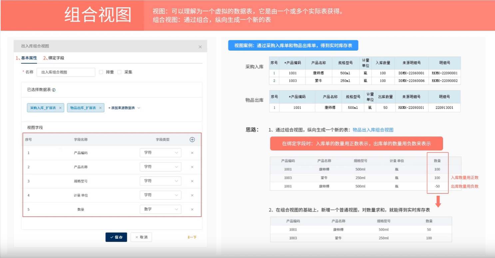​

那下面我们结合一个案例来看一下组合视图的应用，比如，我们已经有了采购入库单和物品出库单，在这两个数据表中，除了入库数量和出库数量不一样，其他字段都一样，那通过组合视图，我们就可以生成一个这样的物品出入库组合表，只不过在绑定字段时，需要把入库数量用正数表示，出库数量用负数表示。在这个组合视图的基础上，我们可以再新增一个普通视图，按产品对这里的数量进行汇总，就能得到物品的实时库存表。

了解了思路后，下面我们来看具体的操作，回到Workfine设计器，进入数据集成界面，在左侧找到库存视图分组，新增组合视图，名称为物品出入库组合视图；选择数据表，在库存管理中选择采购入库_扩展表，物品出库_扩展表；设置完成后，添加新表中的视图字段，在采购入库和物品出库当中，只有入库数量和出库数量两个字段不一样，其他字段都一样，所以这里呢，我们可以选择采购入库单中的字段进行添加，设置完成后，点击保存，然后把入库数量改成数量；设置完成后，点击绑定字段，在组合数据表中，我们可以看到有两个扩展表，首先选中采购入库扩展表，将采购入库单中的字段进行相应的填充，然后选择物品出库扩展表，将物品出库单中的字段进行相应的填充，这里需要注意，应该设置为负数，所以我们点击编辑按钮，将数量乘负一，设置完成后，点击保存。点击数据预览，就能看到所有物品的入库和出库记录。

当组合视图建立完成后，下面我们通过普通视图对产品的数量进行汇总，新增常规视图，名称为物品实时库存表；选择数据源为刚才的组合视图，点击视图字段，将视图中的字段添加到新的数据表中，找到数量，点击编辑，我们对数量进行求和，因为入库为正，出库为负，将入库和出库的数量进行合计，就能得到实时的库存量，设置完成后保存。点击数据预览，就能看到物品的实时库存量。

有了实时库存量，我们就可以回到出库单模板中，给产品名称添加列表。回到产品出库单模板，选中产品名称，在数据规范中点击编辑，找到列表后点击新增，名称为可出库产品；数据源选择刚才的实时库存表；筛选条件，库存数量大于零，也就是说，筛选出有库存的物品，在填充方式中添加相应的字段，并给产品编码设置排序；设置完成后点击新建，绑定可出库产品列表，在绑定时，我们可以根据字段进行相应的填充，设置完成后，点击确认，关闭数据规范窗口。

保存模板后前往应用端测试，在产品出库单中选择出库产品时，我们会发现只能选择有库存量的产品，比如1001目前的库存量是50，我们出库数量为20，那还剩下30，保存后再次点击新增选择产品时，我们会发现1001产品的库存量就已经是30了，后面我们就不再继续测试了。

课程最后给大家留一个思考题，就是我们在选择物品出库时，如果不想让出库的数量大于库存的数量，应该怎么办呢，希望课后大家多去思考，多去尝试操作，这里呢，就不做过多的讲解了。这节课我们主要讲解了组合视图，并通过组合视图实现了实时库存的案例，希望通过这节课的学习，大家能熟练掌握组合视图的知识点，这节课就讲解到这里，谢谢大家的观看，

### [3、数据表：关联](https://community.bn100.com/video)

大家好，欢迎来到Workfine数字化课堂，这节课我们来学习数据表之间的关联，表关联就是指表与表之间根据关联条件联系到一起，形成新的数据形式，就比如这里有采购订单和产品信息表，他们之间通过产品编码相等进行关联，就能形成这样的新数据表，在新数据表中，既有采购订单中的数据信息，又有产品信息表中的数据信息，这就是数据表关联。在Workfine中，关联的方式有三种，分别是左关联、右关联和内联，那下面我们就结合这两张表来快速区分一下这三种关联方式。

​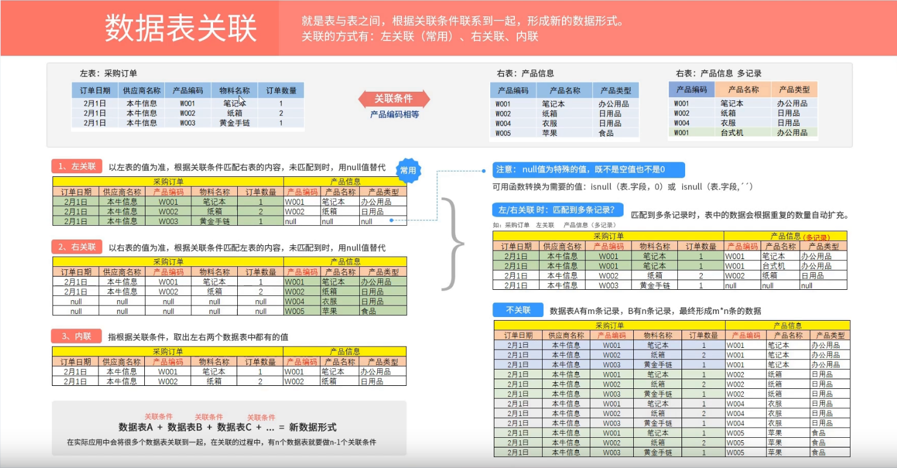​

首先我们来看最常用的左关联，以左表的值为准，根据关联条件匹配右表中的内容，未匹配到时用null值替代，什么意思呢，如果用采购订单左关联产品信息表，那就是先把左表中的数据内容拿过来放在新的数据表中，然后根据关联条件去右表中匹配内容，匹配到时就把右表中的内容放在新的数据表中，匹配不到时为null值，最终我们会得到一个这样的新数据表，需要注意的是，这里的null值既不是空值，也不是零值，在后期需要时，我们可以用isnull函数将null值转换为零值或空值。

右关联是以右表的值为准，根据关联条件去匹配左表中的内容，未匹配到时用null值替代，如果采购订单右关联产品信息表，那就是先把产品信息表的内容放在新的数据表中，然后根据关联条件去匹配左表中的内容，匹配到时就把内容放在新的数据表中，匹配不到时为null值，最终我们会得到一个这样的新数据表。

讲到这里，我们会发现左关联和右关联本质上没有什么区别，区别就是以哪个表为准去匹配数据，在左右关联时，我们可能会遇到一种情况，就是匹配到多条记录时应该怎么办，比如我们用采购订单左关联产品信息（多记录表），那编码001在右表中会匹配到两条数据，在新的数据表中，我们会发现左表中的数据也扩展成了两行，也就是说，在左/右关联时，如果匹配到多条记录，那表中的数据会根据重复的数量自动扩充。

认识了左关联和右关联后，下面我们来看一下什么是内联，内联是指根据关联条件取出左右两个数据表中都有的值，当采购订单内联产品信息表时，这两个表中都有编码001和002的产品信息，所以在新的数据表中，就是这两条数据信息。

这就是左关联、右关联和内联。在Workfine中，表关联的应用范围非常广泛，当然这里呢，我们只讲了两个数据表之间的关联，其实在实际应用中，我们会将很多个数据表关联在一起，在关联时，我们需要建立数据表之间的关联条件来获取新的数据形式。这里呢，有一个知识点需要记住，如果有n个数据表，我们需要建立n-1个关联条件。

在课程最后，我们来看一下如果数据表之间不设置关联条件会怎样，当采购订单和产品信息表在不设置关联的情况下，Workfine会把采购订单中所有的信息提取过来，依次去对应产品信息表中第一条信息，然后将采购订单中所有的信息调取过来，去对应产品信息表中第二条数据记录，然后以此类推，最终我们会收到3×4，也就是12条数据记录。在某种特殊的情况下，我们也会用到不关联。

这节课我们主要讲解了数据表之间的关联，希望通过这节课的学习，大家能熟练掌握表关联相关的知识点。在以后的工作中，我们会根据实际的业务需求，给数据表设置正确的关联方式。这节课就讲解到这里，谢谢大家的观看。

## 02、集成

### [1、外部数据源概念](https://community.bn100.com/video)

大家好，今天我们一起来学习Workfine的第2章知识点，第7节数据集成。我们来学习Workfine的外部数据源这个功能。  

首先，我们来讲一下外部数据源的基本概念，以及我们后面的视频讲解中需要用到的相关的准备工作。我们说外部数据源的话，它是其它业务系统中的数据连接到Workfine中来，我们再进行数据的处理或者进行业务的延伸的一个操作。  

​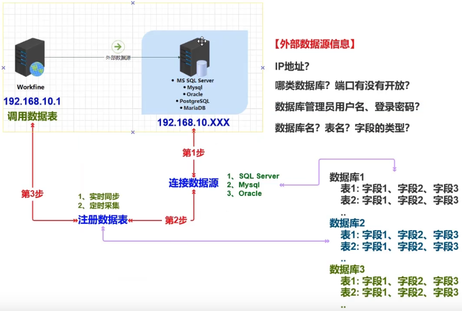​

我们来看一下这张图。Workfine如果要进行一个外部数据源的连接操作，需要经过三步。

第一步，我们要连接到这个数据源，就是说，我们要确定这台服务器它的ip地址在哪里？是哪一台服务器？然后它要连接到哪一个数据库？我们所用的数据库是哪一类，要确定好，然后对应的端口有没有开放。另外我们还要知道登录数据库管理员的用户名和密码，这样我们才能够对数据功能进行访问。连接到数据的时候呢，我们有很多数据库，有库1、库2、库3，到底是连接哪一个呢，这个我们要确定下来。假设我们现在连接的是数据库2，连接成功之后呢，我们就要进行注册数据表的一个访问了。我们既然连接的数据库2，那么我们的表面很多个，我们注册这个数据表，就是让Workfine知道我们调用业务数据系统里面的表1还是表2，这个表名呢，要把它确定下来。  
最后呢，我们还要确定我们注册的这个表字段，假设我们现在调用数据库2的一个表1，你是指定用它的字段1、字段2，还是说所有的字段呢，进行调用，所以第二步我们就要确认我们调研的数据库表字段的结构信息，要把它确定下来。只有这样确定好了之后呢，我们才能够在Workfine里面的数据源的地方呢，进行这个数据表的读取操作。也就是说，我们要知道业务系统的信息呢，首先要知道我们安装的是哪一类的数据库，目前Workfine都支持这些主流的数据库系统。  
另外，我们还要确认一个ip地址，把对应的端口呢，要开放起来，1433端口是微软的SQL Server，3306是Mysql的一个端口，Oracle是1521默认端口。我们查询Windows的ip地址的话，可以点击开始，cmd这个命令，然后输入 ipconfig/all 这个参数呢，来进行查询IP地址。如果是Linux操作系统，我们以Centos 7为例，你可以在命令行输入一个 ip addr 呢，来执行这个查询命令得到ip的信息。另外我们还要确认相关的信息，比如我们连接的数据库名称，我们有哪些表，表名以及表字段信息等等。还要确认相关的字段类型是数值型、字符型、日期型还是其他等等。

我们在连接到业务系统数据库的时候，可以用这个第三方的工具叫Navicat。目前呢，这是我打开的官方网站，可以看到它可以连接Mysql，连接微软的SQL Server以及Oracle，还可以连接其他的数据库。这是一个非常知名的第三方数据库连接工具。  

对于我们后面所讲的视频课程呢，我们会用到一个测试环境。我们搭建的是Vmware的Workstation 15这个版本，然后用的是Windows server操作系统。  

今天我们通过外部数据源的基本概念呢，就是想让大家知道Workfine可以和我们现有的业务系统呢进行整合，进行一个数据的处理。我们可以知道怎样来连接数据源。我们需要知道有哪些步骤？怎样连接数据库？我们注册表字段信息以及怎样调用？这一节呢，我们就简单的讲到这里。

### [2、SQL Server外部数据源](https://community.bn100.com/video)

大家好，今天我们一起来学习Workfine的第2章知识点，第7节数据集成。我们继续来学习Workfine的外部数据源这个功能。今天我们详细的来讲一下，当外部数据源是微软的SQL Server的时候，我们怎么样来建立一个外部数据源以及怎样运用。  

我们首先回到第一步。我们找到这台服务器的ip地址，把防火墙关掉，把1433端口呢，开起来。我们现在进行第一步的操作。当前的虚拟机呢，我们已经安装好了微软的SQL Server据库，我们点这里的开始，右键点运行，输入一个CMD，然后再确定，我们输入一个命令，ipconfig/all，然后敲回车，可以看到这个ip地址就出来了，192.168.10.101，所以我们找到了ip地址呢是这个。现在我们来关闭防火墙，我们点击左键，打开这里的控制面板，我们点击系统和安全，再单击Windows defender防火墙，我们选择这里来启用或关闭windows防火墙，专用网络设置，我们选择关闭，公用网络设置，我们也选择关闭。最后点击这里，这样我们的防火墙就关闭了，等于把所有的端口呢就开放，包括1433端口。  

接下来我们就要执行第二步，在Workfine里面形成一个外部数据源。我们回来Workfine的设计端，找到这里的数据集成，外部数据源，点新建，我们这里起一个名称，我们就叫测试SQL Server；数据源的名字呢，我们就用上面这个名称就可以了；数据源的类型，我们就选择微软的SQL Server，数据源地址就是刚刚我们拼出来的那台服务器的地址，192.168.10.101，然后把这个端口1433，我们不变；这里的登录方式，我们用账号登录就选择我们在安装数据库的时候启用的用户名和密码，用户名是sa，然后我们输入我们安装时候的密码；好了之后，我们单击这里的运行，如果显示连接成功，我们就单击里的下拉框，我们可以看到绑定的数据库有三个，我们只要选择我们测试的一个数据库，就可以了，我们选test，再点新建。这样我们就创建了一个外部数据的一个链接。

接下来我们执行第三步，数据对象的一个注册。单击我们刚刚创建的外部数据源，这时候就出现了一个stu这个表，因为我们创建的数据库呢，是test，test下面有stu这个表。我们再来回到我们之前创建的这个微软的这个SQL Server 2014，我们有这个管理工具，打开来看一下。我们点击数据库，+，这里的test就是我们数据库里面已经有了一个数据库了，我们再把它展开，这个表呢下面就有一个stu，大家可以看一下，它有姓名、性别、年龄、身份证号，还有住址等等这些信息。我们点修改，所以我们这里绑定了数据库test之后，在右侧就会显示test数据库下面的所有表。

现在我们虽然创建了链接，然后显示了这个表，但是目前还不能够使用，我们还要进行数据对象的一个注册。所以我们要点击这里的注册，这里的基本信息，第一个是对象别名，这里有个对象名称，这个对象名称是不能够修改的，也就是说，在我们的外部数据源里面，这个stu是早已经创建好的一个表名，我们不能够修改，我们只能通过这里的别名来进行修改，我们就把它修改成stu学生信息表。这个表里面呢，有很多个字段，如果我们取姓名这个字段就把这个字段选项打勾。如果我们选择性别，这个字段把这个也打勾。如果其他不要，就不需要勾选了。另外，如果我们都要选择，就把这个选项打钩，这样一次性就选中了。这里的来源字段名称是不能够修改的，还有这里的数据类型也不能修改。我们只能修改这里的注册名称和注册类型。注册名称呢，就相当于我们把字段名称呢，给它修改一下，可以修改成中文。例如，我们可以把这里的姓名，内容改成中文的姓名，这个改成性别，这个改成年龄，这里的id改成身份证号，这里的addr我们把它改成地址。特别是后面我们要给大家强调一下，这里的注册类型是什么意思呢？因为我们本地安装的Workfine已经使用的是SQL Server，微软的数据库，我们外部的数据源数据库呢，也是微软的SQL Server，所以这里的注册类型就不需要进行转换了。好了之后，我们就点保存。所以我们这里的数据对象，第三步注册呢，就完成了注册完成之后呢，我们就可以实时的提取外部数据源的表数据了。这种情况通常用于表数据记录相对来说较小，而且实时性要求比较高。  

我们再来讲一下第4步，在Workfinei里面怎样来应用和调用这个外部数据源表数据呢？我们首先来看第一个，我们在提取公式（取数公式）里面来调用。我们回到设计端，模板管理，我们这里创建了一个新的数据集成外部数据源的分类，我们创建了一个查询报表，叫微软的SQL Server 2014，我们现在创建了一个这样的一个外部数据源的查询表，这里的姓名、性别、年龄、还有身份证、ID号、地址呢，刚好一定要和我们外部数据源的这个表结构一定要相同，包括数据类型都要一致。这里设置好了之后呢，我们来创建一个新的提取公式，我们点加号，取一个名称，就叫测试SQL Server；执行实际选择手动；特别是这里数据的来源，选择数据表，这里很重要，这个时候我们就要选择最下面这个外部数据，这里会看到外部数据-stu学生信息表，这里的stu学生信息表呢，就是我们刚刚创建了一个表的别名，把它选中，然后点保存，这样我们就关联上了；筛选条件，我们为空值，默认选择全部；主要是这里的填充方式，我们把它填到当前的扩展表，选这个扩展表，目标字段，姓名，我们就选择外部数据-stu学生信息表里面的姓名，下面一一对应。好了之后，我们先验证一下，正确之后点新建，关闭。把当前模板的保存起来。

我们回到前端，刷新之后呢点这里的查询，可以看到我们获取了三条信息，张三、李四和王五。我们回到我们的外部数据源，找到这里的学生信息表，我们点右键，我们来选择编辑前面200行，可以看到我们外部数据源里面也是张三、李四、王五，这样我们就实时的就把这个学生信息表呢，就查询出来了。现在我们来做一个测试，我们来增加一条记录，输入一个新的学生姓名，666；性别，我们不填；年龄，666；ID号也是666，我们敲回车。再点这里的保存，把当前这个新增记录呢，把它保存起来。这个时候我们再回到Workfine的应用端，再点这里的查询，看看我们刚刚创建的666这条记录能不能够查询出来？可以看到这条记录呢，已经实时的读取出来了。我们在外部数据源删除掉刚才我们创建的这条记录，再把它保存一下，我们回到Workfine的前端，来点击这里的查询，看这条666记录是否依然存在？可以看到666这条记录呢，并没有显示出来，和外部数据源的这个表信息呢，是保持一致的。

现在我们来做一个测试，我们来增加一条记录，输入一个新的学生姓名，666；性别，我们不填；年龄，666；ID号也是666，我们敲回车。再点这里的保存，把当前这个新增记录呢，把它保存起来，这个时候我们再回到Workfine的应用端，再点这里的查询，看看我们刚刚创建的666这条记录能不能够查询出来？可以看到这条记录呢，已经实时的都取出来了。我们在外部数据源删除掉刚才我们创建的这条记录，再把它保存一下，我们回到Workfine的前端来，点击这里的查询，看这条666记录是否依然存在。可以看到666这条记录呢，并没有显示出来，和外部数据源的这个表信息呢，是保持一致的。

接下来呢，我们再做一个应用的测试，数据规范里面我们来绑定一个列表。我们现在回到Workfine的设计端，找到这里的数据规范，点列表，我们来新增一个，我们输一个名称，外部SQL Server-学生信息表；接下来我们就选择这里的数据表，同理，也是找到这里的外部数据，选择我们刚刚连接好的stu学生信息表，然后点保存；筛选条件为空；填充方式，我们选择姓名、性别，也全部选中，然后这里我们根据姓名呢，来做一个排序；验证一下，正确之后点新建。我们单击这里的预览来查看一下。可以看到学生信息呢，被读取出来了。我们也来做一个测试，添加一条记录。我们输一个777，也把它保存起来。我们再回到这里的列表，我们点这里的预览。可以看到增加的777这条记录呢，同时也加入进来了。

最后，我们再来讲一下今天学习的外部数据源，SQL Server。首先，我们在新建数据源的时候，这里的名称和数据源名称，它必须是英文或者是中文开头，中间不要有空格，也不能够使用其他的特殊字符，这个大家要注意。另外，这里的数据对象注册给大家讲一下，红色的这里，对象别名是一个表的名称，我们可以把它改成中文；这里的注册名称就是把这里的字段名是英文的，可以把它改成中文；特别是这里的注册类型要给大家强调一下，因为我们目前Workfine用的是SQL Server的数据库，现在调用的外部数据源呢，它也是SQL Server的数据库，两个数据库相同，所以这里的数据类型不需要进行任何的修正和更改，直接采用默认就可以了。最后，我们在提取公式或者数据规范调用数据表的地方，一定要选择这里的外部数据，要找到这里对应的数据表的名称，这个名称呢，就是我们之前在这里起的一个对象别名，就是指外部数据源的一张表，它的表的名称，这里要对应起来。

这一节的内容呢，相对来说比较多一些，如果大家没有真实的生产业务环境，可以用Vmware这个工具来搭建一个虚拟环境，包括怎样安装Windows server以及怎样安装微软的SQL Server数据库，我们在这里没有详细给大家讲解，大家可以到百度里面去查阅相关的教程就可以了。这一节呢，我们就简单的讲到这里。

### [3、MySQL外部数据源](https://community.bn100.com/video)

大家好，今天我们一起来学习Workfine的第2章知识点，第7节数据集成。我们接着来学习Mysql数据库的外部数据源连接。  

首先，我们要做好前期的准备工作。我们安装好Mysql，我们以8.0为例，然后允许root用户呢，可以远程登录访问。我们现在登录这台Mysql 8.0，在命令行呢，输入root用户的密码，敲回车。我们在桌面上有一个Mysql允许root远程登录的一个命令，

```sql
show databases;
use mysql;
select host,user from user;
update user set host = '%' where user = 'root';
flush privileges;
```

我们把这里的每一行命令呢，把它连续的放在一起，可以批处理输入，我们点右键复制，再回到这里的Mysql，我们点右键，前面几条命令呢，就执行了，最后一条，我们再敲个回车就可以了。生效之后呢，以后就允许root远程登陆这台服务器了。  

我们再来查看一下服务器的ip地址和关闭防火墙。我们左键单击这里的控制面板，系统和安全，点击防火墙，这里的启用或关闭，把这里的专用网络设置和公用网络设置，全部选择这个关闭，然后确定就可以了。最后我们再来查看一下这台服务器的ip地址，右键，运行，cmd，确定，我们输一个`ipconfig/all`​，敲回车，这样就查到了这台服务器的ip地址，192.168.10.100。

最后，我们再来下载Mysql的ODBC和第三方的Navicat这个数据库连接工具。我们先登陆Mysql的官方网站，dev.mysql.com，找到这里的下载，再单击这里的ODBC，这里是最新版本8.0.20，我们下载第一个就可以了，64位的。这个ODBC安装呢，比较简单，一直下一步呢，就可以了，这里我就不一一的给大家演示了。另外，我下载了一个Navicat这个12版本的绿色版，这是第三方的一个数据库连接工具，大家也可以根据需求来下载一个。  

接下来我们进行Workfine外部数据源Mysql的相关操作。我们在新增外部数据源Mysql之前呢，我们还要配置好ODBC，我们回到win10的桌面，点这里的开始，我们找到这里的windows管理工具，左键单击ODBC数据源(64位)，这里有个系统DSN，我们点这里的添加，我们找到这里的Mysql ODBC 8.0 Unicode Driver，选这个，然后点完成。这里要求我们输一个数据源的名称，我们就输一个测试Mysql就可以了；这里的描述，我们可以不填；这里的设备ip地址就是我们刚刚ping出来的192.168.10.100；输入用户名User，root，再输入对应的数据库登录密码，然后点这里的Test测试，这里显示成功连接之后，我们点确定，这里的数据库，我们单击下拉来选择test就可以了。这里的test呢，是我们事先输入好的Mysql的一个测试数据。  
我们点OK，最后单击确定。

我们现在从桌面上启动这个Navicat的第三方数据库连接工具，我们来连接安装好的Mysql数据库。这里就选择第一个Mysql，连接名称我们就输一个测试Mysql；服务器地址，我们同样也输入192.168.10.100；再输入密码，然后点这里的连接测试，测试成功点确定，再单击这里的确定。我们右键，打开链接，双击test数据库，我们再双击表，看到里面有一个stu学生信息表，我们双击打开，可以看到里面有三条数据信息，包括了以下字段：姓名、性别、年龄、费用、住址、日期和时间。这后面呢，我们就演示通过Workfine创建一个外部数据源来访问提取这里的学生信息表。  

我们回到设计端，找到数据集成，外部数据源，点新增，我们输一个名称叫testmysql；这里的数据源名称呢，不能够随便乱填写了，我们要回到我们之前配置ODBC的地方，把这里的datasource name，这里的数据源名称（测试Mysql）呢，把它复制过来，要和这里的名称保持一致，这是很重要的一个地方，然后把它粘贴过来；这里的数据类型我们就要选择对应的Mysql；这里的数据源地址呢，我们就说一个192.168.10.100；端口默认值；登录账号，我们输一个root，对应的密码。好了之后，我们来测试一下，这里连接成功。这个时候，我们选择绑定数据库，点下拉，就选择我们之前打开的这个数据库test。然后点新建。这样就创建了一个Mysql的外部数据源。

接下来我们进行数据对象的注册，我们单击左键，选中这条Mysql的外部数据源，这里就出现了test数据库下面的一个stu学生信息表，我们点这里的注册。这里的对象别名，我们改一个stumysql学生信息表，这里是不能改，这个是外部数据源Mysql的一个英文的表的名称。这里有很多表的字段，我们要引用哪个就注册哪一个，假设我们现在全部要引用，全部选中就可以了。我们还可以把这里的字段名称呢，给它注册改一下改成中文：姓名、性别、年龄、费用、地址、日期、时间。特别是这里的注册类型，大家要注意，我们现在的数据类型呢，是Mysql的一个表字段的数据类型，我们现在要转换到Workfine的SQL Server里面来，所以这里的注册类型呢，要经过一定的调整，比方说我们这里的字符串型（varchar(255)），在Workfine里面最好把它改成以n开头的SQL Server的一个字符串类型（nvarchar(255)），解决显示乱码的一个问题。把这里也改一下，加个n就可以了。我们下面的int整数和decimal小数呢，是相同的，所以就不需要进行更改，我们采用默认值就可以了。这里我们再来改一下。因为这里显示的是日期，所以在Workfine里面对应的SQL Server类型呢，也是date日期型。就是后面这一个要改一下，Mysql里面，它的字段类型呢，叫time，那么在Workfine里面对应的SQL Server就要改成datetime，配置好了以后我们点这里的保存按钮。这样呢，我们就完成了数据库表的一个注册，我们就可以实时的提取外部数据源表数据了。  

接下来我们讲一下Workfine对外部数据源的一个应用。我们先来讲一下这里的提取公式，我们现在回到模板管理，我们创建了一个新的查询模板，这里的字段类型呢，和我们外部数据源Mysql的一个学生信息表的字段类型呢，要保持一致。特别是我们要回到这里的数据管理器，我们创建好了一个扩展表，这里的相关的数据类型要一一对应，文本型对文本型，数字型对数字型，特别是这里的日期，我们选择这个日期型，那么后面的字段要是，默认这一种，我们也可以把它改一下，改成这种年月日。最后一个要注意了，因为这里显示的是时间，而我们Workfine里面只有一个日期型，所以对应的要把这里的字段样式呢，给它改一下，改成是这里的显示时间就可以了，另外也可以改成是这种显示中文的时分秒。我们保存，我们来创建一个提取公式，执行时机，手动；数据来源，我们找到外部数据，选择这里的Mysql学生信息表，保存；筛选条件为空值；填充方式，我们选择这里的扩展表，对应的姓名、性别全部把它一一的对应填写过来。我们来验证一下，正确之后点新建。最后把当前模板保存起来。

我们回到应用前端，点击这里的查询，可以看到外部数据源Mysql学生信息表的数据就全部都取出来了。这里的日期和时间，我们可以通过模板管理里面的数据管理器呢，来进行调整。我们找到这里的扩展表，把这里的日期格式呢，改成和Mysql里面显示的字段样式一样，就选择这一种。时间也改一下，改成是单纯的数字显示，这样就和Mysql里面的学生信息表信息呢，显示格式就一样。我们点保存，再把当前模板保存起来。我们前端刷新之后呢，再点击这里的查询，可以看到这里的日期和时间格式呢，就改变了。我们回到外部数据源的学生信息表来添加一条记录，点保存，我们再回到前端，点这里的查询，可以看到我们添加的这条记录呢，就实时的提取出来。我们再把这条记录呢，删除掉。我们回到前端，再来点击这里的查询，可以看到我们这里的查询结果呢，和外部数据源学生信息表的数据呢，是一致的。

我们现在回到数据规范。选择这里的列表，我们点新增，我们取个名称就叫外部数据源Mysql；选择数据表，外部数据，选择这里的Mysql学生信息表点保存。筛选条件为空值；填充方式，我们把它全部选择过来。我们再对一个字段呢进行排序，选择年龄吧。点验证，正确之后点新建。我们点这里的预览，可以看到我们这里的时间呢，出现了问题，并没有显示时分秒，我们来解决一下这个问题，我们点这里的修改，填充方式，我们点这里的编辑，我们先把这里删除掉，我们要用到一个高级函数，找到这里的类型转换函数，选择日期转字符，把这里的'[日期]'删除掉，选择我们这里的时间，另外，这里的'[格式]'，你把它删除掉，我们来看一下，如果要用到这里的时分秒，我们可以选择这里的代码，8或者是108，我们就采用这里的带世纪数位，代码108就可以了，就会把我们的日期函数呢，转换成时分秒显示的一种格式，我们回到列表，把这里的代码呢，就输一个108，然后保存起来。再来验证一下，正确，点保存。最后，我们点这里的预览。可以看到，通过我们对日期的一个转换，就把日期转换成时分秒的格式呢，进行显示了。

最后，我们再来总结一下，我们今天学习的Mysql外部数据源或者说相关的注意事项。前面我们的前期准备工作呢，一定要做好，包括ip地址，防火墙的关闭以及下载安装ODBC，还有Navicat这个第三方的连接工具。允许root远程进行Mysql的访问呢，我们还要先登录Mysql，然后执行下面的[批处理命令](siyuan://blocks/20230410181134-7l32c69)就可以了。我们还要配置ODBC，这里要注意，数据源名称的写法最好不要有空格。另外，我们在创建外部数据源的时候，这里的数据源名称要和我们创建ODBC的时候呢，这里的名称要保持一致。最后，我们在数据对象注册的时候一定要注意，除了这里的注册名称可以改成中文，另外，Mysql转换到Workfine对应的SQL Server数据库的时候，文本的转换，我们要防止出现乱码，在前面呢，把这个数据类型加一个n就可以了；最后这个时间的显示，时分秒呢，我们要用datetime这个类型。至于日期型date以及整数型int，还有小数decimal，它们的类型呢，完全相同，所以不需要进行任何调整。在查询模板里面，我们还要注意这里的数据类型，选择日期，时间和这里的显示格式呢，我们要在字段样式里面去进行调整。最后，特别是我们在列表里面的应用，要进行一个日期转字符的一个函数应用，把最后一个代码呢，要用108来代替，才能够正确地显示时分秒这个格式。

今天我们所讲的Mysql外部数据源呢，相对来说知识点比较多，大家可以参照我们的视频呢，下来做相关的练习、操作。另外，如果在使用过程当中遇到任何问题呢，可以到我们的官方QQ群呢，进行提问、咨询。这一节呢，我们就简单的讲到这里。

### [4、采集计划](https://community.bn100.com/video)

大家好，今天我们一起来学习Workfine的第2章知识点，第7节数据集成。我们接下来学习外部数据源的另外一个注册数据表的方法，采集计划。  

​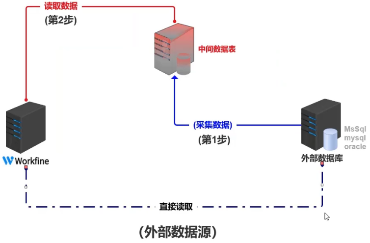​

我们先来看一下这张图。前面我们所讲的读取外部数据呢，都是通过直接读取的办法，来进行外部数据源相关数据表单的一个调用，这种情况呢，通常是用于外部数据库相对来说，表记录比较小，而且对我们的业务系统呢，要求比较高，就是说实时性比较高，我们会频繁地读取外部数据源的相关表数据。如果外部数据库里面的表单数据比较多，我们又不是经常调用，有可能是一个星期或者一个月甚至更长的周期才访问一次。那么我们可以降低我们Workfine这边的服务器的负担，我们可以采用定时采集数据的办法，第一步，我们读取外部数据源的数据呢，把它放到Workfine的这个中间表里面来。当我们需要的时候，然后Workfine再从中间数据表呢，把数据提取出来。  

今天我们就来讲一下注册数据表的第二个方法，数据采集计划。我们现在回到Workfine设计端，数据集成，外部数据源，这条记录是我们之前创建的微软的SQL Server这个外部数据源的链接，我们点这里的修改，我们来测试一下这台数据库是不是保持正常连接的状态，点这里的测试，连接成功，我们点保存。在右侧是我们之前创建的一个自动链接，现在我们把注册数据表呢，做一个修改，点这里的操作，有一个下拉，我们选择这里的采集计划。首先，我们要把采集计划选项打勾，把它开起来，选择第一个，启用数据自动采集，下面是各种方式，这里是月份，这里是周，这里是日，我们就选择默认的每日；这里的时间呢，就指定每天凌晨12:00；这里的分钟，是每一分钟。设置好了之后，我们单击保存按钮。我们点击这里的下拉，又出现一个菜单，叫手工采集，也就是说我们有了采集计划的时候呢，我们也可以进行手动的干预，就说我们用手工的方式的话，立刻进行一个数据的采集操作。假设现在我们点击手工采集，这样我们呢，就实现了学生信息表的一个提取操作了，我们通过手工采集，就瞬间把这里的数据库表单呢，就全部提到这里的中间数据表来了。这个时候，我们的Workfine调用这里的数据就和外部数据源的数据呢，才能够保持一致。  

我们现在回到外国数学来新增一条记录，为了做个测试，我就输666，然后点这里的保存。也就是说，目前这里的外部数据源增加了一条666，如果我们没有进行自动采集或者手工采集，这里的中间数据表的话和这里的数据是不同步的。我们来看看这里的数据规范列表，点预览，可以看到我们输入的学生666呢，它并没有同步过来。我们现在回到外部数据源，点这里的修改，下拉，选择手工采集，也就是说，我们现在对外部数据库呢，做了一次数据采集的操作，那么这个时候中间的数据表呢，和外部数据源的这个数据表呢，就同步了。我们来测试一下我们的数据规范，列表，可以看到我们执行了手工采集之后呢，这条数据才同步过来。我们再回到外部数据源，把这条记录进行删除，点这里的保存。我们现在不进行手工采集，点这里的预览，可以看到这条记录还是依然存在的。我们再回到外部数据源，点这里的修改，下拉，选择手工采集，我们人工的执行一次同步的操作。我们再回到数据规范，列表，选择这里的预览，可以看到，外部数据呢，同步过来了，666这条记录呢，也被删除了。

最后，我们再来总结一下我们今天学习的采集计划。这种情况呢，主要用于表记录数据很大而且实时性要求不是很高的这种情况。我们也讲到了，如果我们要马上进行数据的同步操作，怎么办呢？我们就可以点击手工采集，用手动的方法呢，来促使它同步。这一节呢，我们就简单的讲到这里。

# 用户权限

## [01、组织](https://community.bn100.com/video)

大家好，欢迎来到Workfine数字化课堂，这节课我们来学习组织。企业组织就是我们通常所说的单位或部门，在Workfine中建立组织信息时，不仅要确定组织的名称等信息，还需要确定组织的从属关系，直到形成一个这样的树形组织结构图，这里是根级部门，第二层是部门，部门可以继续向下划分，右侧这个是子公司，子公司下面也分几个部门。大家在课后绘制树形组织结构图时需要注意，一个组织中只能有一个根级部门，除根级部门外，其他所有部门都有唯一的上级部门，最后，同一级别的部门名称不允许重复。

​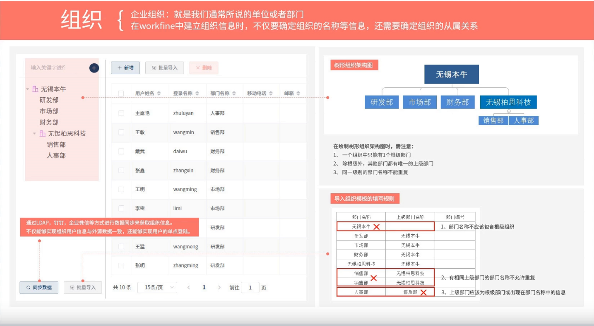​

当企业的组织结构图绘制完成后，我们可以以结构图作为参照来给企业建立组织。在Workfine中添加组织有两种方法，一是手动添加，二是批量导入，在批量导入组织信息时，我们需要提前按照要求填写组织信息，比如，部门名称中不能包含根级组织，有相同上级的部门名称不能重复，上级部门应该为根级部门或出现在部门名称中的部门。了解了组织的基本知识后，下面我们来看具体的操作。

回到Workfine设计器，进入组织用户界面，左侧为组织，这里是系统默认的根级目录，只能修改，无法删除，我们在组织属性中，可以将组织名称修改为无锡本牛，根级目录是公司，是单位，所以应该勾选单位；当根级部门修改完成后，我们来看如何手动添加组织，将鼠标放在根目录的右侧，在出现的选项中选择新增组织，输入组织的名称，研发部，组织编号不输入的话，系统会自动生成，研发部是部门，不是子公司，所以不用勾选单位，保存后，研发部就创建完成了。利用同样的方法，我们可以将所有的组织建立起来。

当企业的组织比较多的时候，逐个添加比较麻烦，这时我们可以采用批量导入的方法来快速建立组织，在批量导入组织前，根级目录已经修改为无锡本牛，然后删除刚才创建的研发部，避免跟导入的数据出现重复错误，点击批量导入按钮，下载Excel模板文件，打开模板文件，按照刚才所讲的要求填写部门和上级部门信息，保存、关闭。点击选取文件，选中刚才填写的模板文件，保存，就能看到组织信息已经导入成功。这里有一点需要大家注意，如果是子公司，我们需要在组织属性中手动勾选为单位，这样组织前面就会有一个图标，部门是没有的。创建好的组织可以利用鼠标拖动的方法来移动组织的上下位置和层级关系。

这节课我们主要讲解了组织的概念以及组织的添加方法，除了刚才讲到的方法外，我们还可以通过LDAP、钉钉、企业微信等方式进行数据同步来获取组织信息，不仅能实现组织用户信息与外部数据一致，还能实现用户的单点登录，感兴趣的朋友可以去查看相关的文档教程，这里不做过多的讲解，这节课就讲解到这里，谢谢大家的观看。

## [02、用户](https://community.bn100.com/video)

大家好，欢迎来到Workfine数字化课堂，这节课我们来学习用户。用户是指企事业单位中各种用工形式的人员，包括固定工、合同工、临时工和实习生等。在Workfine中，建立企业用户最终是为了让不同的人员能够通过账户登录系统，并拥有相应的业务权限。

​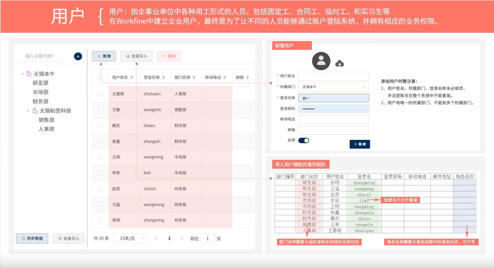​

在Workfine中添加用户有两种方法，一是手动添加，二是批量导入，在手动添加用户时，需要注意用户姓名、所属部门，登录名称为必填项，并且在录入用户信息时，登录名称在整个系统中不能重复，每个用户都应该有自己唯一的所属部门，不能出现一个用户有多个所属部门的情况；在批量导入用户时，我们需要提前按照要求填写用户信息，在填写信息时有几个注意事项，一、部门名称需要与组织架构中的组织名称相对应，二、登陆名称不允许重复，三、角色可不填，如果要填写角色的名称，必须要与角色权限中的角色相对应，这些注意事项已经给大家标注出来了，希望课后大家在导入用户信息时能正确填写用户的信息。

了解了用户的概念以及添加方法后，下面我们来看具体的操作，回到Workfine设计器，进入组织用户界面，左侧为上节课建立的组织，右侧为用户，大家可以看到，这里已经有了一个账户，是超级管理员，也是系统默认的最高权限的账户，大家在操作时尽量不要去删除。  
点击新增，我们来看如何手动添加用户，输入用户的名称，选择用户所在的部门，输入登录名称，当用户的相关信息填写完成后，点击新建就能手动添加用户，利用同样的方法可以将所有的用户添加进去。  
当用户比较多的时候，逐个添加比较麻烦，我们可以批量导入用户，在批量导入用户前，我们先删除刚才添加的用户，避免与导入的数据出现重复而出错，点击批量导入按钮，下载Excel模板，打开模板，按照刚才所讲的填写要求，将用户信息填写完成后保存，关闭模板，回到Workfine设计器，点击选取文件，选择刚才填写的用户模板，保存，当用户信息导入成功后，在应用端就能实现用户使用自己的账号登录系统，前往应用端测试，输入用户的账户，点击登录，即可登录系统。

这节课我们主要讲解了用户的基本概念以及用户的添加方法，至于如何给不同的用户分配不同的业务权限，我们会在下节课中讲解，这节课就讲解到这里，谢谢大家的观看。

## [03、角色权限](https://community.bn100.com/video)

大家好，欢迎来到Workfine数字化课堂，这节课我们来学习角色权限，角色与岗位有类似之处，不同的角色应该拥有不同的岗位职责，比如，当公司添加了相应的角色后，就可以给角色绑定相应的用户和模板，并且在绑定模板时，还可以根据实际的业务需求设置模板的各种权限，从而能将不同的业务权限付给不同的用户。

​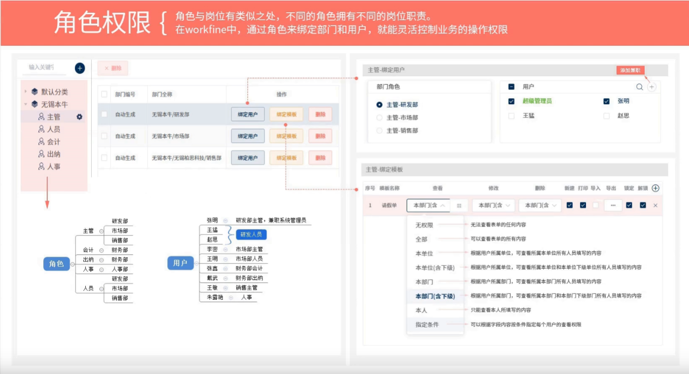​

了解了角色权限的基本知识后，下面我们以无锡本牛公司为例来看如何设置角色权限，回到Workfine设计器，进入角色权限界面，将鼠标放在加号上，点击新增分组，首先创建无锡本牛分组，选中分组后，鼠标放在加号上，点击新增角色，输入角色的名称→主管，所属分类为无锡本牛公司，在绑定部门中勾选有主管的相应部门，设置完成后，点击新建，这样我们就新建了一个角色，继续添加角色→人员，勾选有人员的部门，点击新建同样的方法，可以将所有的角色添加进去。

当角色添加完成后，下面我们来看如何给角色绑定用户，首先选择主管，点击绑定用户，勾选研发部主管张明，保存后，选择市场部，勾选市场部的主管保存，然后选择销售部，勾选销售部主管。

当用户绑定完成后，我们来看如何绑定模板，这里我们以绑定请假单为例来进行讲解，鼠标放在加号上，在人事管理中选择请假单模板，当部门角色为研发部主管时，我们将查看、修改、删除的操作权限设置为本部门，意思就是主管可以查看、修改甚至删除本部门中所有人员的填写信息，也可以根据实际的业务需求去设置模板的其他操作权限，设置完成后，点击保存。然后可以切换到市场部、销售部去设置相应的模板及权限，如果市场部、销售部与研发部主管的模板权限一致，那我们可以直接将鼠标放在研发部右侧，点击复制模板权限，将研发部主管的模板权限复制到市场部和销售部，设置完成后，点击保存，关闭窗口。

当主管的用户和模板绑定完成后，选择人员，我们给人员绑定用户，保存后切换到市场部绑定人员，然后切换到销售部，单击绑定模板，添加模板请假单，当角色为研发部人员时，我们将模板的权限改为本人，意思就是，普通员工只能查看、修改、删除自己的填写信息，设置完成后，点击保存，也可以将研发部人员的模板权限复制到市场部和销售部，设置完成后保存，关闭窗口。

利用同样的方法，我们可以给所有的角色绑定相应的用户和模板，因为操作比较简单，这里就不再进行演示了，希望课后大家可以独立去完成。这样在应用端使用研发部员工账号登录系统后，员工只能看到自己的填写记录，如果使用研发部主管账号登录，就可以看到本部门中所有人员填写信息。

这节课我们主要讲解了角色权限，希望通过这节课的学习，大家能举一反三，在以后的工作中能够根据实际的业务需求去设置合理的角色权限，这节课就讲解到这里，谢谢大家的观看。

# 系统设置

## [01、预警设置](https://community.bn100.com/video)

大家好，欢迎来到Workfine数字化课堂，这节课我们来学习预警设置。在Workfine中通过设置预警能够让某些业务得到及时的提醒。预警设置相对比较简单，那下面我们就结合以前的案例来制作一个库存预警。

回到Workfine设计器，在数据集成类目中找到之前的物品实时库存表，点击数据预览就能看到每个物品的实时库存量。那下面我们就利用预警来实现当物品的库存量小于1000时，系统管理员就会收到提醒。在系统设置中找到预警设置，新增预警，库存预警；选择接收人，勾选超级管理员；预警的时间间隔以小时为单位，这里呢，我们设置一小时；预警内容为库存紧急提醒，添加数据源，在数据视图中找到物品实时库存表；触发条件，库存表中的物品数量小于1000；显示字段，我们将需要接收人看到的字段添加到右侧的显示字段中，设置完成后点击新建，这样我们就添加了一个库存预警，每隔一小时就会自动触发预警，当物品库存表中有物品的库存量小于1000时，系统管理员就会收到提醒。不需要的预警可以在这里停用或者在这里删除，当然我们也可以点击手动触发来触发预警，手动触发后前往应用端查看，使用系统管理员账号登录，在右上方有一个预警提示，单击后可以看到库存紧急提醒，单击，可以看到详细的内容。

这就是预警设置，能够让某些业务得到及时的提醒。希望课后大家多去思考，多去尝试操作，这节课就讲解到这里，谢谢大家的观看。

## [02、定时任务](https://community.bn100.com/video)

大家好，欢迎来到Workfine数字化课堂，这节课我们来学习定时任务。定时任务是指通过定时功能定时触发某些任务的执行。在Workfine中，定时任务的执行动作有回写公式、短信公式、视图采集和同步组织部门等多种类型，大家可以根据自己的业务需求来灵活选择。

那这节课我们就以回写公式为例，来看一下定时任务的用法。在回写公式类目中，有供应商信息表，这个是主表，里面有一条数据，供应商类型为优选型的供应商，江苏宏达，这个是定时更新表，是扩展表，主要用于批量更新供应商信息，它里面也有一条数据，也是优选型供应商江苏宏达。

那下面我们就来看如何利用定时任务中的回写公式来批量修改供应商信息。回到Workfine设计器，在系统设置类目中找到定时任务，新增定时任务，定时任务的名称为定时更新供应商信息；指定用户就是谁来执行，为了方便测试，我们选择超级管理员，执行频次是执行一次，还是循环执行，还是按高级表达式来执行，大家可以根据实际的业务需求来选择，那这里呢，我们选择执行一次；这里是执行时间，现在是2022年12月6日10:34，我们将时间设置成10:40，也就是到了这个时间就会自动执行；在执行动作中，添加回写公式，公式的名称为更新供应商信息，操作类型选择修改记录，添加回写目标，在回写公式中选择供应商主表，数据来源，在回写公式中选择定时更新扩展表，筛选条件，供应商编号相同；最后我们来设置取值字段，将需要更新的字段进行填充，勾选唯一约束，设置完成后，点击新建，新建，这样我们就添加了一个定时任务，等到了刚才设置的时间，就会自动执行回写公式。

前往应用端测试，在应用端登录后，我们将定时任务中的信息进行修改，将江苏宏达修改为合格供应商保存，然后在供应商信息表中看一下，他现在还是优选型供应商，我们稍微等一下，时间已到，现在是10:41，那在供应商信息表中，我们可以看到，江苏宏达它的供应商类型已经变成了合格供应商，这就是定时任务。回到定时任务的界面，这里是定时任务的状态，当我们不需要的时候可以将状态停用，或者在这里直接将定时任务删除，如果单击这里的立即执行，就能立即执行定时任务。

这节课我们主要讲解了定时任务，就是通过定时功能定时触发某些任务的执行，定时任务的动作有很多种，这里就不再一一演示了，希望课后大家多去尝试操作，这样才能在以后的工作中根据实际的业务需求来灵活设置定时任务，这节课就讲解到这里，谢谢大家的观看。

## [03、系统设置：其他](https://community.bn100.com/video)

大家好，欢迎来到Workfine数字化课堂。这节课，我们来看一下系统设置中剩下的一些内容，系统设置中的内容比较多，有一些设置呢，我们已经单独介绍过了，那这节课我们就来介绍几个比较常用的设置。

回到Workfine设计器，在系统设置类目中，我们先来看登录设置和工作界面，首先，登录设置主要是修改应用端的登录界面，包括登录界面上的logo、系统名称和背景图片；工作界面主要是修改应用端的工作界面，比如左上角的系统logo和系统名称，这两个设置都比较简单，这里就不再演示了，课后大家可以根据需求去修改。

这里是数据规范，点开后里面有自动编号、下拉、级联列表等等，我们在创建模板时，添加的数据规范都会按类别展示，在这里我们可以对他们进行修改、重置、删除以及查看在模板中的使用记录等等，这些操作跟之前的都一样，比较简单。

在移动设置中，我们可以绑定微信公众号、企业微信以及钉钉等等，具体的绑定方法在对应的帮助文档中都有详细的步骤，大家可以跟着里面的步骤一步一步进行绑定。

开发者权限，当开发者权限是停用状态时，系统管理员角色和模板设计者权限的用户进入设计端后，能操作系统内所有的模板、视图、流程等数据，当权限开启后，默认只有建立者才能操作自己的模板、视图、流程等数据，其他开发者能看到整体的结构，但无法调用和操作其他人的模板、视图、流程等数据，只有经过建立者的授权后，才能进行操作，这就是开发者权限，大家可以根据需求来进行选择，是启用权限还是停用权限。

安全策略是指用户在登录应用端时对密码复杂度的要求，默认是停用状态，启用后，我们可以设置相应的安全策略，比如密码的组成部分，密码的长度要求、排除要求等等，这些都比较简单，课后大家可以根据自己的需求去设置。

这里是系统日志，系统日志反映的是整个软件的运行情况，当软件出现问题时，我们可以将系统日志下载之后发给技术人员来追查问题。

最后是版权信息，在这里我们可以看到当前软件的版本，授权并发、授权代码以及版权声明等信息。

这节课我们主要介绍了一些系统中比较常用的设置，没有做任何的操作演示，希望课后大家多去尝试操作，在以后的工作中能根据实际的业务需求灵活设置系统，这节课就讲解到这里，谢谢大家的观看。
